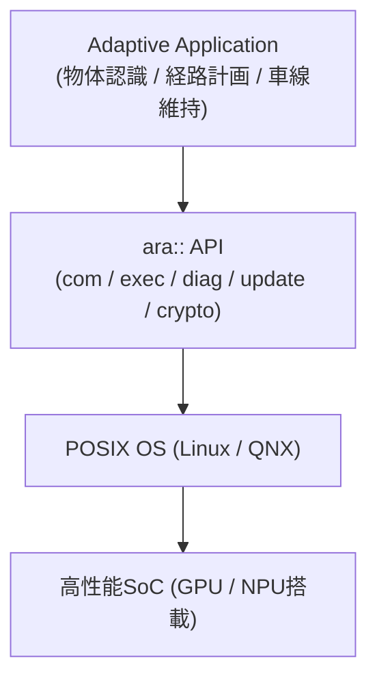

## 概要
Adaptive AUTOSARは、高性能プロセッサ上でLinux等のOSを動かしながら、機能安全と柔軟なソフトウェア配置を両立する車載ミドルウェア標準です。Classic AUTOSARが静的なマイコン向けであるのに対し、Adaptiveは動的なサービス追加・OTA更新・AI推論を想定して設計されています。

## なぜ必要か
ADAS・自動運転ではGPU/NPU搭載の**高性能SoC**が必須となり、Classic AUTOSARのリアルタイムOSでは対応できません。Adaptive AUTOSARは**POSIX**準拠OS上で動き、アプリケーションを「Adaptive Application(AA)」として疎結合で組み合わせる設計を可能にします。

## 主要コンポーネント
- ****ara::**com** — SOME/IPまたはDDSを使ったサービス通信API
- ****ara::**exec** — アプリケーションのライフサイクル管理(起動/停止)
- ****ara::**diag** — UDS診断のアダプティブ対応
- ****ara::**update** — OTA更新フレームワーク
- ****ara::**crypto** — 暗号化・鍵管理

## 自動運転での利用例
ADAS Domain Controllerに Adaptive AUTOSAR を採用し、物体認識・経路計画・車線維持の各機能を独立したAdaptive Applicationとして展開します。OTAでアルゴリズムを更新でき、フィールドでの機能改善が可能になります。通信は [[some-ip]] または [[ros2-dds]] で行われます。

## 関連用語
Classic版の [[autosar]] と対になる存在です。通信ミドルウェアとして [[some-ip]] を使い、ソフト定義車両全体の文脈は [[sdv]] を参照。

## 次に学ぶべき内容
Adaptive AUTOSARが実現する [[sdv]] の全体像を学びましょう。

## 図解

