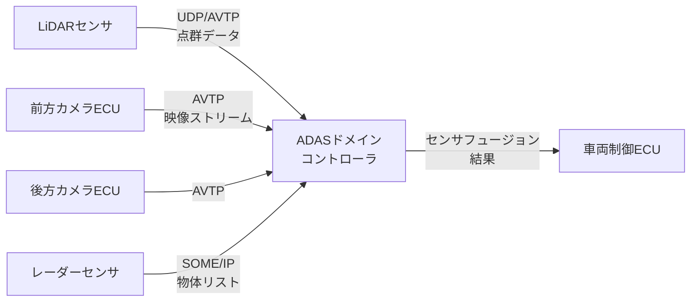

## 概要
ADAS通信とは、先進運転支援システム(ADAS)を構成するセンサー・コンピュータ・アクチュエータ間のデータ通信全般を指します。カメラ・レーダー・LiDARの大量データを、低遅延かつ高信頼に運ぶことが求められます。

## なぜ必要か
ADAS/自動運転では、認識→判断→制御のループを短い周期で回す必要があり、通信の遅延・ジッタ・欠損が安全性に直結します。そのため帯域・リアルタイム性・冗長性を考慮した通信設計が不可欠です。

## 自動運転での利用例
高帯域な [[ethernet]] をバックボーンに、低遅延通知は [[udp]] ベースの [[some-ip]] で、時刻同期にはTSN(Time-Sensitive Networking)を用います。これらを束ねた車両像が [[sdv]] です。安全のため通信経路を二重化することもあります。

## 関連用語
基盤技術は [[ethernet]] / [[udp]] / [[some-ip]]、上位概念が [[sdv]] です。

## 次に学ぶべき内容
ロードマップは一周しました。気になった用語をクリックして、Wikipedia風に知識を深めましょう。

## 図解

