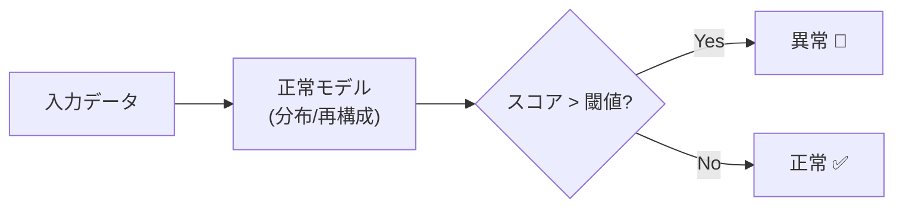

## 概要
「99.9%は正常、残り0.1%の異常を自動で見つけたい」――でも異常データはほとんど収集できない。これが異常検知の本質的な難しさです。正常パターンだけで学習し、そこから外れたデータを「異常」と判定する教師なし手法が主流です。車載ネットワークでは「不正なCAN IDのパケット」「データレート急上昇」「未知のECUからの通信」などの検出に使われます。統計的手法・Isolation Forest・オートエンコーダを場面に応じて使い分けましょう。

## 活用シーン
- **製造ラインの故障予兆**: センサーデータの統計的外れ値をリアルタイム検出
- **ネットワーク侵入検知**: 通常と異なる通信パターンを教師なし学習で検出
- **金融不正検知**: 取引パターンが顧客の過去の行動から大きく外れたものを検知



## 主要な数式

**z スコア法**（\(|z| > 3\) を異常とする）：

$$z = \frac{x - \mu}{\sigma}$$

**マハラノビス距離**（多変量、相関を考慮）：

$$D_M(\mathbf{x}) = \sqrt{(\mathbf{x} - \boldsymbol{\mu})^\top \mathbf{\Sigma}^{-1}(\mathbf{x} - \boldsymbol{\mu})}$$

**オートエンコーダの再構成誤差**（誤差が大きいほど異常）：

$$\mathrm{score}(\mathbf{x}) = \lVert \mathbf{x} - \hat{\mathbf{x}} \rVert^2, \qquad \hat{\mathbf{x}} = \mathrm{Decoder}(\mathrm{Encoder}(\mathbf{x}))$$

**閾値の設定**（正常データの誤差分布の分位点）：

$$\tau = \mu_{\text{err}} + k\,\sigma_{\text{err}}$$

## 統計的手法（Z-スコア・IQR）

> 💡 **実務ポイント:** Z-スコア法は正規分布を仮定するため、外れ値が多いデータには IQR 法の方が頑健。どちらも単変量の方法で、特徴量間の相関は考慮できない。

```python
import numpy as np
import pandas as pd
import matplotlib.pyplot as plt
from sklearn.ensemble import IsolationForest
from sklearn.svm import OneClassSVM
from sklearn.preprocessing import StandardScaler

np.random.seed(42)

# CANバスのメッセージレート（正常）+ 異常点を混入
normal   = np.random.normal(100, 10, 500)
outliers = np.array([200, 210, -50, 5, 190])
data     = np.concatenate([normal, outliers])
np.random.shuffle(data)

# Z-スコア法
z_scores = np.abs((data - data.mean()) / data.std())
anomalies_z = data[z_scores > 3]
print(f"Z-スコア法（|z|>3）: {len(anomalies_z)} 件の異常")

# IQR法（外れ値に頑健）
q1, q3 = np.percentile(data, [25, 75])
iqr = q3 - q1
lower, upper = q1 - 1.5 * iqr, q3 + 1.5 * iqr
anomalies_iqr = data[(data < lower) | (data > upper)]
print(f"IQR法: {len(anomalies_iqr)} 件の異常")

plt.figure(figsize=(10, 4))
plt.plot(data, "b.", alpha=0.4, label="正常")
plt.axhline(upper, color="red",    linestyle="--", label=f"上限 {upper:.1f}")
plt.axhline(lower, color="orange", linestyle="--", label=f"下限 {lower:.1f}")
plt.scatter(np.where((data < lower) | (data > upper))[0], data[(data < lower) | (data > upper)],
            color="red", s=100, zorder=5, label="異常")
plt.legend()
plt.title("IQR法による異常検知")
plt.show()
```

**数式で表すと**

$$
z = \frac{x - \mu}{\sigma}, \qquad [\,Q_1 - 1.5\,\mathrm{IQR},\ Q_3 + 1.5\,\mathrm{IQR}\,], \quad \mathrm{IQR} = Q_3 - Q_1
$$

Z-スコア法は平均 \(\mu\)・標準偏差 \(\sigma\) からの標準化偏差が \(|z|>3\) の点を異常とします。IQR 法は第 1・第 3 四分位 \(Q_1, Q_3\) から定めた区間の外側を異常とし、外れ値の影響を受けにくいのが特徴です。

## 異常検知の可視化


## Isolation Forest

```python
# 2次元特徴量（パケットレート + ペイロードサイズ）
n_normal  = 400
n_anomaly = 20
X_normal  = np.random.normal([100, 200], [10, 20], (n_normal, 2))
X_anomaly = np.random.uniform([150, 300], [250, 500], (n_anomaly, 2))
X = np.vstack([X_normal, X_anomaly])
y_true = np.array([1]*n_normal + [-1]*n_anomaly)  # 1=正常, -1=異常

scaler = StandardScaler()
X_scaled = scaler.fit_transform(X)

iso = IsolationForest(
    n_estimators=200,
    contamination=0.05,   # 想定異常率
    random_state=42,
)
y_pred = iso.fit_predict(X_scaled)
scores  = iso.score_samples(X_scaled)   # 低いほど異常

from sklearn.metrics import classification_report
print(classification_report(y_true, y_pred, target_names=["異常", "正常"]))

# 決定境界の可視化
xx, yy = np.meshgrid(np.linspace(-3, 3, 200), np.linspace(-3, 3, 200))
Z = iso.decision_function(np.c_[xx.ravel(), yy.ravel()]).reshape(xx.shape)

plt.figure(figsize=(9, 6))
plt.contourf(xx, yy, Z, levels=20, cmap="RdYlGn", alpha=0.4)
plt.colorbar(label="異常スコア（低=異常）")
plt.scatter(*scaler.transform(X_normal).T, c="blue", s=20, alpha=0.5, label="正常")
plt.scatter(*scaler.transform(X_anomaly).T, c="red", s=60, marker="x", label="異常")
plt.legend()
plt.title("Isolation Forest 決定境界")
plt.show()
```

**数式で表すと**

$$
s(\mathbf{x}, n) = 2^{-\dfrac{E[h(\mathbf{x})]}{c(n)}}, \qquad c(n) = 2H(n-1) - \frac{2(n-1)}{n}
$$

`score_samples` は、各木でデータ点が孤立するまでの平均経路長 \(E[h(\mathbf{x})]\) を、正規化定数 \(c(n)\) で割って算出します。経路長が短い（＝少ない分割で孤立する）点ほどスコアが 1 に近づき、異常と判定されます。

## One-Class SVM

```python
oc_svm = OneClassSVM(kernel="rbf", gamma="auto", nu=0.05)
oc_svm.fit(scaler.transform(X_normal))   # 正常データだけで学習
y_pred_svm = oc_svm.predict(X_scaled)

print("One-Class SVM:")
print(classification_report(y_true, y_pred_svm, target_names=["異常", "正常"]))
```

## オートエンコーダーによる異常検知

```python
import torch
import torch.nn as nn

class AnomalyAutoencoder(nn.Module):
    def __init__(self, in_dim=2, latent=1):
        super().__init__()
        self.enc = nn.Sequential(nn.Linear(in_dim, 16), nn.ReLU(), nn.Linear(16, latent))
        self.dec = nn.Sequential(nn.Linear(latent, 16), nn.ReLU(), nn.Linear(16, in_dim))
    def forward(self, x):
        return self.dec(self.enc(x))

model    = AnomalyAutoencoder()
opt      = torch.optim.Adam(model.parameters(), lr=1e-3)
crit     = nn.MSELoss(reduction="none")

# 正常データだけで訓練
X_train  = torch.FloatTensor(scaler.transform(X_normal))
for _ in range(500):
    loss = crit(model(X_train), X_train).mean()
    opt.zero_grad(); loss.backward(); opt.step()

# 再構成誤差で異常スコアを計算
X_all   = torch.FloatTensor(X_scaled)
with torch.no_grad():
    recon   = model(X_all)
    errors  = crit(recon, X_all).mean(dim=1).numpy()

threshold = np.percentile(errors[:n_normal], 95)
y_ae = np.where(errors > threshold, -1, 1)

print(f"再構成誤差閾値: {threshold:.4f}")
print(classification_report(y_true, y_ae, target_names=["異常", "正常"]))
```

**数式で表すと**

$$
\mathrm{score}(\mathbf{x}) = \lVert \mathbf{x} - \hat{\mathbf{x}} \rVert^2, \qquad \tau = \mathrm{percentile}_{95}\bigl(\{\mathrm{score}(\mathbf{x}) : \mathbf{x}\in \text{正常}\}\bigr)
$$

正常データのみで学習したモデルの再構成誤差を異常スコアとし、正常データ誤差分布の 95 パーセンタイルを閾値 \(\tau\) に設定します。\(\mathrm{score}(\mathbf{x}) > \tau\) の点を異常と判定します。

## よくある間違いと対処法

1. **`contamination` を実際の異常率に合わせない** → Isolation Forest の `contamination` はデータ中の想定異常率。実際の異常が少ない場合は `0.01〜0.05` を設定する。デフォルトの `auto` は過去との比較。
2. **正常データと異常データを混ぜて学習する** → 教師なし異常検知は「正常データのみ」で学習するのが原則。異常データを混ぜると正常の分布が歪む。
3. **特徴量をスケーリングしない** → Isolation Forest や One-Class SVM はスケールの影響を受ける。`StandardScaler` で前処理する。
4. **閾値を固定で使う** → 環境変化により「正常の範囲」が変わることがある。移動ウィンドウで正常基準を動的に更新する設計を検討する。

## 時系列での異常検知（移動ウィンドウ）

```python
# ECU温度センサーの時系列
t = np.linspace(0, 50, 500)
temp = 80 + 5 * np.sin(t) + np.random.normal(0, 1, 500)
# 異常注入: 急激な温度上昇
temp[200:210] += 30

window = 30
rolling_mean = pd.Series(temp).rolling(window).mean()
rolling_std  = pd.Series(temp).rolling(window).std()
z_roll = (pd.Series(temp) - rolling_mean) / (rolling_std + 1e-6)

plt.figure(figsize=(12, 5))
plt.plot(temp, label="温度", alpha=0.8)
plt.fill_between(range(len(temp)),
                 rolling_mean - 3*rolling_std,
                 rolling_mean + 3*rolling_std,
                 alpha=0.2, color="green", label="正常範囲 ±3σ")
anomaly_idx = np.where(np.abs(z_roll) > 3)[0]
plt.scatter(anomaly_idx, temp[anomaly_idx], color="red", s=80, zorder=5, label="検知異常")
plt.legend()
plt.title("移動ウィンドウ Z-スコアによる時系列異常検知")
plt.show()
```

**数式で表すと**

$$
z_t = \frac{x_t - \mu_t}{\sigma_t + \epsilon}, \qquad \mu_t = \frac{1}{w}\sum_{i=t-w+1}^{t} x_i, \quad \sigma_t = \sqrt{\frac{1}{w}\sum_{i=t-w+1}^{t}(x_i - \mu_t)^2}
$$

固定閾値ではなく、窓幅 \(w\)（`window`）の移動平均 \(\mu_t\)・移動標準偏差 \(\sigma_t\) から動的な正常範囲を作ります。\(|z_t| > 3\) の時刻を異常とし、環境変化に追従できます。

## まとめ

- 統計的手法（Z-スコア・IQR）: 単変量・解釈しやすい・外れ値に弱い（IQRは強い）
- Isolation Forest: 多変量・高速・`contamination` の設定が鍵
- One-Class SVM: 正常データのみで学習・高次元データでも有効・`nu` パラメータで検知感度調整
- オートエンコーダ: 再構成誤差が大きい＝異常。複雑なパターンの異常に対応できる
- 時系列異常検知は移動ウィンドウで「動的な正常範囲」を設定する
