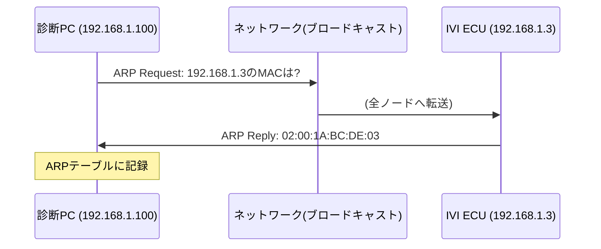

## 概要
ARP(**Address Resolution Protocol**)は、IPアドレスから対応する [[mac-address]] を調べるためのプロトコルです。「このIPの機器のMACは?」とネットワークに問い合わせ(ARPリクエスト)、該当機器が自分のMACを返答(ARPリプライ)します。

## なぜ必要か
[[ip]] は論理的な宛先を示しますが、[[ethernet]] が実際にフレームを届けるには物理アドレスであるMACが必要です。ARPはこの「IP→MAC」の橋渡しを担う、L3とL2をつなぐ重要な仕組みです。

## 自動運転での利用例
車載Ethernetでも、ECU同士がIP通信を始める前にARPでMACを解決します。解析時にARPの様子を見ると、どのECUがどのIPを持ち、いつ通信を開始したかが分かります。ARPが返らない場合は相手ECUの不在や設定ミスを疑います。

## 関連用語
解決対象が [[mac-address]]、問い合わせの元になるのが [[ip]]、フレームを運ぶのが [[ethernet]] です。

## 次に学ぶべき内容
ARPが補助する論理アドレス [[ip]] の仕組みを復習しましょう。

## 図解

