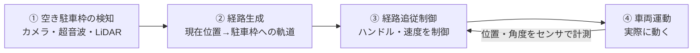
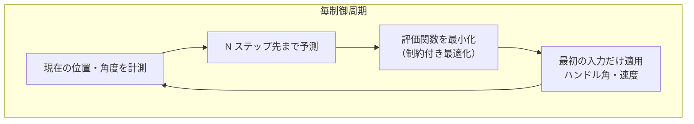
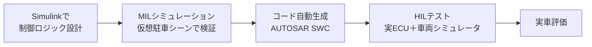

## 自動駐車を制御工学で見る

自動駐車（Automated Parking Assist / Valet Parking）は、これまでの記事で学んだ制御工学の総合応用です。「目標の駐車位置」に車をぴったり収めるという、典型的な **目標追従＋フィードバック制御** の問題として定式化できます。



大きく **知覚 → 計画 → 制御** の3段で、制御工学が主役なのは③の「経路追従制御」です。

## 車両モデル（制御対象）

低速の駐車では **自転車モデル（kinematic bicycle model）** がよく使われます。車の位置 \((x, y)\)、向き \(\theta\)、速度 \(v\)、ハンドル角 \(\delta\) の関係は、

$$
\dot{x} = v\cos\theta,\quad
\dot{y} = v\sin\theta,\quad
\dot{\theta} = \frac{v}{L}\tan\delta
$$

ここで \(L\) はホイールベース（前後輪間距離）。これが [[block-diagram]] における「制御対象 \(P\)」にあたります。非線形なので、伝達関数（[[transfer-function]]）で扱うには動作点まわりで線形化するか、非線形のまま MPC で扱います。

## 制御量と目標

| 制御したい量 | 目標 | アクチュエータ |
|---|---|---|
| 横方向位置・車体角 | 駐車枠の中心線に一致 | ステアリング（ハンドル角 \(\delta\)） |
| 前後位置・速度 | 目標停止位置で \(v=0\) | アクセル・ブレーキ |

## 経路追従の制御則

### ① PID による横方向制御

最もシンプルには、目標経路からの **横偏差 \(e\)**（横方向のずれ）をフィードバックし、PID（[[control-engineering]]）でハンドル角を決めます。

$$
\delta(t) = K_p\, e(t) + K_i \int_0^t e\, d\tau + K_d\, \dot{e}(t)
$$

行き過ぎ（オーバーシュート）は壁や隣の車への接触につながるため、減衰比 \(\zeta\) を 1 に近づけ（[[transfer-function]]）、オーバーシュートを抑える設計が重要です。

### ② Pure Pursuit（純追跡）

前方の目標点を追いかける幾何学的手法。前方注視距離 \(L_d\) 先の目標点への角度 \(\alpha\) から、

$$
\delta = \arctan\!\left(\frac{2L\sin\alpha}{L_d}\right)
$$

とハンドル角を決めます。実装が簡単で低速の駐車に向きます。

### ③ モデル予測制御（MPC）

先の数ステップを予測し、**制約（車体寸法・舵角限界・障害物）を守りながら** 評価関数を最小化する入力列を毎周期計算します。

$$
\min_{u_0,\dots,u_{N-1}} \sum_{k=0}^{N-1} \Big( \|x_k - x_k^{\text{ref}}\|_Q^2 + \|u_k\|_R^2 \Big)
\quad \text{s.t. 車両モデル・障害物制約}
$$

障害物回避と車庫入れの狭い空間を扱えるため、実際の自動駐車で採用が進んでいます。



## Python による縦列駐車の簡易シミュレーション

```python
import numpy as np
import matplotlib.pyplot as plt

L = 2.7            # ホイールベース [m]
dt = 0.1
Kp, Kd = 0.8, 0.4  # 横偏差に対するPDゲイン

# 目標経路：y=0 の直線に沿って後退駐車する想定
x, y, theta, v = 0.0, 1.5, 0.0, -1.0   # 初期：目標線から1.5mずれ、後退
e_prev = y
xs, ys = [x], [y]

for _ in range(200):
    e = 0.0 - y                 # 横偏差（目標 y=0 とのずれ）
    de = (e - e_prev) / dt
    delta = Kp*e + Kd*de        # PD制御でハンドル角
    delta = np.clip(delta, -0.6, 0.6)   # 舵角制限 [rad]
    # 自転車モデルで更新
    x += v*np.cos(theta)*dt
    y += v*np.sin(theta)*dt
    theta += v/L*np.tan(delta)*dt
    e_prev = e
    xs.append(x); ys.append(y)

plt.plot(xs, ys, label="車両軌跡")
plt.axhline(0, ls="--", color="gray", label="目標経路")
plt.xlabel("x [m]"); plt.ylabel("y [m]"); plt.legend()
plt.title("PD制御による横方向の経路追従")
plt.savefig("parking.png", dpi=120)
```

**数式で表すと**、ループ内は自転車モデル

$$
\theta_{k+1} = \theta_k + \frac{v}{L}\tan\delta_k\,\Delta t
$$

に、PD則 \(\delta_k = K_p e_k + K_d \dot{e}_k\) を組み合わせた閉ループで、横偏差 \(e\) をゼロへ収束させています。舵角の `clip` は物理的なハンドル角限界（制約）を表します。

## 開発・検証の流れ（MBD）

自動駐車の制御ロジックは [[matlab-simulink]] を使ったモデルベース開発で作られます。



- 仮想環境で無数の駐車シーン（縦列・並列・斜め、狭い枠、動く歩行者）を安全に試せる
- 生成コードは [[autosar]] / [[adaptive-autosar]] のコンポーネントとして車載ECUへ
- センサやアクチュエータ指令は車載ネットワーク（[[some-ip]] / [[can]] / [[adas-comm]]）で流れる

## 実システムでの課題

| 課題 | 内容 | 対策 |
|---|---|---|
| 非線形性 | 低速・大舵角で線形近似が崩れる | MPC・非線形制御 |
| 制約 | 車体寸法・舵角・障害物 | MPC で明示的に制約化 |
| センサ誤差・遅延 | 位置推定のノイズ、通信遅延 | フィルタ（カルマン）・ロバスト設計 |
| 切り返し | 一度で入らない狭い枠 | 経路計画で前進・後退を分割 |

## まとめ

- 自動駐車は「知覚 → 計画 → 制御」の総合問題で、制御工学が経路追従を担う
- 車両は自転車モデルで表され、[[block-diagram]] の制御対象 \(P\) になる
- 制御則は PID → Pure Pursuit → **MPC** と、制約と障害物対応で高度化
- オーバーシュート抑制（減衰比設計、[[transfer-function]]）が接触回避に直結
- 開発は [[matlab-simulink]] のモデルベース開発、実装は [[autosar]] と車載ネットワーク
