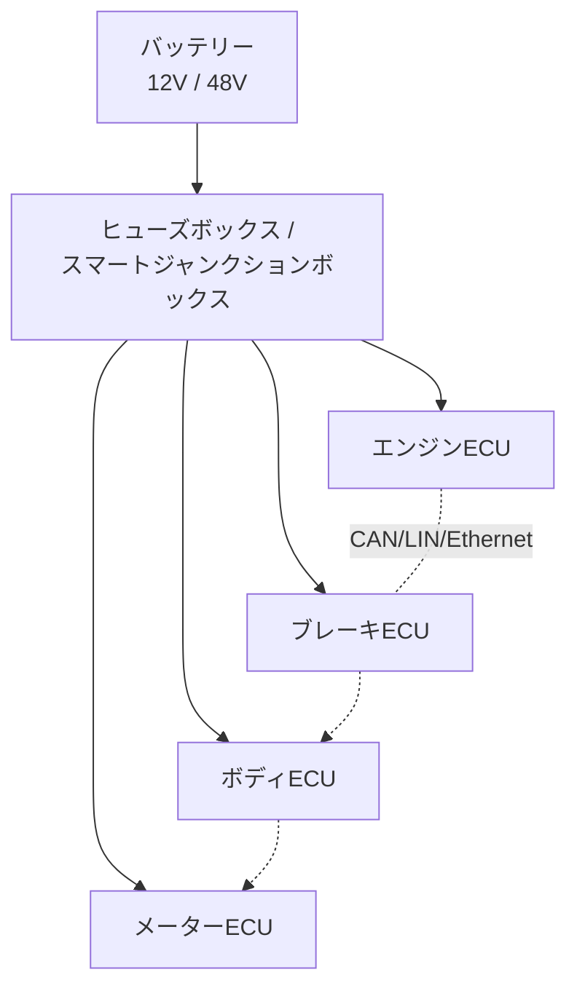

## 概要
現代の自動車には100個以上のECU（電子制御ユニット）と数kmのワイヤーハーネスが搭載されています。電気の基礎知識が車の設計・整備・診断に直結します。「電気の基礎（V=RI）」を自動車の文脈で理解しましょう。

## 車載電源システムの概要

バッテリーからヒューズボックスを経て、多数のECUへ電力とネットワークが分配されます。

## 12Vバッテリーと電圧降下

鉛バッテリーの公称電圧は12V（満充電で12.6V、放電限界11.8V）。始動時にはスターターモーターが大電流を引くため、内部抵抗による**電圧降下**が起きます。オームの法則 \(V_{\text{drop}} = I \times R\) そのものです。

$$V_{\text{drop}} = I_{\text{starter}} \times R_{\text{internal}} = 200\,\text{A} \times 0.01\,\Omega = 2\,\text{V}$$

つまり始動の瞬間、端子電圧は 12V → 約10V まで落ちます。バッテリーが劣化して内部抵抗が増えると、この降下が大きくなり始動不良になります。

**エンジン動作中の主な消費電流（12V系）**：

| 負荷 | 電流 |
|---|---|
| ECU群（全体） | 20 A |
| エアコンブロア | 15 A |
| リアデフォッガー | 12 A |
| シートヒーター | 10 A |
| 電動パワステ | 8 A |
| ヘッドライト（LED） | 5 A |

合計 約70Aで、オルタネーターには \(70\,\text{A} \times 14.4\,\text{V} \approx 1\,\text{kW}\) の発電が求められます。

## オルタネーター（発電機）

オルタネーターはエンジンでベルト駆動され、14V前後の直流を発電します。プーリー比でエンジンより高速に回り、アイドリングでも発電できるよう設計されています。

| エンジン回転数 | オルタネーター回転数 | 発電電流（80A定格） |
|---|---|---|
| 600 rpm（アイドル） | 1,500 rpm | 約40 A |
| 1,000 rpm | 2,500 rpm | 80 A（定格） |
| 2,000 rpm以上 | 5,000 rpm | 80 A（頭打ち） |

> アイドリングで電装品を多用するとバッテリーが持ち出しになるのは、低回転では発電が追いつかないためです。

## ワイヤーハーネスの設計

電線は「許容電流」と「電圧降下」の2つで太さを選びます。電圧降下は往復距離（行き＋帰り）で計算します。

$$V_{\text{drop}} = I \times R_{\text{per\_m}} \times (2L)$$

| 断面積 | 許容電流 | 抵抗 [Ω/m] |
|---|---|---|
| 0.5 sq | 10 A | 0.038 |
| 0.85 sq | 13 A | 0.022 |
| 1.25 sq | 19 A | 0.015 |
| 2.0 sq | 25 A | 0.0092 |
| 3.0 sq | 32 A | 0.0062 |

例：10Aを3m先へ送る場合、0.5sqでは \(10 \times 0.038 \times 6 = 2.28\,\text{V}\) も降下してしまいます。許容降下0.5V以内に収めるには 1.25sq以上が必要です。配線が長い・電流が大きいほど太い電線が要る、というのがハーネス設計の基本です。

## ECUの電源回路

ECUにはエンジン状態に応じて3系統の電源が供給されます。

| 電源 | 供給タイミング | 用途 |
|---|---|---|
| 常時電源（+B） | 常時（バッテリー直結） | メモリ保持・時計・盗難防止（暗電流 5〜15mA） |
| IG電源 | キーON / エンジンON | ECU本体の動作電源 |
| ACC電源 | ACC位置以降 | ラジオ・ナビ・パワーウィンドウ |

ECU内部では12Vを段階的に降圧します（12V → 5V → 3.3V → CPUコア1.2V）。降圧方式には2種類あり、効率が大きく異なります。

| 方式 | 効率 | 特徴 |
|---|---|---|
| リニアレギュレーター | 低い（\(\eta = V_{out}/V_{in}\)） | 差分を熱で捨てる。12V→5Vなら約42% |
| スイッチングDC-DC | 高い（約90%） | 発熱が少なく大電流向き |

12V→5Vで1A供給する場合、リニア方式は \((12-5)\times 1 = 7\,\text{W}\) も発熱します。大電流ではスイッチング方式が必須です。

## 48V マイルドハイブリッドシステム

最新車では 12V に加えて **48V** 系統を併用します。電力 \(P = VI\) より、同じ電力なら電圧を4倍にすれば電流は1/4になり、配線を細く・軽くできるのが狙いです。

| 項目 | 内容 |
|---|---|
| 主なコンポーネント | BSG（ベルト駆動スタータージェネレーター 12kW級）、48Vリチウム電池 0.5〜1kWh、双方向DC-DC |
| メリット | 回生制動で燃費10〜15%向上／電動過給／滑らかなアイドルストップ／完全EVより安価 |
| 採用車種 | Mercedes A-Class, BMW 5シリーズ, Audi A6 など |

**回生ブレーキのエネルギー**は運動エネルギーの式で見積もれます。

$$E = \frac{1}{2}mv^2 \times \eta_{\text{regen}}$$

車重1500kgが100km/h（27.8 m/s）から停止する際の運動エネルギーは約580 kJ。回収効率60%なら約 **97 Wh** を電池に戻せます。これを繰り返し利用することで燃費が改善します。
