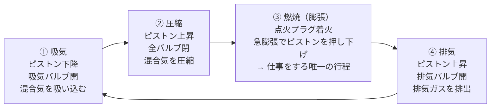
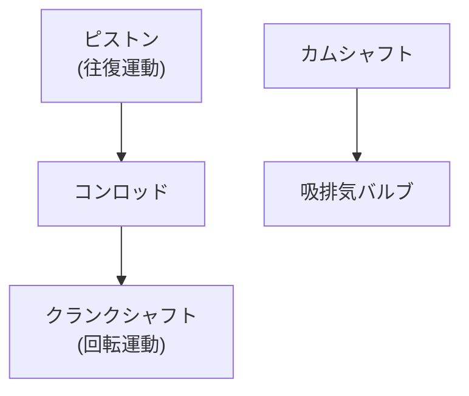
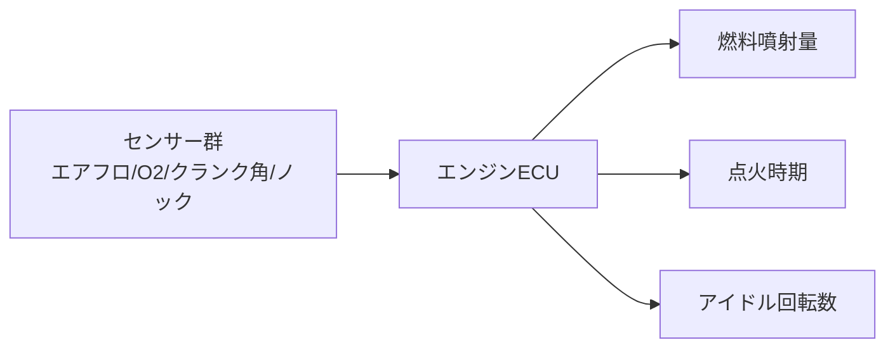

## 概要
自動車のガソリンエンジンは「燃料の燃焼エネルギーを回転運動に変換する機械」です。4ストロークサイクルの仕組みを理解することで、燃費・出力・排気ガス・エンジン制御（ECU）すべての動作が繋がります。

## 4ストロークサイクル

ガソリンエンジンは「吸気→圧縮→燃焼→排気」の4行程を繰り返します。クランクが2回転（720°）で1サイクルが完了し、仕事をするのは③燃焼行程だけです。

| 行程 | クランク角 | ピストン | バルブ |
|---|---|---|---|
| ① 吸気 | 0〜180° | 下降 | 吸気開 |
| ② 圧縮 | 180〜360° | 上昇 | 全閉 |
| ③ 燃焼 | 360〜540° | 下降 | 全閉 |
| ④ 排気 | 540〜720° | 上昇 | 排気開 |

## 圧縮比と熱効率

圧縮比 $\varepsilon$ は、ピストンが下死点（BDC）と上死点（TDC）にあるときの燃焼室容積の比です。

$$\varepsilon = \frac{V_{BDC}}{V_{TDC}}$$

オットーサイクルの理論熱効率は圧縮比だけで決まり、圧縮比が高いほど効率が上がります（$\gamma \approx 1.4$ は比熱比）。

$$\eta_{th} = 1 - \frac{1}{\varepsilon^{\gamma - 1}}$$

| エンジン | 圧縮比 ε | 理論熱効率 |
|---|---|---|
| ガソリン（通常） | 10.5 | 約61% |
| ガソリン（高圧縮） | 13.0 | 約65% |
| ディーゼル | 17.0 | 約70% |

ただし圧縮比を上げすぎるとガソリンが自己着火する**ノッキング**が起きるため、ガソリンエンジンには上限があります。ディーゼルが高効率なのは、この制約がなく高圧縮にできるからです。

## エンジンの主要部品

ピストンの往復運動を、コンロッドとクランクシャフトで回転運動に変換するのが基本構造です。

| 部品 | 役割 |
|---|---|
| シリンダーブロック | エンジン本体。シリンダー穴を加工（鋳鉄/アルミ） |
| シリンダーヘッド | 燃焼室の蓋。バルブ・点火プラグ・カムを搭載 |
| ピストン | 上下運動する可動部品。リングでガスをシール |
| コンロッド | 往復運動↔回転運動を変換 |
| クランクシャフト | 動力を取り出す主軸 |
| カムシャフト | バルブ開閉タイミングを制御 |
| 点火プラグ | 火花で点火（約30,000kmで交換） |
| ウォーターポンプ | 冷却水を循環（適正水温80〜100°C） |

## 排気量と出力の関係

排気量（総行程容積）はボア径 $D$、ストローク $L$、気筒数 $N$ で決まります。

$$V_h = \frac{\pi}{4} D^2 \times L \times N$$

| エンジン | ボア×ストローク×気筒 | 排気量 |
|---|---|---|
| 軽自動車 3気筒 | 60×68mm × 3 | 約577 cc |
| コンパクト 4気筒 | 73×89mm × 4 | 約1,490 cc |
| 2.0L 4気筒 | 83×92mm × 4 | 約1,991 cc |
| V6 3.5L | 94×83mm × 6 | 約3,456 cc |
| V8 5.0L | 100×100mm × 8 | 約6,283 cc |

**比出力（PS/L）** はエンジンの「効率の良さ・チューニング度」を表します。NA軽自動車が約70 PS/Lなのに対し、F1エンジンは650 PS/L超に達します。

## エンジン制御（ECU）との関連

ECUは各種センサーの入力をもとに、燃料・点火・アイドルをリアルタイムに制御します。

| 制御対象 | 主なセンサー入力 | 目標 |
|---|---|---|
| 燃料噴射量 | エアフロ・O2・回転数 | 理論空燃比 A/F = 14.7（ストイキ） |
| 点火時期 | クランク角・ノックセンサー | 最大トルク点（MBT）付近・ノック回避 |
| アイドル回転数 | スロットル全閉・A/C信号 | 700〜850 rpm |

理論空燃比（ストイキ）を保つことで、三元触媒が最も効率よく排気ガスを浄化できます。O2センサーで排気を監視し、噴射量を補正し続ける**フィードバック制御**が現代エンジンの基本です。
