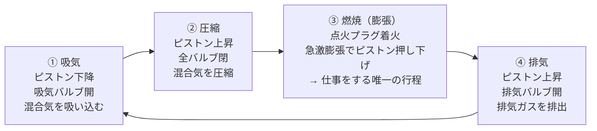

## 概要
自動車のガソリンエンジンは「燃料の燃焼エネルギーを回転運動に変換する機械」です。4ストロークサイクルの仕組みを理解することで、燃費・出力・排気ガス・エンジン制御（ECU）すべての動作が繋がります。

## 4ストロークサイクル



```python
import numpy as np
import matplotlib.pyplot as plt

# 4ストロークのクランク角と行程の対応
strokes = [
    (  0, 180, "① 吸気",    "skyblue"),
    (180, 360, "② 圧縮",    "orange"),
    (360, 540, "③ 燃焼",    "red"),
    (540, 720, "④ 排気",    "gray"),
]

fig, ax = plt.subplots(figsize=(10, 2))
for start, end, name, color in strokes:
    ax.barh(0, end - start, left=start, color=color, alpha=0.7, height=0.5)
    ax.text((start + end) / 2, 0, name, ha="center", va="center", fontsize=10)
ax.set_xlim(0, 720)
ax.set_xticks(range(0, 721, 180))
ax.set_xticklabels(["0°", "180°\nTDC→BDC", "360°\nBDC→TDC", "540°\nTDC→BDC", "720°"])
ax.set_yticks([])
ax.set_title("4ストロークサイクル（クランク角 0〜720°）")
plt.tight_layout()
plt.show()
```

## 圧縮比と熱効率

$$\varepsilon = \frac{V_{BDC}}{V_{TDC}}$$

$$\eta_{th} = 1 - \frac{1}{\varepsilon^{\gamma - 1}}$$

```python
def otto_efficiency(compression_ratio, gamma=1.4):
    """オットーサイクルの理論熱効率"""
    return 1 - 1 / compression_ratio**(gamma - 1)

cr_range = np.linspace(5, 20, 100)
eta = otto_efficiency(cr_range)

plt.figure(figsize=(8, 4))
plt.plot(cr_range, eta * 100, "b-", lw=2)
plt.xlabel("圧縮比 ε")
plt.ylabel("理論熱効率 [%]")
plt.title("圧縮比と熱効率（オットーサイクル）")
plt.grid(True)

# 代表的な圧縮比
typical = {
    "ガソリン（通常）": (10.5, "red"),
    "ガソリン（高圧縮）": (13.0, "orange"),
    "ディーゼル": (17.0, "green"),
}
for name, (cr, color) in typical.items():
    eta_val = otto_efficiency(cr) * 100
    plt.axvline(cr, color=color, linestyle="--", alpha=0.7)
    plt.annotate(f"{name}\nε={cr}\nη={eta_val:.0f}%",
                 xy=(cr, eta_val), xytext=(cr+0.2, eta_val - 5), fontsize=8)
plt.show()
```

## エンジンの主要部品

```python
engine_components = {
    "シリンダーブロック": "エンジン本体。シリンダー穴が加工されている。材質: 鋳鉄またはアルミ",
    "シリンダーヘッド":   "燃焼室の蓋。吸排気バルブ・点火プラグ・カムシャフトを搭載",
    "ピストン":          "上下運動する可動部品。アルミ合金製。ピストンリングでガスシール",
    "コンロッド":        "ピストンとクランクシャフトを連結。往復運動↔回転運動を変換",
    "クランクシャフト":  "コンロッドの往復を回転に変換。車の動力を取り出す主軸",
    "カムシャフト":      "吸排気バルブの開閉タイミングを制御。チェーン/ベルトで駆動",
    "バルブ":           "吸気・排気の開閉弁。材質: ステンレス（排気側は高温のためNi合金）",
    "点火プラグ":       "混合気に電気火花で点火。消耗品（約30,000km交換）",
    "オイルポンプ":     "エンジン各部に潤滑油を循環",
    "ウォーターポンプ": "冷却水を循環して水温を管理（適正温度: 80〜100°C）",
}

print("=== エンジン主要部品 ===")
for part, desc in engine_components.items():
    print(f"\n【{part}】")
    print(f"  {desc}")
```

## 排気量と出力の関係

$$V_h = \frac{\pi}{4} D^2 \times L \times N$$

```python
def displacement(bore_mm, stroke_mm, cylinders):
    """排気量計算"""
    bore = bore_mm / 1000   # mm → m
    stroke = stroke_mm / 1000
    Vh = np.pi / 4 * bore**2 * stroke * cylinders
    return Vh * 1e6   # m³ → cc

# 代表的なエンジン
engines = [
    ("軽自動車 3気筒",     60, 68, 3),
    ("コンパクト 4気筒",   73, 89, 4),
    ("2.0L 4気筒",         83, 92, 4),
    ("V6 3.5L",            94, 83, 6),
    ("V8 5.0L",           100, 100, 8),
    ("直4 2.0L ターボ",    83, 92, 4),
]

print(f"{'エンジン':20s} {'ボア':5s} {'ストローク':8s} {'排気量':8s}")
print("-" * 50)
for name, bore, stroke, cyl in engines:
    cc = displacement(bore, stroke, cyl)
    print(f"{name:20s} {bore:3d}mm × {stroke:3d}mm = {cc:5.0f} cc")

# 出力密度（比出力）の計算
print("\n比出力（馬力/排気量）:")
compare = [
    ("軽自動車NA", 47, 660),
    ("スポーツカーNA", 220, 2000),
    ("F1エンジン（参考）", 1050, 1600),
    ("テスラModel 3（EV）", 490, None),
]
for name, ps, cc in compare:
    if cc:
        print(f"  {name:20s}: {ps/cc*1000:.1f} PS/L")
    else:
        print(f"  {name:20s}: （排気量なし）")
```

## エンジン制御（ECU）との関連

```python
# ECUが制御する主要パラメータ
ecu_control = {
    "燃料噴射量": {
        "センサー入力": ["エアフロセンサー（吸入空気量）", "O2センサー（排気λ）",
                        "スロットル開度", "エンジン回転数"],
        "目標": "理論空燃比 A/F = 14.7（ストイキ）",
        "制御": "インジェクタ開弁時間（パルス幅 μs単位）",
    },
    "点火時期": {
        "センサー入力": ["クランク角センサー（回転数・位相）", "ノックセンサー（異常燃焼）",
                        "水温センサー", "吸気温センサー"],
        "目標": "MBT（最大トルク点）付近、ノック回避",
        "制御": "クランク角基準での点火タイミング（°BTDC）",
    },
    "アイドル回転数": {
        "センサー入力": ["スロットル全閉スイッチ", "A/Cオン信号", "電気負荷"],
        "目標": "700〜850 rpm（冷間時は高め）",
        "制御": "ISC（アイドルスピードコントロール）バルブ",
    },
}

for system, info in ecu_control.items():
    print(f"\n【{system}】")
    print(f"  入力: {', '.join(info['センサー入力'][:2])} ...")
    print(f"  目標: {info['目標']}")
    print(f"  制御: {info['制御']}")
```
