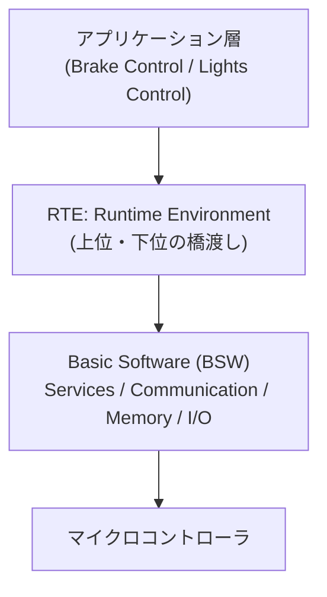

## 概要
AUTOSAR(AUTomotive Open System ARchitecture)は、車載ソフトウェアの標準アーキテクチャです。ハードに依存しない再利用可能なソフト開発を目指します。従来制御向けの **Classic Platform** と、高性能・サービス指向の **Adaptive Platform** があります。

## なぜ必要か
車載ソフトは大規模・長寿命・多サプライヤで開発されます。共通の標準が無いと互換性や再利用が困難です。AUTOSARは層構造とインターフェースを標準化し、ECU間・サプライヤ間の連携を可能にします。

## 自動運転での利用例
Adaptive Platform は POSIX ベースで、[[some-ip]] によるサービス指向通信を前提とします。自動運転のような高性能・動的なアプリは Adaptive 上で構築され、Classic(CAN中心)と共存します。

## 関連用語
通信手段として [[some-ip]] と [[can]]、次世代の通信ミドルウェアとして [[ros2-dds]]、車両全体の方向性として [[sdv]] があります。

## 次に学ぶべき内容
ロボティクス由来の通信基盤、[[ros2-dds]] へ進みましょう。

## 図解

