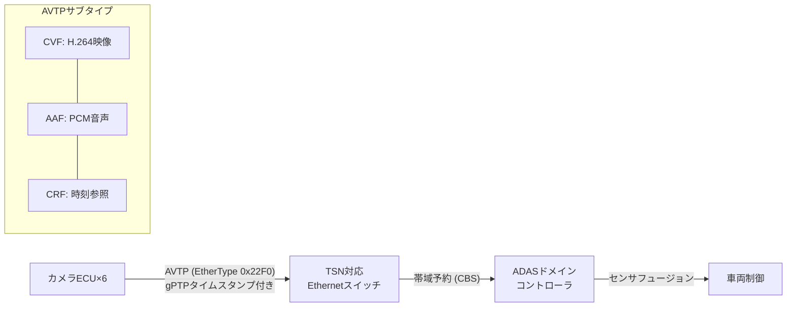

## 概要
AVTP(Audio Video Transport Protocol、**IEEE 1722**)は、車載Ethernet上で映像・音声ストリームをリアルタイム転送するプロトコルです。カメラ映像をサラウンドビューモニター(SVM)に表示したり、マイク音声をデジタルオーディオバスに流す用途に使われます。

## なぜ必要か
カメラの生映像(1080p@30fpsで約1 Gbps)をECU間で転送する場合、通常のTCP/IPでは遅延・ジッターが問題になります。AVTPはタイムスタンプ付きのストリームをEthernetフレームに直接マッピングし、[[ptp]] 時刻同期と組み合わせてマイクロ秒精度の低遅延転送を実現します。

## 仕組み
- Ethernetフレームの EtherType **0x22F0** を使用
- 各フレームにavtp_timestampを付与(gPTP基準時刻)
- 受信側は一定バッファで再生タイミングを合わせる(Presentation Time)

## 主なサブタイプ
- **CVF (Compressed Video Format)** — H.264/H.265圧縮映像
- **CRF (Clock Reference Format)** — 時刻同期専用ストリーム
- **AAF (AVTP Audio Format)** — PCM音声

## 自動運転での利用例
全周囲カメラ(6〜8台)の映像をAVTPでADAS Domain Controllerへ集約し、センサフュージョンに使います。[[tsn]] の帯域予約(CBS: Credit-Based Shaper)と組み合わせることで、映像フレームの遅延上限を保証します。

## 関連用語
時刻同期は [[ptp]]、帯域保証は [[tsn]]、ベースはもちろん [[ethernet]] です。

## 次に学ぶべき内容
映像転送の帯域保証を実現する [[tsn]] を深く理解しましょう。

## 図解

