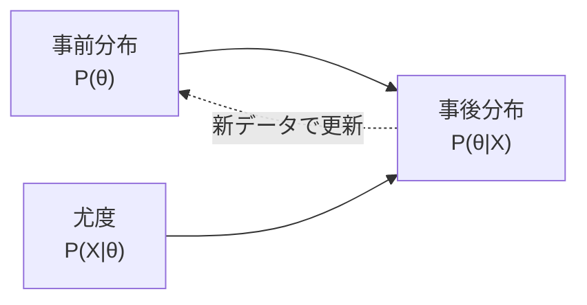

## 概要
「10回コインを投げて7回表が出た。このコインは本当に偏っているか？」――頻度論は「p値が0.05未満なら有意差あり」と答えますが、ベイズ統計は「偏りの確率分布そのもの」を与えます。ベイズ統計は**データを観測するたびに信念を更新する**枠組みで、事前知識をモデルに組み込め、小サンプルでも不確かさを定量化できます。A/Bテスト・意思決定・パラメータ推定で、「どちらが良いか」だけでなく「どれくらい良いか・どれくらい確信できるか」まで答えられます。

## 活用シーン
- **ベイズA/Bテスト**: 「B案がA案より良い確率は何%か」を直接算出して意思決定
- **パラメータ推定**: サンプルが少ない状況でも事前知識を使って不確かさ付きの推定
- **医療・品質管理**: 不良品率や治癒率の事後分布から意思決定のリスクを評価



## 主要な数式

**ベイズの定理**（パラメータ $\theta$ とデータ $X$）：

$$\underbrace{P(\theta \mid X)}_{\text{事後分布}} = \frac{\overbrace{P(X \mid \theta)}^{\text{尤度}}\;\overbrace{P(\theta)}^{\text{事前分布}}}{\underbrace{P(X)}_{\text{周辺尤度}}} \propto P(X \mid \theta)\,P(\theta)$$

周辺尤度（エビデンス）は全パラメータについての積分：

$$P(X) = \int P(X \mid \theta)\,P(\theta)\,d\theta$$

**ベータ–二項共役**：事前分布 $\theta \sim \mathrm{Beta}(\alpha,\beta)$ に $n$ 回中 $k$ 回成功を観測すると、

$$\theta \mid X \sim \mathrm{Beta}(\alpha + k,\; \beta + n - k)$$

事後平均は $\dfrac{\alpha+k}{\alpha+\beta+n}$ となる。

**ベイズ因子**（モデル $M_1$ と $M_0$ の比較）：

$$\mathrm{BF}_{10} = \frac{P(X \mid M_1)}{P(X \mid M_0)}$$

## 可視化


## ベイズの定理

```python
import numpy as np
import matplotlib.pyplot as plt
from scipy import stats

# ベイズの定理: P(θ|X) ∝ P(X|θ) × P(θ)
# 事後分布  ∝  尤度     × 事前分布

# コインの表裏（θ = 表が出る確率）を推定する例
# 事前分布: θ ~ Beta(2, 2)  →「0.5 くらいかな」という弱い信念
# データ: 10回投げて7回表

n_trials = 10
n_heads  = 7

alpha_prior, beta_prior = 2, 2          # 事前分布パラメータ
alpha_post = alpha_prior + n_heads       # 事後分布 = Beta(α+成功, β+失敗)
beta_post  = beta_prior  + (n_trials - n_heads)

theta = np.linspace(0, 1, 300)

prior     = stats.beta.pdf(theta, alpha_prior, beta_prior)
likelihood = stats.binom.pmf(n_heads, n_trials, theta)   # 正規化前
likelihood /= likelihood.max()                            # スケール合わせ（可視化用）
posterior  = stats.beta.pdf(theta, alpha_post, beta_post)

plt.figure(figsize=(8, 4))
plt.plot(theta, prior,     label=f"事前分布 Beta({alpha_prior},{beta_prior})", linestyle="--")
plt.plot(theta, likelihood,label="尤度（スケール調整）", linestyle=":")
plt.plot(theta, posterior, label=f"事後分布 Beta({alpha_post},{beta_post})", linewidth=2)
plt.xlabel("θ（表の確率）")
plt.ylabel("密度")
plt.legend()
plt.title("ベイズ更新: コインの表裏推定")
plt.tight_layout()
plt.show()

print(f"事後分布の平均: {alpha_post / (alpha_post + beta_post):.3f}")
print(f"事後分布の95% 信用区間: {stats.beta.ppf([0.025, 0.975], alpha_post, beta_post)}")
```

## 逐次ベイズ更新

```python
# データが来るたびに信念を更新する → ベイズ統計の本質
# 同じコイン推定を1投ずつ更新

rng = np.random.default_rng(42)
flips = rng.binomial(1, 0.65, size=30)  # 真の表確率 0.65

alpha, beta_p = 2, 2   # 初期事前分布
history = [(alpha, beta_p)]

for flip in flips:
    alpha  += flip
    beta_p += (1 - flip)
    history.append((alpha, beta_p))

fig, axes = plt.subplots(1, 3, figsize=(12, 4))
for ax, step in zip(axes, [1, 10, 30]):
    a, b = history[step]
    x = np.linspace(0, 1, 300)
    ax.plot(x, stats.beta.pdf(x, a, b))
    ax.axvline(0.65, color="red", linestyle="--", label="真の値")
    ax.set_title(f"{step}回観測後: Beta({a},{b})")
    ax.set_xlabel("θ")
    ax.legend()
plt.tight_layout()
plt.show()
```

## MCMC（マルコフ連鎖モンテカルロ）

```python
# 解析的に解けない複雑なモデルにはMCMCでサンプリング
# PyMC を使った線形回帰のベイズ推定

import pymc as pm
import arviz as az

# データ生成（真の傾き=2、切片=1、ノイズσ=0.5）
rng = np.random.default_rng(0)
X_obs = rng.uniform(0, 10, 50)
y_obs = 2.0 * X_obs + 1.0 + rng.normal(0, 0.5, 50)

with pm.Model() as linear_model:
    # 事前分布
    intercept = pm.Normal("intercept", mu=0, sigma=10)
    slope     = pm.Normal("slope",     mu=0, sigma=10)
    sigma     = pm.HalfNormal("sigma", sigma=1)

    # 尤度
    mu = intercept + slope * X_obs
    y  = pm.Normal("y", mu=mu, sigma=sigma, observed=y_obs)

    # MCMC サンプリング（NUTS: No-U-Turn Sampler）
    trace = pm.sample(2000, tune=1000, chains=4, random_seed=42, progressbar=False)

# 結果確認
summary = az.summary(trace, var_names=["intercept", "slope", "sigma"])
print(summary)
# →  mean  sd   hdi_3%  hdi_97%
# intercept ≈ 1.0
# slope     ≈ 2.0

az.plot_posterior(trace, var_names=["slope"], ref_val=2.0)
plt.show()
```

## ベイズ因子（モデル比較）

```python
from scipy.special import betaln

def log_bayes_factor_coin(n_heads, n_trials, alpha=1, beta=1):
    """
    H0: θ = 0.5 (公正なコイン)
    H1: θ ~ Beta(α, β) (任意の確率)
    ベイズ因子 BF10 = P(data|H1) / P(data|H0)
    """
    # H0 の周辺尤度
    log_p_h0 = stats.binom.logpmf(n_heads, n_trials, 0.5)

    # H1 の周辺尤度 (Beta-Binomial)
    log_p_h1 = (
        betaln(alpha + n_heads, beta + n_trials - n_heads)
        - betaln(alpha, beta)
        + stats.binom.logpmf(n_heads, n_trials, 0.5) * 0  # 組み合わせ項は相殺
    )
    # 簡易計算
    from math import comb, log
    p_h0 = 0.5 ** n_trials
    from scipy.special import beta as beta_fn
    p_h1 = (comb(n_trials, n_heads)
            * beta_fn(alpha + n_heads, beta + n_trials - n_heads)
            / beta_fn(alpha, beta))

    bf = p_h1 / p_h0
    return bf

for heads in [5, 7, 9, 10]:
    bf = log_bayes_factor_coin(heads, 10)
    interp = ("H0支持" if bf < 1/3 else
              "H1支持" if bf > 3  else "どちらとも言えない")
    print(f"10回中{heads}回表: BF10 = {bf:.2f}  → {interp}")
```

## ベイズ A/B テスト

```python
def bayesian_ab_test(conv_a, n_a, conv_b, n_b,
                     alpha_prior=1, beta_prior=1, n_samples=100_000):
    """
    A/B テストをベイズ的に評価
    conv_x: コンバージョン数, n_x: 試行数
    戻り値: P(B > A), 期待リフト
    """
    rng = np.random.default_rng(42)
    # 事後分布からサンプリング
    samples_a = rng.beta(alpha_prior + conv_a, beta_prior + n_a - conv_a, n_samples)
    samples_b = rng.beta(alpha_prior + conv_b, beta_prior + n_b - conv_b, n_samples)

    prob_b_better = (samples_b > samples_a).mean()
    expected_lift = ((samples_b - samples_a) / samples_a).mean() * 100

    print(f"A: {conv_a}/{n_a} = {conv_a/n_a*100:.1f}%")
    print(f"B: {conv_b}/{n_b} = {conv_b/n_b*100:.1f}%")
    print(f"P(B > A) = {prob_b_better:.1%}")
    print(f"期待リフト = {expected_lift:+.1f}%")

    # 95% 信用区間
    diff = samples_b - samples_a
    ci = np.percentile(diff, [2.5, 97.5])
    print(f"差の95%信用区間: [{ci[0]:+.4f}, {ci[1]:+.4f}]")
    return prob_b_better

# 例: A(従来) vs B(新デザイン)
bayesian_ab_test(conv_a=120, n_a=1000, conv_b=145, n_b=1000)
```

## 事前分布の選び方

| パラメータ | 推奨事前分布 | 理由 |
|---|---|---|
| 確率 p ∈ [0,1] | Beta(1,1) — 無情報 / Beta(α,β) — 情報あり | 共役事前分布、解析的に解ける |
| 平均 μ ∈ ℝ | Normal(0, σ) | 連続値、対称 |
| 分散 σ > 0 | HalfNormal / Exponential | 正値制約 |
| カウント λ > 0 | Gamma | ポアソン分布の共役 |
| 多クラス確率 | Dirichlet | 多項分布の共役 |

## よくある間違いと対処法

1. **事前分布を強くしすぎる** → 情報のない場合は無情報事前分布（`Beta(1,1)` や `Normal(0, 10)`）を使う。強い事前分布はデータが少ない場合に支配的になる。
2. **信用区間と信頼区間を混同する** → ベイズの95%信用区間（HDI）は「θがこの区間にある確率が95%」という直感的な意味。頻度論の95%信頼区間は「この方法で繰り返せば95%の区間が真値を含む」という意味で異なる。
3. **MCMCの収束を確認しない** → `az.summary()` の `r_hat` が1.01以上なら収束していない。`chains=4` に増やし `tune=2000` を増やすか、モデルを再設計する。
4. **計算コストを見積もらない** → MCMCはサンプル数×パラメータ数×チェーン数だけ計算が必要。大規模モデルには変分推論（ADVI）やRLAP近似を検討する。

## 頻度論 vs ベイズ 比較

| 観点 | 頻度論 | ベイズ |
|---|---|---|
| 確率の解釈 | 長期的な頻度 | 不確かさの度合い |
| パラメータ | 固定した未知値 | 確率変数 |
| 結果の表現 | 信頼区間（95% CI）| 信用区間（HDI） |
| 事前知識の組み込み | 難しい | 事前分布として自然に組み込む |
| 計算コスト | 低い | MCMC など高コスト |
| サンプルサイズ | 大サンプルで強力 | 小サンプルでも機能する |

## まとめ

- ベイズ更新: 事後分布 ∝ 尤度 × 事前分布（データが増えると事後が事前を上書きしていく）
- 共役事前分布（ベータ-二項など）は解析的に解けて高速
- 複雑なモデルには PyMC + NUTS（MCMC）でサンプリング。`r_hat ≈ 1.0` で収束確認
- 95%信用区間（HDI）は「パラメータがこの範囲にある確率が95%」という直感的な意味
- ベイズA/Bテストは「B > A の確率が何%か」を直接算出できるため意思決定に使いやすい
