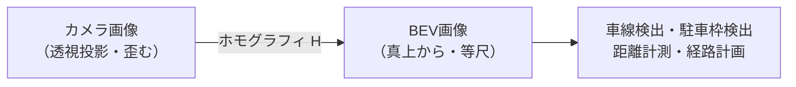
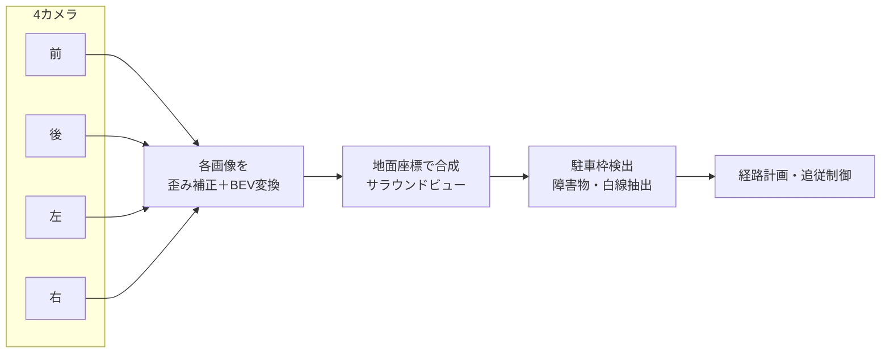

## BEV変換とは

**BEV（Bird's Eye View、鳥瞰図／俯瞰図）変換** とは、車体に取り付けたカメラの「斜め前を見た画像」を、**真上から見下ろした地図のような画像**に変換する画像処理です。**IPM（Inverse Perspective Mapping、逆透視変換）** とも呼ばれます。


カメラ画像では遠くのものほど小さく・狭く歪み、平行な車線は遠方で1点に収束します。BEV変換をかけると平行線が平行に戻り、**実世界の距離・位置関係がそのまま測れる**ようになります。自動駐車や車線認識、サラウンドビュー（アラウンドビューモニタ）の基盤技術です。



## なぜBEVが必要か

| 課題（カメラ視点） | BEVでの解決 |
|---|---|
| 遠近で物体サイズが変わる | 距離に依らず一定スケール |
| 平行な車線が交わって見える | 平行のまま → 車線幅を正確に測れる |
| 複数カメラの画像を統合しにくい | 共通の地面座標に合成できる（サラウンドビュー） |
| 障害物までの距離が分からない | 地面上の実距離 [m] を直接読める |

## 数学的な原理：ホモグラフィ

「平面（地面）を別の平面（俯瞰図）へ写す」変換は、**ホモグラフィ（射影変換）** と呼ばれる \(3\times3\) 行列 \(H\) で表せます。同次座標を使い、

$$
\begin{bmatrix} x' \\ y' \\ w' \end{bmatrix}
= H
\begin{bmatrix} u \\ v \\ 1 \end{bmatrix}
=
\begin{bmatrix} h_{11} & h_{12} & h_{13} \\ h_{21} & h_{22} & h_{23} \\ h_{31} & h_{32} & h_{33} \end{bmatrix}
\begin{bmatrix} u \\ v \\ 1 \end{bmatrix}
$$

変換後の画像座標は、同次座標を \(w'\) で割って得ます。

$$
X = \frac{x'}{w'} = \frac{h_{11}u + h_{12}v + h_{13}}{h_{31}u + h_{32}v + h_{33}},\qquad
Y = \frac{y'}{w'} = \frac{h_{21}u + h_{22}v + h_{23}}{h_{31}u + h_{32}v + h_{33}}
$$

\(H\) は自由度8（スケール不定のため9成分−1）。**対応点が4組あれば解ける**のがポイントです。

## 4点対応で変換行列を求める

BEV変換は「カメラ画像上で地面の四角形（台形に見える）を選ぶ → それを俯瞰図の長方形に対応させる」だけで作れます。

```python
import cv2
import numpy as np

# カメラ画像上の4点（地面の台形。遠方ほど内側に寄る）
src = np.float32([
    [580, 460],   # 左上（遠く・左車線）
    [700, 460],   # 右上（遠く・右車線）
    [1040, 680],  # 右下（手前・右車線）
    [240, 680],   # 左下（手前・左車線）
])
# 俯瞰図での対応点（長方形。実世界の平行線に対応）
dst = np.float32([
    [300, 0],
    [980, 0],
    [980, 720],
    [300, 720],
])

# ホモグラフィ行列 H を計算（4点対応）
H = cv2.getPerspectiveTransform(src, dst)
print("H =\n", np.round(H, 4))
```

**数式で表すと**、`getPerspectiveTransform` は4組の対応点 \((u_i,v_i)\to(X_i,Y_i)\) が

$$
X_i(h_{31}u_i + h_{32}v_i + 1) = h_{11}u_i + h_{12}v_i + h_{13}
$$

（Yも同様）を満たすよう連立方程式を解き、\(3\times3\) 行列 \(H\) を一意に決めています。

```python
# 画像をBEVへ変換（ワープ）
img = cv2.imread("road.jpg")
bev = cv2.warpPerspective(img, H, (1280, 720))
cv2.imwrite("bev.jpg", bev)

# 逆変換（BEV → カメラ視点）は逆行列
H_inv = np.linalg.inv(H)
back = cv2.warpPerspective(bev, H_inv, (1280, 720))
```

**数式で表すと**、`warpPerspective` は出力画素 \((X,Y)\) ごとに \(H^{-1}\) で入力座標 \((u,v)\) を逆算し、双一次補間で画素値を埋めます（バックワードワーピング）。逆変換に \(H^{-1}\) を使えるのはホモグラフィが可逆だからです。

## カメラパラメータから求める方法

対応点を手で選ぶ代わりに、**カメラの内部・外部パラメータ**が分かっていれば理論的に \(H\) を導けます。ピンホールカメラモデルでは、世界座標 \((X, Y, Z)\) と画像座標 \((u, v)\) が

$$
s \begin{bmatrix} u \\ v \\ 1 \end{bmatrix}
= K\, [R \mid t]
\begin{bmatrix} X \\ Y \\ Z \\ 1 \end{bmatrix}
$$

で結ばれます。\(K\) は内部パラメータ（焦点距離・光学中心）、\(R, t\) は回転・並進（カメラの取付姿勢）。地面を \(Z = 0\) と置くと \(Z\) の列が消え、\((X, Y)\) と \((u, v)\) を結ぶ \(3\times3\) のホモグラフィに帰着します。

$$
s \begin{bmatrix} u \\ v \\ 1 \end{bmatrix}
= K\,[\,r_1 \; r_2 \; t\,]
\begin{bmatrix} X \\ Y \\ 1 \end{bmatrix}
= H_{\text{地面}} \begin{bmatrix} X \\ Y \\ 1 \end{bmatrix}
$$

```python
# 内部パラメータ K と外部パラメータ R,t から地面ホモグラフィを構成
def ground_homography(K, R, t):
    # 地面 Z=0 なので R の1,2列目と t を使う
    H_cam = K @ np.column_stack([R[:, 0], R[:, 1], t])
    return np.linalg.inv(H_cam)   # 画像→地面(BEV)
```

**数式で表すと**、上の関数は \(H_{\text{地面}} = K[r_1\ r_2\ t]\)（世界→画像）を作り、その逆 \(H_{\text{地面}}^{-1}\)（画像→BEV）を返しています。

## 事前の歪み補正が必須

広角・魚眼カメラ（車載の周辺監視で多用）はレンズ歪みが大きいため、BEV変換の前に **歪み補正（undistortion）** をかけます。半径方向歪みは

$$
u_{\text{corr}} = u\,(1 + k_1 r^2 + k_2 r^4 + k_3 r^6), \quad r^2 = u^2 + v^2
$$

でモデル化され、`cv2.undistort` で補正します。これを飛ばすと直線が曲がり、BEV上の距離がずれます。

```python
undistorted = cv2.undistort(img, K, dist_coeffs)
bev = cv2.warpPerspective(undistorted, H, (1280, 720))
```

## 自動駐車・ADASでの応用



- **サラウンドビューモニタ**：前後左右4カメラのBEVを地面座標で合成し、車を真上から見た映像を生成
- **駐車枠検出**：BEV上では白線が平行・等尺になるため、枠のサイズ・角度を正確に測れる（[[auto-parking-control]] の目標位置になる）
- **車線認識**：平行線として扱えるので曲率・車線幅の推定が安定
- **距離計測**：地面上の実距離 [m] が直接読め、障害物までの余裕を判断

BEVで得た駐車枠の中心線が、制御工学側の「目標経路」になります。知覚（BEV）→計画→制御という流れは [[auto-parking-control]] を参照してください。

## 限界と注意点

| 限界 | 内容 |
|---|---|
| 平面仮定 | 地面が平らな前提。段差・坂・立体物は歪む（背の高い物体は伸びる） |
| 遠方の精度 | 遠くほど1画素が広い実距離に対応し、解像度・精度が落ちる |
| キャリブレーション依存 | 取付角のずれがBEV全体の歪みに直結。定期的な校正が必要 |
| 動的物体 | 歩行者・他車は地面上の点ではないため位置がずれる |

近年は幾何変換だけでなく、**深層学習でカメラ特徴を直接BEV空間へ写す**手法（BEVFormer、Lift-Splat-Shoot 等）も自動運転で主流になりつつあります。

## まとめ

- BEV変換はカメラの斜め視点画像を真上からの俯瞰図に直す処理（IPM）
- 地面という平面の写像なので **ホモグラフィ（\(3\times3\) 射影変換）** で表せる
- **4点対応**（`getPerspectiveTransform`）または**カメラパラメータ**から \(H\) を求める
- 事前の歪み補正が必須。魚眼ほど重要
- サラウンドビュー・駐車枠検出・車線認識の基盤で、[[auto-parking-control]] の知覚を担う
