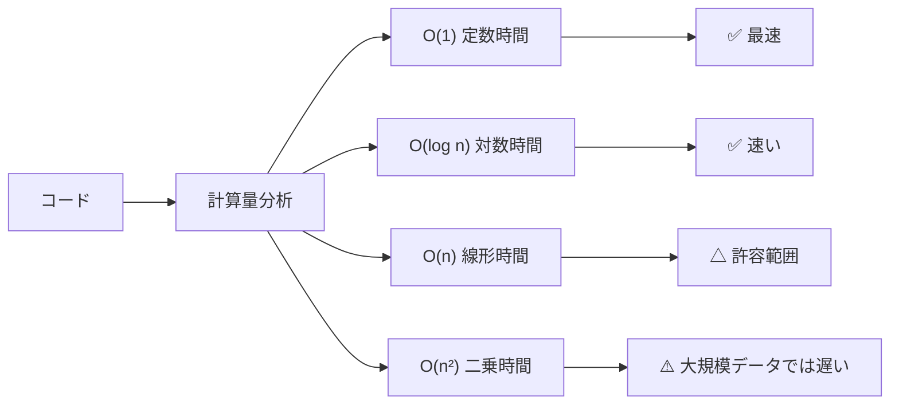

## なぜ計算量を学ぶのか

「このコードは速いか？」——これを感覚ではなく**数学的に表現する**のが計算量（時間複雑度）です。データが1万件から100万件に増えたとき、実行時間は2倍になるのか、100倍になるのか、それとも2000倍になるのか。計算量を知れば事前に予測できます。



## Big-O 記法とは

**Big-O記法（ランダウの O 記法）** は、アルゴリズムの実行ステップ数を入力サイズ \(n\) の関数として表したものです。定数倍や低次の項は無視し、**最も支配的な項だけ**を残します。

$$f(n) = 3n^2 + 5n + 100 \Rightarrow O(n^2)$$

「最悪ケースでこのオーダーより悪くならない」という**上界（upper bound）**を示します。

## 主要な計算量クラス

| 記法 | 名称 | n=100のとき | n=1,000,000のとき | 例 |
|------|------|------------|------------------|----|
| \(O(1)\) | 定数時間 | 1 | 1 | 配列の添字アクセス |
| \(O(\log n)\) | 対数時間 | ≈7 | ≈20 | 二分探索 |
| \(O(n)\) | 線形時間 | 100 | 1,000,000 | 線形探索 |
| \(O(n \log n)\) | 線形対数 | ≈700 | ≈20,000,000 | マージソート |
| \(O(n^2)\) | 二乗時間 | 10,000 | 10^12 | バブルソート |
| \(O(2^n)\) | 指数時間 | 10^30 | （現実的に不可能） | 総当たり探索 |

## 各クラスのコード例

### O(1) — 定数時間

```python
def get_first(arr):
    return arr[0]   # n に関係なく常に1ステップ

def is_even(n):
    return n % 2 == 0
```

**計算量・数式で表すと**

$$
T(n) = O(1)
$$

入力サイズ \(n\) に関係なくステップ数が一定です。

### O(log n) — 対数時間

```python
def binary_search(arr, target):
    lo, hi = 0, len(arr) - 1
    while lo <= hi:
        mid = (lo + hi) // 2
        if arr[mid] == target:
            return mid
        elif arr[mid] < target:
            lo = mid + 1
        else:
            hi = mid - 1
    return -1

# 1,000,000 件のソート済み配列でも約20回のループで終わる
```

**計算量・数式で表すと**

$$
T(n) = T(n/2) + O(1) = O(\log n)
$$

毎回探索範囲が半分になるため、最悪でも \(\log_2 n\) 回で終わります。

### O(n) — 線形時間

```python
def find_max(arr):
    max_val = arr[0]
    for x in arr:      # n 回ループ
        if x > max_val:
            max_val = x
    return max_val

def linear_search(arr, target):
    for i, x in enumerate(arr):   # 最悪 n 回
        if x == target:
            return i
    return -1
```

**計算量・数式で表すと**

$$
T(n) = O(n)
$$

要素を1回ずつ走査するため、ステップ数は \(n\) に比例します。

### O(n log n) — 線形対数時間

```python
def merge_sort(arr):
    if len(arr) <= 1:
        return arr
    mid = len(arr) // 2
    left  = merge_sort(arr[:mid])
    right = merge_sort(arr[mid:])
    return merge(left, right)

def merge(left, right):
    result = []
    i = j = 0
    while i < len(left) and j < len(right):
        if left[i] <= right[j]:
            result.append(left[i]); i += 1
        else:
            result.append(right[j]); j += 1
    return result + left[i:] + right[j:]
```

**計算量・数式で表すと**

$$
T(n) = 2T(n/2) + O(n) = O(n \log n)
$$

サイズ半分の部分問題を2つ解き、\(O(n)\) でマージします（マスター定理より）。

### O(n²) — 二乗時間

```python
def bubble_sort(arr):
    n = len(arr)
    for i in range(n):          # 外側 n 回
        for j in range(n-i-1):  # 内側 n 回 → 合計 n² 回
            if arr[j] > arr[j+1]:
                arr[j], arr[j+1] = arr[j+1], arr[j]
    return arr
```

**計算量・数式で表すと**

$$
T(n) = \sum_{i=0}^{n-1}(n-i-1) = \frac{n(n-1)}{2} = O(n^2)
$$

二重ループのため比較回数は \(n^2\) のオーダーになります。

## 実測で確認

```python
import time, random

def measure(func, n):
    arr = [random.randint(0, n) for _ in range(n)]
    t0 = time.perf_counter()
    func(arr)
    return time.perf_counter() - t0

sizes = [1000, 10000, 100000]
for n in sizes:
    t_linear  = measure(find_max, n)
    t_sort    = measure(sorted, n)         # O(n log n)
    t_bubble  = measure(bubble_sort, n) if n <= 10000 else float('inf')
    print(f"n={n:7d}: linear={t_linear*1000:.1f}ms  sort={t_sort*1000:.1f}ms  bubble={t_bubble*1000:.1f}ms")
```

典型的な出力（環境により異なる）：
```
n=   1000: linear= 0.1ms  sort= 0.1ms  bubble=  2.0ms
n=  10000: linear= 0.8ms  sort= 1.0ms  bubble=200.0ms
n= 100000: linear= 8.0ms  sort=12.0ms  bubble=  inf (省略)
```

## 空間計算量

実行に必要な**メモリ量**も Big-O で表現できます。

```python
# O(1) 空間 — 追加メモリなし
def sum_array(arr):
    total = 0          # 変数1つだけ
    for x in arr:
        total += x
    return total

# O(n) 空間 — 入力と同じサイズの配列を作る
def double_all(arr):
    return [x * 2 for x in arr]   # n 個の新配列

# O(log n) 空間 — 再帰の深さ分のスタック
def binary_search_recursive(arr, target, lo=0, hi=None):
    if hi is None: hi = len(arr) - 1
    if lo > hi: return -1
    mid = (lo + hi) // 2
    if arr[mid] == target: return mid
    if arr[mid] < target: return binary_search_recursive(arr, target, mid+1, hi)
    return binary_search_recursive(arr, target, lo, mid-1)
```

## ベストケース・最悪ケース・平均ケース

| ケース | 記法 | 意味 |
|--------|------|------|
| 最悪ケース | \(O(\cdot)\) | どんな入力でもこれ以上かからない |
| 平均ケース | \(\Theta(\cdot)\) | ランダム入力での平均 |
| ベストケース | \(\Omega(\cdot)\) | 最も幸運な入力 |

線形探索の例：
- ベスト：探したい値が先頭にある → \(O(1)\)
- 平均：真ん中あたりにある → \(O(n/2) = O(n)\)
- 最悪：末尾または存在しない → \(O(n)\)

## 計算量の落とし穴

```python
# ❌ ループの中に O(n) の操作
def naive_contains(arr):
    unique = []
    for x in arr:
        if x not in unique:   # list の in 演算子は O(n)！
            unique.append(x)
    return unique
# 全体は O(n²)

# ✅ set を使えば O(1) の検索
def fast_contains(arr):
    unique = set()
    for x in arr:
        unique.add(x)   # O(1)
    return list(unique)
# 全体は O(n)
```

```python
# ❌ 文字列の += は O(n) → ループ内で O(n²)
def build_str_bad(items):
    s = ""
    for x in items:
        s += str(x)   # 毎回新しい文字列オブジェクトを作る
    return s

# ✅ join を使えば O(n)
def build_str_good(items):
    return "".join(str(x) for x in items)
```

## まとめ

```
選択の目安:
  O(1)         → 理想。配列アクセス・ハッシュ検索
  O(log n)     → 大規模データに強い。二分探索・ヒープ操作
  O(n)         → 一度舐める処理なら許容範囲
  O(n log n)   → ソートの現実的な限界
  O(n²)        → n < 10,000 程度なら許容。それ以上は要改善
  O(2^n) 以上  → n < 20 程度しか実用にならない
```

次は具体的なデータ構造——配列・連結リスト・スタック・キュー・ハッシュテーブル・木——を学びます。
