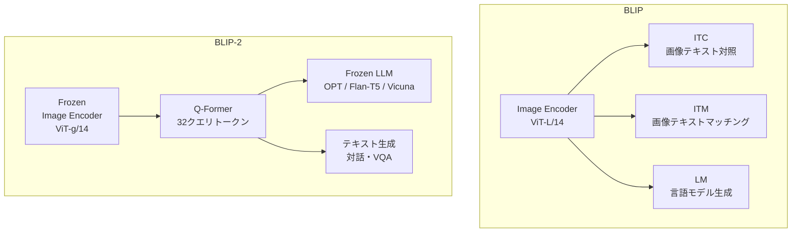

## 概要
BLIP（Bootstrapping Language-Image Pre-training）はSalesforce Researchが2022年に発表した視覚言語モデルです。CLIPの「ベクトル類似度」に留まらず、**画像キャプション生成**・**VQA（視覚的質問応答）**・**画像検索**を一つのモデルで実現します。BLIP-2（2023）はFrozen LLMと視覚エンコーダーを橋渡しするQ-Formerを導入し、GPT-4V的なマルチモーダル対話の基盤となりました。

## BLIP vs BLIP-2 のアーキテクチャ



```python
import torch
from transformers import BlipProcessor, BlipForConditionalGeneration
from transformers import Blip2Processor, Blip2ForConditionalGeneration
from PIL import Image
import requests

# BLIP: シンプルな画像キャプション生成
def load_blip():
    model_name = "Salesforce/blip-image-captioning-base"
    processor = BlipProcessor.from_pretrained(model_name)
    model = BlipForConditionalGeneration.from_pretrained(
        model_name, torch_dtype=torch.float16
    )
    return model, processor

# BLIP-2: LLM連携マルチモーダル
def load_blip2():
    model_name = "Salesforce/blip2-opt-2.7b"   # or blip2-flan-t5-xl
    processor = Blip2Processor.from_pretrained(model_name)
    model = Blip2ForConditionalGeneration.from_pretrained(
        model_name, torch_dtype=torch.float16
    )
    return model, processor
```

## 画像キャプション生成

```python
def generate_caption(image, model, processor, prompt=None, max_new_tokens=100):
    """
    画像からキャプションを生成
    prompt を与えると条件付きキャプション生成（BLIP の特徴）
    """
    device = next(model.parameters()).device

    if prompt:
        inputs = processor(image, text=prompt, return_tensors="pt").to(device, torch.float16)
    else:
        inputs = processor(image, return_tensors="pt").to(device, torch.float16)

    with torch.no_grad():
        ids = model.generate(
            **inputs,
            max_new_tokens=max_new_tokens,
            num_beams=5,
            repetition_penalty=1.3,
        )
    caption = processor.decode(ids[0], skip_special_tokens=True)
    return caption

# 条件付きキャプション vs 無条件キャプションの違い
# image = Image.open("car.jpg")
# model, proc = load_blip()

# 無条件キャプション → 画像全体の説明
# print(generate_caption(image, model, proc))
# → "a red sports car parked on the street"

# 条件付きキャプション → 特定の側面に注目
# print(generate_caption(image, model, proc, prompt="the color of the car is"))
# → "the color of the car is red"
```

## VQA（視覚的質問応答）

```python
def visual_qa(image, question, model, processor):
    """
    画像に関する自然言語の質問に答える
    VQA: Visual Question Answering
    """
    device = next(model.parameters()).device
    inputs = processor(image, question, return_tensors="pt").to(device, torch.float16)

    with torch.no_grad():
        ids = model.generate(**inputs, max_new_tokens=50)
    answer = processor.decode(ids[0], skip_special_tokens=True)
    return answer

# 使用例
# image = Image.open("dashboard.jpg")
# model, proc = load_blip()

# 車載ダッシュボード画像への質問応答
questions = [
    "What is the speed shown on the speedometer?",
    "Is the fuel gauge showing low fuel?",
    "What warning lights are on?",
    "What gear is the transmission in?",
]
# for q in questions:
#     print(f"Q: {q}")
#     print(f"A: {visual_qa(image, q, model, proc)}")
#     print()
```

## BLIP-2 のマルチモーダル対話

```python
def blip2_chat(image, conversation_history, model, processor):
    """
    BLIP-2 による画像についての会話
    conversation_history: [{"role": "user", "content": "..."}, ...]
    """
    device = next(model.parameters()).device

    # 会話履歴をプロンプトに変換
    prompt = ""
    for turn in conversation_history:
        if turn["role"] == "user":
            prompt += f"Question: {turn['content']} Answer:"
        else:
            prompt += f" {turn['content']}\nQuestion:"

    inputs = processor(image, text=prompt, return_tensors="pt").to(device, torch.float16)

    with torch.no_grad():
        ids = model.generate(
            **inputs,
            max_new_tokens=200,
            do_sample=False,
        )
    response = processor.decode(ids[0], skip_special_tokens=True)
    # プロンプト部分を除いた応答を返す
    if "Answer:" in response:
        response = response.split("Answer:")[-1].strip()
    return response

# 多ターン会話の例（自動車診断ユースケース）
# image = Image.open("engine_bay.jpg")
# model, proc = load_blip2()

conversation = [
    {"role": "user", "content": "What do you see in this image?"},
    # → "I see an engine bay of a car with several components visible..."
    {"role": "assistant", "content": "I see an engine bay with several components."},
    {"role": "user", "content": "Is there any visible damage or leaks?"},
    # → "I can see what appears to be oil residue near the..."
]
# response = blip2_chat(image, conversation, model, proc)
# print(response)
```

## Q-Formerの仕組み

```python
import torch.nn as nn

class SimpleQFormer(nn.Module):
    """
    BLIP-2 の Q-Former の概念実装
    固定した学習可能クエリが視覚特徴から情報を抽出し
    LLMが扱いやすい形に変換する
    """
    def __init__(self, num_query_tokens=32, hidden_dim=768, num_heads=12):
        super().__init__()
        # 学習可能なクエリトークン（視覚特徴を要約）
        self.query_tokens = nn.Parameter(torch.zeros(1, num_query_tokens, hidden_dim))
        nn.init.normal_(self.query_tokens, std=0.02)

        # Cross-Attention: クエリが画像特徴に注目
        self.cross_attn = nn.MultiheadAttention(hidden_dim, num_heads, batch_first=True)

        # Self-Attention: クエリ間の関係
        self.self_attn  = nn.MultiheadAttention(hidden_dim, num_heads, batch_first=True)

        self.ffn = nn.Sequential(
            nn.Linear(hidden_dim, hidden_dim * 4),
            nn.GELU(),
            nn.Linear(hidden_dim * 4, hidden_dim),
        )
        self.norm1 = nn.LayerNorm(hidden_dim)
        self.norm2 = nn.LayerNorm(hidden_dim)
        self.norm3 = nn.LayerNorm(hidden_dim)

    def forward(self, image_features):
        """
        image_features: [B, N_patches, D] 固定した画像エンコーダーの出力
        戻り値: [B, num_query_tokens, D] LLMへ渡す圧縮された視覚表現
        """
        B = image_features.size(0)
        queries = self.query_tokens.expand(B, -1, -1)

        # Cross-Attention: 画像の情報をクエリに集約
        q, _ = self.cross_attn(queries, image_features, image_features)
        queries = self.norm1(queries + q)

        # Self-Attention: クエリ間の関係を整理
        q, _ = self.self_attn(queries, queries, queries)
        queries = self.norm2(queries + q)

        # FFN
        queries = self.norm3(queries + self.ffn(queries))
        return queries

# 動作確認
qformer = SimpleQFormer(num_query_tokens=32, hidden_dim=768)
B, N_patches, D = 2, 256, 768   # ViT-g/14 の出力（16x16 patches）
img_feat = torch.randn(B, N_patches, D)
out = qformer(img_feat)
print(f"入力 (画像特徴): {img_feat.shape}")     # [2, 256, 768]
print(f"出力 (Q-Former): {out.shape}")           # [2, 32, 768]
print("→ 256トークンの視覚情報を32トークンに圧縮してLLMへ渡す")
```

## 画像−テキスト検索（Retrieval）

```python
def build_multimodal_retrieval(image_paths, captions, model, processor):
    """
    BLIP による双方向検索インデックス構築
    - テキストから画像を検索
    - 画像からテキストを検索
    """
    device = next(model.parameters()).device

    # 画像埋め込みの計算
    img_embeddings = []
    for path in image_paths:
        img = Image.open(path).convert("RGB")
        inputs = processor(images=img, return_tensors="pt").to(device)
        with torch.no_grad():
            feat = model.get_image_features(**inputs)
        img_embeddings.append(feat)
    img_embeddings = torch.cat(img_embeddings)

    # テキスト埋め込みの計算
    txt_embeddings = []
    for caption in captions:
        inputs = processor(text=caption, return_tensors="pt",
                          truncation=True, max_length=77).to(device)
        with torch.no_grad():
            feat = model.get_text_features(**inputs)
        txt_embeddings.append(feat)
    txt_embeddings = torch.cat(txt_embeddings)

    return img_embeddings, txt_embeddings

# 応用例: 車載カメラ映像のシーン検索
# queries = [
#     "pedestrian crossing the road",
#     "construction zone ahead",
#     "slippery road sign",
#     "emergency vehicle approaching",
# ]
```

## BLIP を使ったデータセット構築

```python
# BLIP の実用的なユースケース:
# 大量の画像に自動でキャプションを付けてデータセットを作る

def auto_caption_dataset(image_dir, output_json, model, processor, batch_size=8):
    """
    画像ディレクトリの全画像にキャプションを自動生成
    fine-tuning 用データセット構築に活用
    """
    import json
    from pathlib import Path

    image_paths = list(Path(image_dir).glob("**/*.jpg")) + \
                  list(Path(image_dir).glob("**/*.png"))

    dataset = []
    for i in range(0, len(image_paths), batch_size):
        batch_paths = image_paths[i:i+batch_size]
        images = [Image.open(p).convert("RGB") for p in batch_paths]

        inputs = processor(images=images, return_tensors="pt", padding=True)
        with torch.no_grad():
            ids = model.generate(**inputs, max_new_tokens=80, num_beams=3)

        for path, id_seq in zip(batch_paths, ids):
            caption = processor.decode(id_seq, skip_special_tokens=True)
            dataset.append({"image": str(path), "caption": caption})

        if (i // batch_size) % 10 == 0:
            print(f"処理済: {i+len(batch_paths)}/{len(image_paths)}")

    with open(output_json, "w", encoding="utf-8") as f:
        json.dump(dataset, f, ensure_ascii=False, indent=2)
    print(f"データセット保存完了: {output_json} ({len(dataset)} 件)")
```

## CLIP vs BLIP vs BLIP-2 まとめ

| 特性 | CLIP | BLIP | BLIP-2 |
|---|---|---|---|
| 発表 | 2021 OpenAI | 2022 Salesforce | 2023 Salesforce |
| タスク | 検索・分類 | 検索・分類・生成 | 検索・生成・対話 |
| テキスト生成 | ❌ | ✅（キャプション）| ✅（LLM連携） |
| VQA | △（分類形式のみ）| ✅ | ✅（自由記述） |
| 対話 | ❌ | ❌ | ✅ |
| ベースモデル | ViT/ResNet + Transformer | ViT + BERT系 | Frozen ViT + Q-Former + LLM |
| パラメータ数 | 400M | 200M | 4〜12B |
| 主な用途 | 画像検索・SD条件付け | キャプション・VQA | マルチモーダル対話 |
