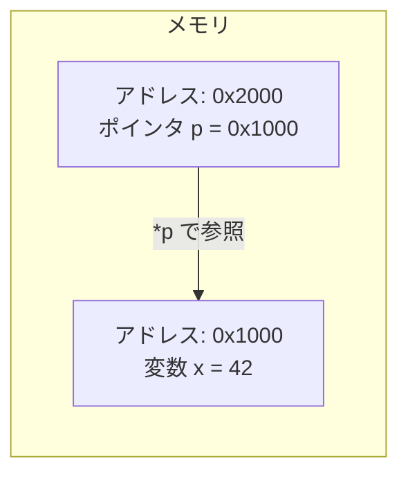
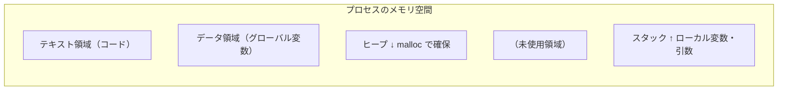

## ポインタは「住所」を持つ変数

ポインタとは**別の変数のアドレス（メモリ上の住所）を格納する変数**です。Pythonや他の高水準言語では裏に隠れている概念ですが、Cでは明示的に操作します。



現実の例えで言うと：
- **変数** = 家（実際のデータが住んでいる）
- **アドレス** = 家の住所
- **ポインタ** = 住所を書いたメモ

## ポインタの宣言と基本操作

```c
#include <stdio.h>

int main(void) {
    int x = 42;
    int *p;       /* int型へのポインタを宣言 */

    p = &x;       /* & = アドレス演算子：xのアドレスをpに代入 */

    printf("x の値:      %d\n",  x);     /* 42 */
    printf("x のアドレス: %p\n",  &x);    /* 0x7ffd... */
    printf("p の値:       %p\n",  p);     /* 0x7ffd...（xと同じ） */
    printf("*p の値:      %d\n",  *p);    /* 42（間接参照） */

    *p = 100;     /* * = 間接参照演算子：pが指す先を書き換える */
    printf("x は今: %d\n", x);  /* 100 に変わった！ */

    return 0;
}
```

| 記号 | 名前 | 意味 |
|------|------|------|
| `&x` | アドレス演算子 | 変数xのアドレスを得る |
| `*p` | 間接参照（デリファレンス） | ポインタpが指す先の値を読む/書く |
| `int *p` | ポインタ宣言 | 「int型の値を指すポインタ」という型 |

## ポインタ渡し（参照渡し）

C言語は関数の引数を**値渡し**するため、コピーが渡されます。外の変数を書き換えたいときはポインタを渡します。

```c
#include <stdio.h>

/* 値渡し：失敗例 */
void bad_swap(int a, int b) {
    int tmp = a;
    a = b;
    b = tmp;
    /* コピーを入れ替えただけ。呼び出し元は変わらない */
}

/* ポインタ渡し：正しい例 */
void swap(int *a, int *b) {
    int tmp = *a;
    *a = *b;
    *b = tmp;
}

int main(void) {
    int x = 10, y = 20;

    bad_swap(x, y);
    printf("bad_swap後: x=%d, y=%d\n", x, y);  /* 10, 20 のまま */

    swap(&x, &y);   /* アドレスを渡す */
    printf("swap後:     x=%d, y=%d\n", x, y);  /* 20, 10 に変わった */

    return 0;
}
```

## ポインタと配列

配列名は先頭要素のアドレスと等しく、ポインタとして使えます。

```c
#include <stdio.h>

int main(void) {
    int arr[5] = {10, 20, 30, 40, 50};
    int *p = arr;   /* &arr[0] と同じ */

    printf("arr[0] = %d\n", arr[0]);   /* 10 */
    printf("*p     = %d\n", *p);       /* 10 */
    printf("*(p+1) = %d\n", *(p+1));   /* 20 */
    printf("p[2]   = %d\n", p[2]);     /* 30（配列表記も使える） */

    /* ポインタのインクリメントは「型サイズ分」進む */
    p++;        /* p は arr[1] を指すように */
    printf("インクリメント後 *p = %d\n", *p);  /* 20 */

    return 0;
}
```

```mermaid
graph LR
  subgraph メモリ（連続領域）
    A0["0x1000: 10"]
    A1["0x1004: 20"]
    A2["0x1008: 30"]
    A3["0x100C: 40"]
    A4["0x1010: 50"]
  end
  P["p = 0x1000"] --> A0
  P2["p+1 = 0x1004"] --> A1
```

### ポインタを使った配列の合計

```c
int sum_array(int *arr, int n) {
    int total = 0;
    for (int i = 0; i < n; i++) {
        total += *(arr + i);   /* arr[i] と同じ */
    }
    return total;
}
```

## ポインタと文字列

```c
#include <stdio.h>
#include <string.h>

int main(void) {
    char str[] = "Hello";
    char *p = str;

    /* 文字列を1文字ずつ処理 */
    while (*p != '\0') {
        printf("%c", *p);
        p++;
    }
    printf("\n");   /* Hello */

    /* 文字列長を自分で数える */
    int len = 0;
    for (char *q = str; *q != '\0'; q++) len++;
    printf("長さ: %d\n", len);   /* 5 */

    return 0;
}
```

## NULL ポインタ

まだ何も指していないポインタには `NULL` を代入します。NULLポインタを間接参照するとクラッシュ（Segmentation fault）します。

```c
int *p = NULL;   /* 安全な初期値 */

if (p != NULL) {
    printf("%d\n", *p);   /* NULLチェック後に使う */
}

/* NULL チェックなしに参照するのは危険 */
/* printf("%d\n", *p); → Segfault! */
```

## ポインタのポインタ（二重ポインタ）

ポインタ自身のアドレスを保持するのが「ポインタのポインタ」です。

```c
#include <stdio.h>

int main(void) {
    int  x  = 42;
    int  *p = &x;     /* x を指すポインタ */
    int **pp = &p;    /* p を指すポインタのポインタ */

    printf("x   = %d\n", x);     /* 42 */
    printf("*p  = %d\n", *p);    /* 42 */
    printf("**pp= %d\n", **pp);  /* 42 */

    **pp = 999;
    printf("x は今: %d\n", x);   /* 999 */

    return 0;
}
```

二重ポインタは「関数でポインタ自体を書き換えたい」「文字列の配列（`char **argv`）」などで出てきます。

## 動的メモリ確保

スタック（ローカル変数の領域）ではなく、ヒープ（実行時に確保する領域）を使う場合は `malloc` を使います。

```c
#include <stdio.h>
#include <stdlib.h>   /* malloc, free */

int main(void) {
    int n = 5;
    int *arr = (int*)malloc(n * sizeof(int));  /* n個のint分の領域を確保 */

    if (arr == NULL) {
        fprintf(stderr, "メモリ確保失敗\n");
        return 1;
    }

    for (int i = 0; i < n; i++) arr[i] = (i + 1) * 10;
    for (int i = 0; i < n; i++) printf("%d ", arr[i]);
    printf("\n");   /* 10 20 30 40 50 */

    free(arr);   /* 必ず解放する */
    arr = NULL;  /* ダングリングポインタ防止 */
    return 0;
}
```

> ⚠️ `malloc` したメモリを `free` しないと**メモリリーク**が起きます。長時間動作するプログラム（サーバー・組み込みシステム）では致命的です。

## メモリの仕組み：スタックとヒープ



| 領域 | 確保タイミング | 解放タイミング | サイズ |
|------|--------------|--------------|--------|
| スタック | 関数呼び出し時（自動） | 関数終了時（自動） | 固定（数MB） |
| ヒープ | `malloc`（手動） | `free`（手動） | 大きく取れる |

## よくあるバグと対策

```c
/* ❌ ダングリングポインタ：解放済みメモリを参照 */
int *p = (int*)malloc(sizeof(int));
free(p);
*p = 42;   /* 未定義動作！ */

/* ✅ 対策：free後にNULLを代入 */
free(p);
p = NULL;

/* ❌ 二重解放 */
free(p);
free(p);   /* クラッシュ！ */

/* ❌ スタック変数のアドレスを返す */
int* bad_func(void) {
    int local = 42;
    return &local;   /* 関数終了でlocaleは消える → 危険 */
}
```

## 実践：ポインタを使った線形探索

```c
#include <stdio.h>

/* 配列からキーを探し、見つかったらそのアドレスを返す */
int* find(int *arr, int n, int key) {
    for (int i = 0; i < n; i++) {
        if (arr[i] == key) return &arr[i];
    }
    return NULL;
}

int main(void) {
    int data[] = {5, 3, 8, 1, 9, 2};
    int *found = find(data, 6, 8);

    if (found) {
        printf("見つかった: %d (インデックス: %ld)\n",
               *found, found - data);   /* ポインタの差 = インデックス */
    } else {
        printf("見つからなかった\n");
    }
    return 0;
}
```

## まとめ

| 操作 | 構文 | 意味 |
|------|------|------|
| アドレスを得る | `&x` | 変数xのメモリアドレス |
| ポインタ宣言 | `int *p` | intへのポインタ型 |
| 間接参照 | `*p` | pが指す先の値 |
| ポインタ算術 | `p + n` | n要素分先のアドレス |
| 動的確保 | `malloc(size)` | ヒープから領域を確保 |
| 解放 | `free(p)` | ヒープの領域を返す |

ポインタを使いこなすと、関数で変数を書き換える・大きなデータを効率よく渡す・動的なデータ構造を作るなど、Cならではの表現力が得られます。次は**構造体**で、複数のデータをひとつにまとめる方法を学びます。
