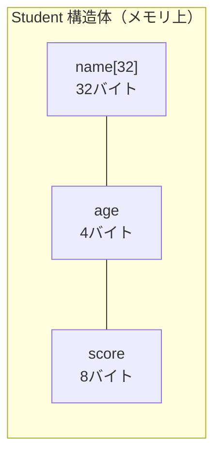
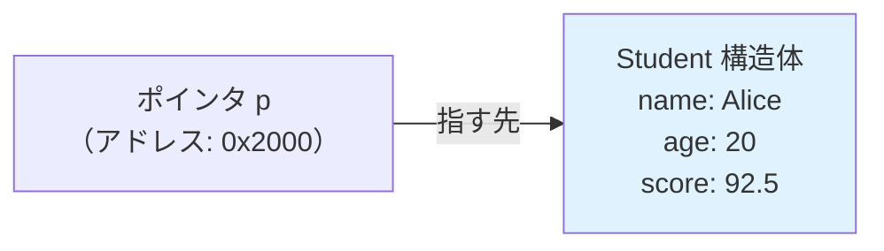

## 構造体とは

「名前・年齢・スコア」のような**複数の異なる型のデータをひとまとめ**にしたい場面があります。配列は同じ型しか入れられませんが、**構造体（struct）** は異なる型を束ねられます。



実生活で言えば、構造体は「社員証」のようなもの。名前（文字列）・社員番号（整数）・部署（文字列）という異なる種類の情報を1枚のカードにまとめています。

## 構造体の定義と使い方

```c
#include <stdio.h>
#include <string.h>

/* 構造体の定義 */
struct Student {
    char   name[32];
    int    age;
    double score;
};

int main(void) {
    /* 変数の宣言と初期化 */
    struct Student s1 = {"Alice", 20, 92.5};
    struct Student s2;

    /* メンバへのアクセス：ドット演算子 */
    s2.age = 22;
    s2.score = 85.0;
    strcpy(s2.name, "Bob");

    printf("%s: 年齢=%d, スコア=%.1f\n", s1.name, s1.age, s1.score);
    printf("%s: 年齢=%d, スコア=%.1f\n", s2.name, s2.age, s2.score);

    printf("構造体のサイズ: %zu バイト\n", sizeof(struct Student));

    return 0;
}
```

## typedef で型名を短くする

`typedef` で別名をつけると `struct Student` の代わりに `Student` と書けます。

```c
typedef struct {
    char   name[32];
    int    age;
    double score;
} Student;   /* 型名を Student と定義 */

int main(void) {
    Student s = {"Carol", 21, 78.5};
    printf("%s: %d歳, %.1f点\n", s.name, s.age, s.score);
    return 0;
}
```

## 構造体の配列

```c
#include <stdio.h>
#include <string.h>

typedef struct {
    char   name[32];
    int    age;
    double score;
} Student;

int main(void) {
    Student class[3] = {
        {"Alice", 20, 92.5},
        {"Bob",   22, 85.0},
        {"Carol", 21, 78.5},
    };

    double total = 0;
    for (int i = 0; i < 3; i++) {
        total += class[i].score;
        printf("[%d] %s: %.1f点\n", i+1, class[i].name, class[i].score);
    }
    printf("平均: %.1f点\n", total / 3);

    return 0;
}
```

## 構造体とポインタ（アロー演算子）

構造体へのポインタからメンバにアクセスするには `->` 演算子（アロー演算子）を使います。

```c
#include <stdio.h>
#include <string.h>

typedef struct {
    char   name[32];
    int    age;
    double score;
} Student;

void print_student(const Student *s) {
    /* (*s).name と書いても同じだが -> の方が読みやすい */
    printf("%s: 年齢=%d, スコア=%.1f\n", s->name, s->age, s->score);
}

void update_score(Student *s, double new_score) {
    s->score = new_score;   /* ポインタ渡しなので呼び出し元が変わる */
}

int main(void) {
    Student alice = {"Alice", 20, 92.5};

    print_student(&alice);
    update_score(&alice, 95.0);
    print_student(&alice);   /* スコアが更新されている */

    return 0;
}
```

| 記法 | 意味 |
|------|------|
| `s.name` | 変数sのメンバname |
| `p->name` | ポインタpが指す構造体のメンバname |
| `(*p).name` | 上と同じ（記法が長い） |



## 動的確保と構造体

`malloc` で構造体を動的に作れます。リスト・木などのデータ構造の基礎です。

```c
#include <stdio.h>
#include <stdlib.h>
#include <string.h>

typedef struct {
    char   name[32];
    int    age;
    double score;
} Student;

int main(void) {
    int n = 3;
    Student *students = (Student*)malloc(n * sizeof(Student));
    if (!students) { perror("malloc"); return 1; }

    strcpy(students[0].name, "Alice");  students[0].age = 20; students[0].score = 92.5;
    strcpy(students[1].name, "Bob");    students[1].age = 22; students[1].score = 85.0;
    strcpy(students[2].name, "Carol");  students[2].age = 21; students[2].score = 78.5;

    /* ポインタ算術でも同じ */
    for (Student *p = students; p < students + n; p++) {
        printf("%s: %.1f\n", p->name, p->score);
    }

    free(students);
    return 0;
}
```

## 連結リスト（linked list）

構造体の中に自分自身へのポインタを持つことで、動的なデータ構造が作れます。

```c
#include <stdio.h>
#include <stdlib.h>
#include <string.h>

typedef struct Node {
    int          value;
    struct Node *next;   /* 自己参照ポインタ */
} Node;

Node* new_node(int val) {
    Node *n = (Node*)malloc(sizeof(Node));
    n->value = val;
    n->next  = NULL;
    return n;
}

void print_list(Node *head) {
    for (Node *p = head; p != NULL; p = p->next) {
        printf("%d -> ", p->value);
    }
    printf("NULL\n");
}

void free_list(Node *head) {
    while (head) {
        Node *tmp = head->next;
        free(head);
        head = tmp;
    }
}

int main(void) {
    /* 1 -> 2 -> 3 -> NULL */
    Node *head = new_node(1);
    head->next = new_node(2);
    head->next->next = new_node(3);

    print_list(head);   /* 1 -> 2 -> 3 -> NULL */
    free_list(head);
    return 0;
}
```

## メモリのパディング（アライメント）

構造体のサイズが「メンバのサイズの合計」にならない場合があります。CPUの効率的なアクセスのため、**パディング（詰め物）** が挿入されます。

```c
#include <stdio.h>

typedef struct {
    char  a;   /* 1バイト */
    /* パディング 3バイト（intの4バイト境界に合わせる） */
    int   b;   /* 4バイト */
    char  c;   /* 1バイト */
    /* パディング 3バイト（構造体全体のサイズを4の倍数に） */
} Padded;

typedef struct {
    int   b;   /* 4バイト */
    char  a;   /* 1バイト */
    char  c;   /* 1バイト */
    /* パディング 2バイト */
} Compact;

int main(void) {
    printf("Padded  のサイズ: %zu バイト\n", sizeof(Padded));   /* 12 */
    printf("Compact のサイズ: %zu バイト\n", sizeof(Compact));  /* 8  */
    return 0;
}
```

> 💡 メモリを節約したいなら、大きい型から順に並べるのが基本です。

## 実践：学生管理システム

```c
#include <stdio.h>
#include <stdlib.h>
#include <string.h>

#define MAX_STUDENTS 100

typedef struct {
    char   name[32];
    int    id;
    double score;
} Student;

/* スコアの降順でソート（比較関数） */
int cmp_score(const void *a, const void *b) {
    const Student *sa = (const Student*)a;
    const Student *sb = (const Student*)b;
    if (sb->score > sa->score) return  1;
    if (sb->score < sa->score) return -1;
    return 0;
}

Student* find_by_id(Student *arr, int n, int id) {
    for (int i = 0; i < n; i++) {
        if (arr[i].id == id) return &arr[i];
    }
    return NULL;
}

int main(void) {
    Student students[] = {
        {"Alice", 1001, 92.5},
        {"Bob",   1002, 85.0},
        {"Carol", 1003, 78.5},
        {"Dave",  1004, 95.0},
    };
    int n = 4;

    /* ランキング表示 */
    qsort(students, n, sizeof(Student), cmp_score);
    printf("=== ランキング ===\n");
    for (int i = 0; i < n; i++) {
        printf("%d位: %s (ID:%d) %.1f点\n",
               i+1, students[i].name, students[i].id, students[i].score);
    }

    /* ID検索 */
    Student *found = find_by_id(students, n, 1003);
    if (found) {
        printf("\nID 1003 = %s (%.1f点)\n", found->name, found->score);
    }

    return 0;
}
```

出力：
```
=== ランキング ===
1位: Dave (ID:1004) 95.0点
2位: Alice (ID:1001) 92.5点
3位: Bob (ID:1002) 85.0点
4位: Carol (ID:1003) 78.5点

ID 1003 = Carol (78.5点)
```

## 構造体のまとめ

| 操作 | 構文 | 場面 |
|------|------|------|
| メンバアクセス | `s.name` | 構造体変数から直接 |
| ポインタ経由アクセス | `p->name` | ポインタ・動的確保 |
| 配列の構造体 | `arr[i].name` | 複数データの管理 |
| 関数への渡し方 | `&s`（ポインタ渡し） | 大きな構造体は値コピーを避ける |
| 動的確保 | `malloc(sizeof(Student))` | 実行時にサイズが決まる場合 |
| 自己参照 | `struct Node *next` | 連結リスト・木構造 |

C言語の構造体はC++の**クラス**の原型です。データと操作（関数ポインタ）を組み合わせることでオブジェクト指向的な設計も可能になります。
