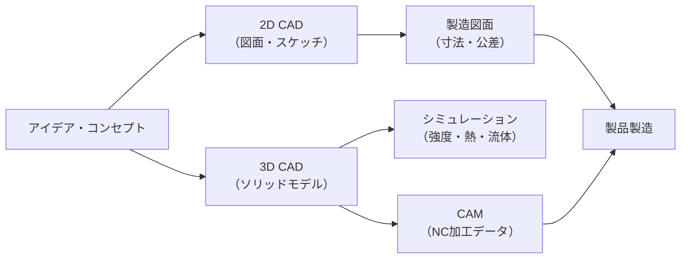
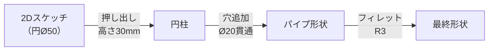

## CADとは何か

**CAD（Computer-Aided Design）** とは、コンピュータを使って設計図や3Dモデルを作成するツール・技術の総称です。紙と鉛筆での手描き製図に取って代わり、現代の製造業・建築・電子機器設計の現場では不可欠な存在となっています。



## 2D CAD vs 3D CAD

| 項目 | 2D CAD | 3D CAD |
|------|--------|--------|
| 表現 | 線・円・寸法で平面図 | ソリッド・サーフェスで立体モデル |
| 代表ソフト | AutoCAD, DraftSight, JW-CAD | CATIA, SolidWorks, Fusion 360, FreeCAD |
| 用途 | 建築平面図・回路図・部品図 | 機械部品・自動車・航空機・家電 |
| 難易度 | 比較的易しい | 習得に時間がかかる |
| 強み | 軽量・シンプル | 干渉チェック・シミュレーション可能 |

## 2D CADの基本要素

2D CADは以下の幾何要素で図形を構成します：

```
エンティティ（幾何要素）:
  ・点（Point）         → 参照点、交点
  ・線分（Line）        → 輪郭線、中心線
  ・円・円弧（Circle/Arc）→ 穴、フィレット
  ・ポリライン          → 閉じた輪郭
  ・スプライン曲線       → 自由曲線
  ・文字（Text）        → 寸法値、注記
  ・寸法（Dimension）   → 長さ・角度・半径の記入
```

### レイヤー（層）管理

2D CADでは「レイヤー」で線の種類・色・表示/非表示を管理します：

| レイヤー名 | 線の種類 | 線の色 | 用途 |
|-----------|---------|--------|------|
| 外形線 | 実線（太） | 白/黒 | 部品の輪郭 |
| 中心線 | 一点鎖線（細） | 赤 | 円・対称の中心 |
| 隠れ線 | 破線（細） | 黄 | 見えない輪郭 |
| 寸法線 | 実線（細） | 青 | 寸法記入 |
| 補助線 | 実線（極細） | 緑 | 作図補助 |

## 3D CADのモデリング手法

### ソリッドモデリング

最も一般的な手法。**スケッチ（2D断面）→ フィーチャー操作**で立体を作ります。

```
フィーチャー操作の種類:
  押し出し（Extrude）  ： 断面を直線方向に押し出す
  回転（Revolve）      ： 断面を軸の周りに回転させる
  掃引（Sweep）        ： 断面をパス（曲線）に沿って動かす
  ロフト（Loft）       ： 複数断面を滑らかにつなぐ
  フィレット           ： エッジを丸める
  チャンファー         ： エッジを面取りする
  穴（Hole）           ： ドリル穴・タップ穴を追加
  シェル               ： 中をくり抜いて薄肉にする
```



### アセンブリ（組み立て）

複数の部品（パーツ）を「拘束」で位置決めして組み立てます：

| 拘束の種類 | 意味 |
|-----------|------|
| 一致（Coincident） | 面・エッジ・点を合わせる |
| 同心（Concentric） | 円柱・穴の軸を一致させる |
| 平行（Parallel） | 面・エッジを平行にする |
| 距離（Distance） | 指定距離を保つ |
| 角度（Angle） | 指定角度を保つ |

## 代表的なCADソフト

### 商用

| ソフト | 得意分野 | 価格帯 |
|--------|---------|--------|
| **CATIA** (Dassault) | 航空・自動車の大規模設計 | 非常に高価 |
| **SolidWorks** | 機械設計・中小製造業 | 高価 |
| **NX** (Siemens) | 大規模製品設計 | 非常に高価 |
| **Fusion 360** (Autodesk) | ものづくり・教育 | サブスク（安価） |
| **AutoCAD** | 2D製図・汎用 | サブスク |

### 無料・オープンソース

| ソフト | 特徴 |
|--------|------|
| **FreeCAD** | Python拡張可能・パラメトリック3D |
| **LibreCAD** | 2D専用・軽量 |
| **OpenSCAD** | コードで3Dモデルを記述 |
| **Blender** | 製品設計よりアート向け |
| **Onshape** | ブラウザで動く・無料プランあり |

## CADデータのフォーマット

| 形式 | 種別 | 特徴 |
|------|------|------|
| `.STEP` / `.STP` | ソリッド交換 | 業界標準・ほぼ全ソフトで読める |
| `.IGES` | サーフェス交換 | 古いが普及している |
| `.STL` | メッシュ | 3Dプリンタ向け・形状のみ |
| `.DXF` / `.DWG` | 2D図面 | AutoCAD互換 |
| `.PARASOLID` | カーネル形式 | SolidWorks/NX系 |
| `.3MF` | 3Dプリンタ向け | STLの後継 |

## CAD図面に必要な情報

3D CADから**2D図面（製造図）** を生成する際には以下を記入します：

```
必須情報:
  ① 投影図（正面・側面・上面など） ← 次の記事で詳解
  ② 寸法（長さ・角度・半径・直径）
  ③ 公差（許容誤差：例 Ø10 ±0.05）
  ④ 表面粗さ（Ra 1.6など）
  ⑤ 幾何公差（平行度・直角度・真円度など）
  ⑥ 材料・熱処理
  ⑦ 表題欄（部品名・図番・設計者・日付・縮尺）
```

## まとめ

- CADはアイデアを正確な形状データに変換するツール
- 2D CADは図面作成・3D CADはモデル→シミュレーション→製造まで一貫
- ソリッドモデリングは「スケッチ＋フィーチャー」の積み重ね
- 図面にはモデルだけでなく寸法・公差・材料などの製造情報が必須

次は3Dモデルを操るための**3次元数学（座標系・変換行列・回転）**を学びます。
