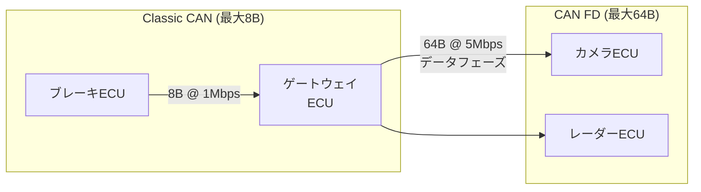

## 概要
CAN FD(CAN with Flexible Data-rate)は、従来の [[can]] を拡張した規格です。1フレームで運べるデータ量を8バイトから最大64バイトへ拡大し、データ部分の通信速度も高速化しました。既存のCAN資産を活かしつつ帯域を底上げします。

## なぜ必要か
ECUの高機能化でやり取りするデータが増え、従来CANの8バイト・低速では不足するようになりました。CAN FDは配線や開発資産を大きく変えずに、より多くのデータを速く送れるようにします。

## 自動運転での利用例
カメラ映像のような大容量は [[ethernet]] が担いますが、制御系の中量データではCAN FDが活躍します。CAN→CAN FD→Ethernetと、データ量に応じて通信方式を使い分けるのが現代の車載ネットワーク設計です。

## 関連用語
基礎が [[can]]、高帯域通信が [[ethernet]]、統合する標準が [[autosar]] です。

## 次に学ぶべき内容
これらを束ねる車載ソフト標準 [[autosar]] を学びましょう。

## 図解

