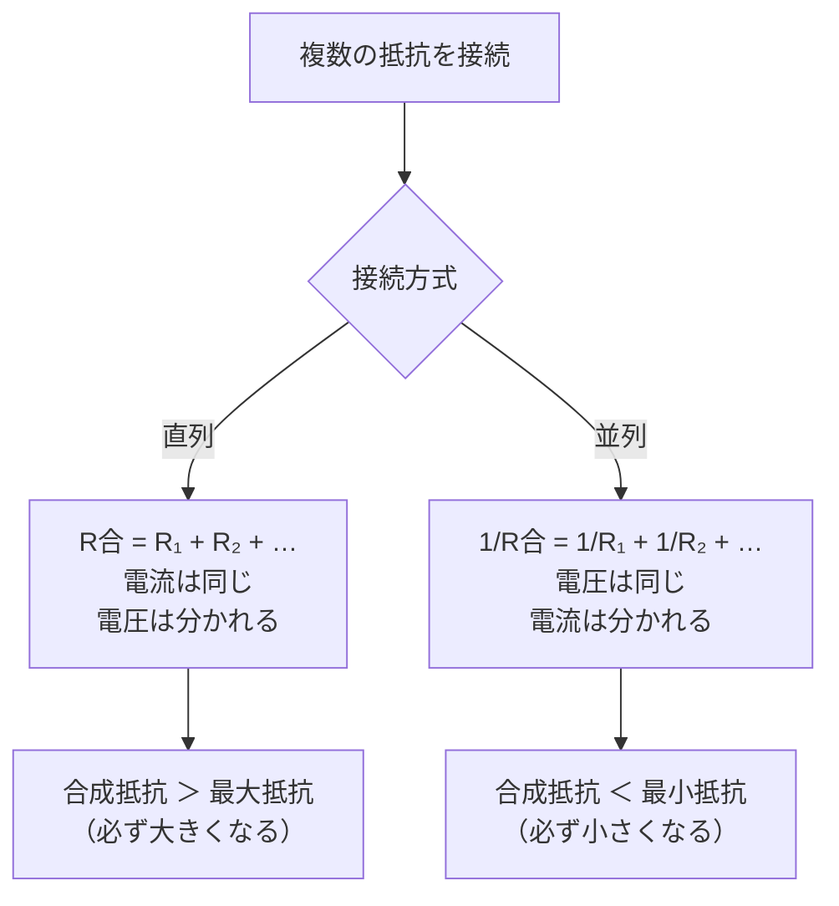

## 概要
複数の抵抗を組み合わせた回路には「直列」と「並列」の2種類があります。この2つの接続の違いを理解することは、電子回路設計・故障診断・車載ハーネス設計の基本です。

## 直列回路

直列回路は抵抗を一列につないだ回路です。

```
直列回路:

  +─────[R1]─────[R2]─────[R3]─────−
  電源          ← 電流 I →
```

**直列接続のポイント:**
- 電流はすべての抵抗で同じ `I₁ = I₂ = I₃ = I`
- 電圧は各抵抗で分担する `V = V₁ + V₂ + V₃`
- 合成抵抗は各抵抗の和 `R合 = R₁ + R₂ + R₃`

```python
import numpy as np
import matplotlib.pyplot as plt

def series_resistance(*resistors):
    """直列合成抵抗"""
    return sum(resistors)

def series_circuit(V_supply, *resistors):
    R_total = series_resistance(*resistors)
    I = V_supply / R_total
    voltages = [I * R for R in resistors]
    return {
        "R_total": R_total,
        "I": I,
        "V_each": voltages,
    }

# 例: 12V 電源に 2Ω, 4Ω, 6Ω を直列接続
result = series_circuit(12, 2, 4, 6)
print(f"合成抵抗: {result['R_total']} Ω")
print(f"電流:     {result['I']} A")
for i, V in enumerate(result['V_each'], 1):
    print(f"R{i} の電圧降下: {V} V")
# → 合成抵抗: 12 Ω
# → 電流: 1.0 A
# → R1: 2V, R2: 4V, R3: 6V（合計 = 12V）
```

**数式で表すと**

$$
R_{series} = \sum_i R_i, \qquad I = \frac{V}{R_{series}}, \qquad V_i = I R_i
$$

直列合成抵抗 \( R_{series} \) [Ω] は各抵抗の和。電流 \( I \) [A] はすべての抵抗で共通で、各抵抗の電圧降下 \( V_i \) [V] の合計が電源電圧に等しくなります。

## 並列回路

並列回路は抵抗を横に並べてつないだ回路です。

```
並列回路:

  +──┬──[R1]──┬──−
     │         │
     ├──[R2]──┤
     │         │
     └──[R3]──┘
```

**並列接続のポイント:**
- 電圧はすべての抵抗で同じ `V₁ = V₂ = V₃ = V`
- 電流は各抵抗で分かれる `I = I₁ + I₂ + I₃`
- 合成抵抗は逆数の和の逆数 `1/R合 = 1/R₁ + 1/R₂ + 1/R₃`

```python
def parallel_resistance(*resistors):
    """並列合成抵抗"""
    return 1 / sum(1/R for R in resistors)

def parallel_circuit(V_supply, *resistors):
    R_total = parallel_resistance(*resistors)
    I_each  = [V_supply / R for R in resistors]
    I_total = sum(I_each)
    return {
        "R_total": R_total,
        "I_total": I_total,
        "I_each": I_each,
    }

# 例: 12V 電源に 6Ω, 12Ω, 12Ω を並列接続
result = parallel_circuit(12, 6, 12, 12)
print(f"合成抵抗: {result['R_total']:.2f} Ω")
print(f"合計電流: {result['I_total']:.2f} A")
for i, I in enumerate(result['I_each'], 1):
    print(f"R{i} の電流: {I} A")
# → 合成抵抗: 3.00 Ω
# → 合計電流: 4.00 A
# → R1: 2A, R2: 1A, R3: 1A
```

**数式で表すと**

$$
\frac{1}{R_{parallel}} = \sum_i \frac{1}{R_i}, \qquad I_i = \frac{V}{R_i}, \qquad I = \sum_i I_i
$$

並列合成抵抗 \( R_{parallel} \) [Ω] は逆数の和の逆数。電圧 \( V \) [V] は各抵抗で共通で、各枝の電流 \( I_i \) [A] の合計が全体電流になります。

## 直列 vs 並列まとめ



## 直並列混合回路

```python
def solve_mixed_circuit():
    """
    回路図:
      12V ─[2Ω]─┬─[3Ω]─┬─ GND
                 ├─[6Ω]─┤
    """
    V = 12
    R1 = 2     # 直列抵抗
    R2, R3 = 3, 6   # 並列部分

    R_parallel = parallel_resistance(R2, R3)   # 3Ω と 6Ω の並列
    R_total    = R1 + R_parallel                # 直列合成

    I_total = V / R_total
    V_R1    = I_total * R1
    V_par   = I_total * R_parallel   # 並列部分の電圧

    I_R2 = V_par / R2
    I_R3 = V_par / R3

    print(f"並列合成抵抗: {R_parallel:.2f} Ω")
    print(f"全体合成抵抗: {R_total:.2f} Ω")
    print(f"全体電流: {I_total:.3f} A")
    print(f"R1(2Ω)の電圧: {V_R1:.2f} V")
    print(f"並列部分の電圧: {V_par:.2f} V")
    print(f"R2(3Ω)の電流: {I_R2:.3f} A")
    print(f"R3(6Ω)の電流: {I_R3:.3f} A")

solve_mixed_circuit()
```

**数式で表すと**

$$
R_{total} = R_1 + \left(\frac{1}{R_2}+\frac{1}{R_3}\right)^{-1}, \qquad I = \frac{V}{R_{total}}, \qquad V_{par} = I \cdot (R_{total}-R_1)
$$

まず並列部分をまとめ、直列抵抗 \( R_1 \) と足して全体抵抗 \( R_{total} \) [Ω] を求めます。並列部分の電圧 \( V_{par} \) [V] から各枝の電流 \( I_i = V_{par}/R_i \) が決まります。

## 電圧分割（分圧器）

```python
# 分圧器: 大きな電圧から小さな電圧を作る
def voltage_divider(V_in, R1, R2):
    """R1とR2の直列でV_inを分圧"""
    V_out = V_in * R2 / (R1 + R2)
    return V_out

# 例: 12V から 3.3V を作る
R1, R2 = 2700, 1000   # 2.7kΩ と 1kΩ
V_out = voltage_divider(12, R1, R2)
print(f"分圧出力: {V_out:.2f} V")   # → 3.24V

# センサーの読み取り（温度センサーNTC）
import numpy as np
R_fixed = 10000   # 固定抵抗 10kΩ
V_supply = 5.0

R_ntc_values = np.array([50000, 25000, 10000, 5000, 2000])  # 温度で変化
for R_ntc in R_ntc_values:
    V_adc = voltage_divider(V_supply, R_fixed, R_ntc)
    print(f"NTC={R_ntc/1000:.0f}kΩ → ADC電圧={V_adc:.2f}V")
```

**数式で表すと**

$$
V_{out} = V_{in} \cdot \frac{R_2}{R_1 + R_2}
$$

分圧器の出力電圧 \( V_{out} \) [V]。直列した2抵抗 \( R_1, R_2 \) [Ω] のうち \( R_2 \) が受け持つ割合で入力電圧 \( V_{in} \) [V] を分割します。

## キルヒホッフの法則

複雑な回路は「キルヒホッフの法則」で解けます。

**電流則（KCL）**: 節点に流れ込む電流の総和 = 流れ出す電流の総和
**電圧則（KVL）**: 閉ループの電圧の和 = 0

```python
# 連立方程式で回路を解く
import numpy as np

# 2ループ回路の例:
# ループ1: V1=12V, R1=2Ω, R3=4Ω (電流I1)
# ループ2: V2=6V,  R2=3Ω, R3=4Ω (電流I2)
# KVL:
# ループ1: 12 = 2*I1 + 4*(I1-I2) → 12 = 6*I1 - 4*I2
# ループ2:  6 = 3*I2 + 4*(I2-I1) →  6 = -4*I1 + 7*I2

A = np.array([[6, -4], [-4, 7]])
b = np.array([12, 6])
I = np.linalg.solve(A, b)
print(f"I1 = {I[0]:.3f} A")
print(f"I2 = {I[1]:.3f} A")
print(f"R3の電流 = {I[0]-I[1]:.3f} A")
```

**数式で表すと**

$$
\sum_{k \in node} I_k = 0, \qquad \sum_{k \in loop} V_k = 0
$$

キルヒホッフの電流則（節点に出入りする電流の総和は0）と電圧則（閉ループの電圧降下の総和は0）。これを連立させた \( A\,\mathbf{I} = \mathbf{b} \) を解いて各ループ電流 \( I \) [A] を求めます。
