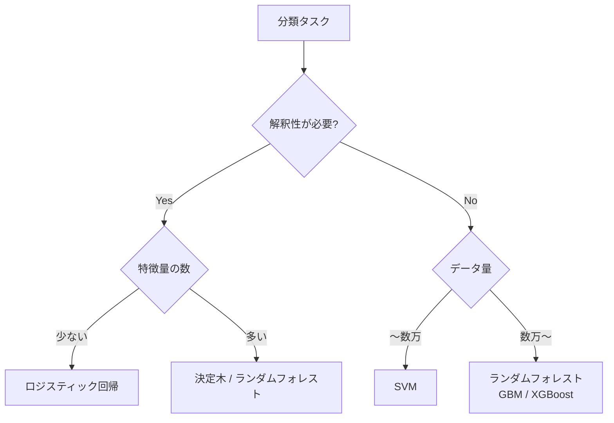

## 概要
「このメールはスパムか？」「この患者は病気か？」「このECUの挙動は正常か異常か？」――入力データが**どのクラスに属するかを自動判定**するのが分類タスクです。ロジスティック回帰・決定木・SVM・ランダムフォレストという4つの代表手法はそれぞれ得意な状況が異なります。まず「解釈性が必要か」「データ量はどのくらいか」で選択肢を絞りましょう。

## 活用シーン
- **故障検知**: ECUの通信ログを特徴量化して正常/異常を2値分類
- **スパム判定**: メール本文の特徴量からスパム確率を出力
- **顧客離脱予測**: 購買パターンから翌月の解約確率を算出

## 主要な数式

**ロジスティック回帰**（シグモイド関数で確率を出力）：

$$P(y=1 \mid \mathbf{x}) = \sigma(\mathbf{w}^\top \mathbf{x}) = \frac{1}{1 + e^{-\mathbf{w}^\top \mathbf{x}}}$$

**多クラスの softmax**：

$$P(y=k \mid \mathbf{x}) = \frac{e^{\mathbf{w}_k^\top \mathbf{x}}}{\sum_{j=1}^{K} e^{\mathbf{w}_j^\top \mathbf{x}}}$$

**交差エントロピー損失**（2値）：

$$\mathcal{L} = -\frac{1}{n}\sum_{i=1}^{n}\Big[y_i \log \hat{p}_i + (1-y_i)\log(1-\hat{p}_i)\Big]$$

**評価指標**：

$$\text{Precision} = \frac{TP}{TP+FP}, \quad \text{Recall} = \frac{TP}{TP+FN}, \quad F_1 = \frac{2\,\text{Precision}\cdot\text{Recall}}{\text{Precision}+\text{Recall}}$$

## アルゴリズムの使い分け



## 共通セットアップ

```python
import numpy as np
import pandas as pd
import matplotlib.pyplot as plt
from sklearn.datasets import make_classification
from sklearn.model_selection import train_test_split, cross_val_score
from sklearn.metrics import classification_report, roc_auc_score
from sklearn.preprocessing import StandardScaler

# サンプルデータ生成（2クラス分類）
X, y = make_classification(
    n_samples=1000, n_features=20, n_informative=10,
    n_redundant=5, random_state=42
)
X_train, X_test, y_train, y_test = train_test_split(
    X, y, test_size=0.2, stratify=y, random_state=42
)
```

## 1. ロジスティック回帰

```python
from sklearn.linear_model import LogisticRegression
from sklearn.pipeline import make_pipeline

lr = make_pipeline(StandardScaler(), LogisticRegression(max_iter=1000))
lr.fit(X_train, y_train)

print(classification_report(y_test, lr.predict(X_test)))
print(f"AUC: {roc_auc_score(y_test, lr.predict_proba(X_test)[:,1]):.3f}")

# 係数から重要な特徴量を確認
coef = lr.named_steps["logisticregression"].coef_[0]
feat_importance = pd.Series(np.abs(coef)).sort_values(ascending=False)
print("上位特徴量:", feat_importance.head(5))
```

**数式で表すと**

$$
\hat{p} = \sigma(\mathbf{w}^\top \mathbf{x} + b) = \frac{1}{1 + e^{-(\mathbf{w}^\top \mathbf{x} + b)}}, \qquad \hat{y} = \mathbb{1}[\hat{p} \ge 0.5]
$$

シグモイド関数で線形結合を0〜1の確率に変換し、閾値0.5でクラスを判定します。学習は交差エントロピー損失の最小化で、係数 `coef_` の絶対値が大きいほど予測への寄与が大きい特徴量です。

**向いている場面:** 特徴量が少ない・線形分離しやすい・確率が必要

## 2. 決定木

```python
from sklearn.tree import DecisionTreeClassifier, plot_tree

dt = DecisionTreeClassifier(max_depth=4, min_samples_leaf=10, random_state=42)
dt.fit(X_train, y_train)
print(classification_report(y_test, dt.predict(X_test)))

# 木の可視化
fig, ax = plt.subplots(figsize=(16, 6))
plot_tree(dt, max_depth=2, filled=True, feature_names=[f"f{i}" for i in range(20)],
          class_names=["0", "1"], ax=ax)
plt.show()

# 特徴量重要度
importances = pd.Series(dt.feature_importances_).sort_values(ascending=False)
print("上位特徴量:", importances.head(5))
```

**数式で表すと**

$$
\mathrm{Gini}(t) = 1 - \sum_{k=1}^{K} p_k^2
$$

決定木は各ノードで不純度（ジニ係数）が最も下がる分割を選びます。\(p_k\) はノード \(t\) 内でクラス \(k\) が占める割合で、純粋なノードほど \(\mathrm{Gini}=0\) に近づきます。

**向いている場面:** ルールを人間が読む必要がある・欠損値に強い・前処理不要

## 3. サポートベクターマシン（SVM）

```python
from sklearn.svm import SVC

svm = make_pipeline(StandardScaler(), SVC(C=1.0, kernel="rbf", probability=True))
svm.fit(X_train, y_train)
print(classification_report(y_test, svm.predict(X_test)))
print(f"AUC: {roc_auc_score(y_test, svm.predict_proba(X_test)[:,1]):.3f}")
```

**数式で表すと**

$$
\min_{\mathbf{w},b}\ \frac{1}{2}\lVert \mathbf{w}\rVert^2 + C\sum_{i=1}^{n}\xi_i \quad \text{s.t.}\quad y_i(\mathbf{w}^\top \phi(\mathbf{x}_i)+b) \ge 1-\xi_i
$$

SVM はクラス間のマージン（\(\lVert \mathbf{w}\rVert\) の逆数に比例）を最大化します。`C` は誤分類（スラック \(\xi_i\)）への罰則の強さ、`kernel="rbf"` は写像 \(\phi\) により非線形分離を可能にします。

**向いている場面:** 高次元・中規模データ・マージン最大化が重要

## 4. ランダムフォレスト

```python
from sklearn.ensemble import RandomForestClassifier

rf = RandomForestClassifier(
    n_estimators=200,
    max_depth=None,
    min_samples_leaf=5,
    n_jobs=-1,
    random_state=42,
)
rf.fit(X_train, y_train)
print(classification_report(y_test, rf.predict(X_test)))
print(f"AUC: {roc_auc_score(y_test, rf.predict_proba(X_test)[:,1]):.3f}")

# 特徴量重要度
importances = pd.Series(
    rf.feature_importances_,
    index=[f"f{i}" for i in range(20)]
).sort_values(ascending=False)

importances.head(10).plot(kind="barh", figsize=(6, 4))
plt.title("特徴量重要度（Random Forest）")
plt.tight_layout()
plt.show()
```

**数式で表すと**

$$
\hat{y} = \operatorname*{arg\,max}_{k}\ \sum_{t=1}^{T} \mathbb{1}\!\left[h_t(\mathbf{x}) = k\right]
$$

ランダムフォレストはブートストラップ標本と特徴量のランダム選択で作った \(T\) 本の決定木 \(h_t\) の多数決で予測します。木を独立に多数作ることで分散を下げ、過学習を抑えます。

**向いている場面:** 大量の特徴量・外れ値・欠損値・高精度が必要

## 決定境界・ROC曲線の可視化


## モデル比較

```python
from sklearn.linear_model import LogisticRegression
from sklearn.tree import DecisionTreeClassifier
from sklearn.svm import SVC
from sklearn.ensemble import RandomForestClassifier

models = {
    "LogisticReg":    make_pipeline(StandardScaler(), LogisticRegression(max_iter=1000)),
    "DecisionTree":   DecisionTreeClassifier(max_depth=5, random_state=42),
    "SVM":            make_pipeline(StandardScaler(), SVC(probability=True)),
    "RandomForest":   RandomForestClassifier(n_estimators=100, n_jobs=-1, random_state=42),
}

results = {}
for name, model in models.items():
    scores = cross_val_score(model, X, y, cv=5, scoring="roc_auc")
    results[name] = scores
    print(f"{name:20s}: {scores.mean():.3f} ± {scores.std():.3f}")

# 箱ひげ図で比較
import seaborn as sns
sns.boxplot(data=pd.DataFrame(results))
plt.title("5-Fold CV AUC の比較")
plt.ylabel("AUC")
plt.show()
```

## クラス不均衡への対応

```python
from sklearn.utils import class_weight
from sklearn.ensemble import RandomForestClassifier

# クラスの比率を自動で調整
rf_balanced = RandomForestClassifier(
    class_weight="balanced",
    n_estimators=200,
    random_state=42,
)
rf_balanced.fit(X_train, y_train)

# または手動で重みを指定
weights = class_weight.compute_class_weight("balanced", classes=np.unique(y), y=y)
weight_dict = dict(enumerate(weights))
```

**数式で表すと**

$$
w_k = \frac{n}{K \cdot n_k}
$$

`class_weight="balanced"` は各クラス \(k\) の重みをサンプル数 \(n_k\) に反比例させ（\(n\) は総数、\(K\) はクラス数）、少数クラスの誤分類に大きなペナルティを与えて不均衡を補正します。

## よくある間違いと対処法

1. **クラス不均衡を見落とす** → 陽性が5%のデータで「全て陰性予測」するだけでAccuracy 95%になる。`class_weight="balanced"` を使い、評価はF1またはAUC-ROCで行う。
2. **StandardScalerを忘れる** → ロジスティック回帰とSVMは特徴量スケールに敏感。`make_pipeline(StandardScaler(), model)` を習慣にする。
3. **決定木を深くしすぎる** → `max_depth` 制限なしだと過学習する。`max_depth=4~6` と `min_samples_leaf=5~10` を設定する。
4. **ランダムフォレストのn_estimatorsが少ない** → デフォルトの `n_estimators=100` は足りないことがある。200以上を設定し `n_jobs=-1` で並列化する。

## まとめ

- 解釈性重視 → ロジスティック回帰（係数が読める）または決定木（ルールが読める）
- 精度重視 → ランダムフォレストまたは LightGBM（[[gradient-boosting]]）
- クラス不均衡 → `class_weight="balanced"` + F1/AUC-ROC で評価
- 必ず交差検証（`cross_val_score`）でモデルの汎化性能を確認する

## 次に学ぶべき内容
最高精度を目指す [[gradient-boosting]]（XGBoost / LightGBM）を学びましょう。
