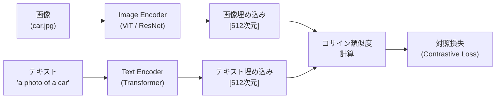

## 概要
CLIP（Contrastive Language-Image Pre-Training）はOpenAIが2021年に発表した視覚言語モデルです。4億枚の画像とテキストのペアで学習し、**テキストで画像を検索**・**ゼロショット画像分類**・**画像キャプション評価**など、「言語で視覚を操る」タスクを可能にしました。Stable DiffusionなどのDiffusionモデルにも組み込まれています。

## CLIPのアーキテクチャ



```python
import torch
import torch.nn.functional as F
import numpy as np
import matplotlib.pyplot as plt

# CLIPの中心アイデア: 画像とテキストを同じ埋め込み空間に写像する
# 対応するペアは近く、対応しないペアは遠くなるように学習

# 対照学習の損失関数（InfoNCE Loss）
def contrastive_loss(image_embeddings, text_embeddings, temperature=0.07):
    """
    CLIP の対照損失
    image_embeddings: [N, D] 正規化済み画像埋め込み
    text_embeddings:  [N, D] 正規化済みテキスト埋め込み
    N: バッチサイズ, D: 埋め込み次元
    """
    # コサイン類似度行列 [N, N]
    logits = torch.mm(image_embeddings, text_embeddings.T) / temperature
    # 対角成分が正例（i番目の画像とi番目のテキストが対応）
    labels = torch.arange(len(image_embeddings))
    # 画像→テキスト と テキスト→画像 の双方向損失
    loss_i2t = F.cross_entropy(logits,   labels)
    loss_t2i = F.cross_entropy(logits.T, labels)
    return (loss_i2t + loss_t2i) / 2

# デモ（ランダムな埋め込みで動作確認）
N, D = 4, 512
img_emb = F.normalize(torch.randn(N, D), dim=-1)
txt_emb = F.normalize(torch.randn(N, D), dim=-1)
loss = contrastive_loss(img_emb, txt_emb)
print(f"対照損失: {loss.item():.4f}  (理論最小値 ≈ {np.log(N):.4f})")
```

## 可視化


## CLIPを使ったゼロショット分類

```python
# pip install transformers torch pillow
from transformers import CLIPProcessor, CLIPModel
from PIL import Image
import requests

model = CLIPModel.from_pretrained("openai/clip-vit-base-patch32")
processor = CLIPProcessor.from_pretrained("openai/clip-vit-base-patch32")
model.eval()

def zero_shot_classify(image_path_or_url, candidate_labels):
    """
    CLIPによるゼロショット画像分類
    学習時に一度も見ていないクラスも分類できる
    """
    # 画像の読み込み
    if image_path_or_url.startswith("http"):
        image = Image.open(requests.get(image_path_or_url, stream=True).raw)
    else:
        image = Image.open(image_path_or_url)

    # プロンプトテンプレート（"a photo of a {label}" が精度向上）
    texts = [f"a photo of a {label}" for label in candidate_labels]

    inputs = processor(
        text=texts,
        images=image,
        return_tensors="pt",
        padding=True,
    )

    with torch.no_grad():
        outputs = model(**inputs)
        logits = outputs.logits_per_image   # [1, num_labels]
        probs  = logits.softmax(dim=-1)[0]

    results = sorted(zip(candidate_labels, probs.tolist()),
                     key=lambda x: x[1], reverse=True)
    return results

# 使用例（任意の画像で試せる）
labels = ["cat", "dog", "car", "bicycle", "airplane", "ship"]
# results = zero_shot_classify("test.jpg", labels)
# for label, prob in results:
#     print(f"  {label:12s}: {prob*100:.1f}%")
```

## 画像−テキスト類似度の可視化

```python
def visualize_similarity(images, texts, model, processor):
    """画像とテキストの類似度行列を可視化"""
    inputs = processor(
        text=texts,
        images=images,
        return_tensors="pt",
        padding=True,
    )
    with torch.no_grad():
        image_features = model.get_image_features(pixel_values=inputs["pixel_values"])
        text_features  = model.get_text_features(
            input_ids=inputs["input_ids"],
            attention_mask=inputs["attention_mask"],
        )
    # 正規化してコサイン類似度を計算
    image_features = F.normalize(image_features, dim=-1)
    text_features  = F.normalize(text_features,  dim=-1)
    similarity = (image_features @ text_features.T).numpy()

    # ヒートマップ表示
    fig, ax = plt.subplots(figsize=(8, 6))
    im = ax.imshow(similarity, cmap="Blues", vmin=0, vmax=1)
    ax.set_xticks(range(len(texts)))
    ax.set_xticklabels(texts, rotation=30, ha="right", fontsize=9)
    ax.set_yticks(range(len(images)))
    ax.set_yticklabels([f"image_{i}" for i in range(len(images))])
    for i in range(len(images)):
        for j in range(len(texts)):
            ax.text(j, i, f"{similarity[i,j]:.2f}", ha="center", va="center",
                    color="white" if similarity[i,j] > 0.6 else "black", fontsize=9)
    plt.colorbar(im)
    plt.title("CLIP 画像−テキスト 類似度行列")
    plt.tight_layout()
    plt.show()
    return similarity
```

## 画像検索（テキストクエリ）

```python
import os
from pathlib import Path

def build_image_index(image_dir, model, processor, device="cpu"):
    """画像ディレクトリをインデックス化"""
    model = model.to(device)
    image_paths = list(Path(image_dir).glob("*.jpg")) + \
                  list(Path(image_dir).glob("*.png"))

    embeddings = []
    for path in image_paths:
        image = Image.open(path).convert("RGB")
        inputs = processor(images=image, return_tensors="pt").to(device)
        with torch.no_grad():
            feat = model.get_image_features(**inputs)
            feat = F.normalize(feat, dim=-1)
        embeddings.append(feat.cpu())

    return image_paths, torch.cat(embeddings, dim=0)

def search_images(query_text, image_paths, image_embeddings, model, processor, top_k=5):
    """テキストクエリで画像を検索"""
    inputs = processor(text=[query_text], return_tensors="pt", padding=True)
    with torch.no_grad():
        text_feat = model.get_text_features(**inputs)
        text_feat = F.normalize(text_feat, dim=-1)

    similarities = (image_embeddings @ text_feat.T).squeeze()
    top_indices  = similarities.argsort(descending=True)[:top_k]

    print(f"クエリ: '{query_text}'")
    for idx in top_indices:
        print(f"  {image_paths[idx].name}: {similarities[idx]:.4f}")
    return [image_paths[i] for i in top_indices]

# 使用例:
# paths, embs = build_image_index("./my_images", model, processor)
# results = search_images("a red sports car at night", paths, embs, model, processor)
```

## Stable Diffusion での CLIP の役割

```python
# CLIP は Stable Diffusion のテキスト条件付けに使われる
# テキスト → CLIPテキストエンコーダー → 埋め込み → U-Net の条件
# 画像品質の評価指標 CLIP Score にも使われる

def clip_score(image, generated_caption, model, processor):
    """
    CLIP Score: 生成画像とキャプションの整合性評価
    高いほど「キャプション通りの画像が生成されている」
    """
    inputs = processor(
        text=[generated_caption],
        images=image,
        return_tensors="pt",
        padding=True,
    )
    with torch.no_grad():
        outputs = model(**inputs)
        # logits_per_image は image-text の類似度スコア
        score = outputs.logits_per_image.item()
    return score

# CLIP Score の解釈
print("CLIP Score の目安:")
print("  > 35: 非常に良い整合性（テキスト通りの画像）")
print("  25〜35: 良い整合性")
print("  < 25: テキストと画像が乖離")
```

## CLIPの限界と発展

| 課題 | 内容 | 発展モデル |
|---|---|---|
| 細粒度な属性理解 | 「赤い車の左側のドア」など | BLIP-2, LLaVA |
| カウント・位置関係 | 「3匹の猫」の正確な識別が苦手 | OWL-ViT |
| 日本語 | 英語ベースの学習 | Japanese CLIP（rinna） |
| 動画 | 静止画のみ | VideoCLIP, CLIP4Clip |
| 医療画像 | ドメイン特化が必要 | BioViL, MedCLIP |
