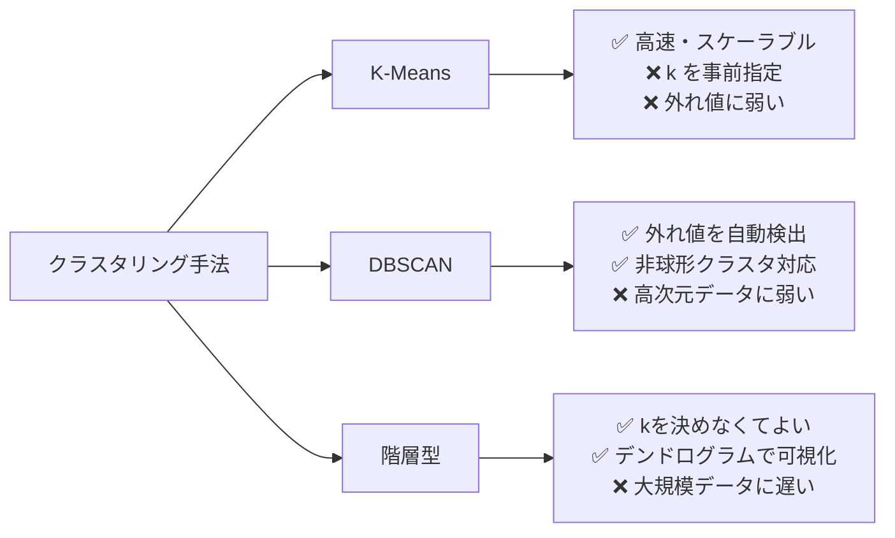

## 概要
「このデータ、何種類のパターンに分かれるの？」――ラベルがない状況でデータを自然なグループに分けるのがクラスタリングです。顧客セグメンテーション・ECU通信パターン分類・異常なパケットの隔離など、「正解を知らないまま構造を発見したい」場面で使います。K-Means（球形クラスタ向け）、DBSCAN（外れ値検出付き）、階層型（クラスタ数を決めなくてよい）の3手法を使い分けましょう。

## 活用シーン
- **顧客セグメント**: 購買履歴から自然に生まれるお客様グループを発見
- **ネットワーク分類**: 通信フローを制御系・診断系・センサー系などにグループ化
- **異常パケット検出**: 通常と異なる通信パターンをノイズ点（DBSCAN）として自動隔離

## 主要な数式

**K-means の目的関数**（クラスタ内二乗和 WCSS を最小化）：

$$J = \sum_{k=1}^{K}\sum_{\mathbf{x}\in C_k} \lVert \mathbf{x} - \boldsymbol{\mu}_k \rVert^2, \qquad \boldsymbol{\mu}_k = \frac{1}{|C_k|}\sum_{\mathbf{x}\in C_k}\mathbf{x}$$

**ユークリッド距離**：

$$d(\mathbf{x}, \mathbf{y}) = \sqrt{\sum_{i=1}^{d}(x_i - y_i)^2}$$

**シルエット係数**（クラスタリング品質、$a$=同クラスタ内平均距離、$b$=最近接他クラスタへの平均距離）：

$$s = \frac{b - a}{\max(a, b)} \in [-1, 1]$$

1に近いほど良いクラスタリング。

## K-Meansクラスタリング

```python
import numpy as np
import pandas as pd
import matplotlib.pyplot as plt
from sklearn.cluster import KMeans, DBSCAN, AgglomerativeClustering
from sklearn.preprocessing import StandardScaler
from sklearn.metrics import silhouette_score

np.random.seed(42)

# 車載ネットワークの通信フロー特徴量（例）
n = 300
data = np.vstack([
    np.random.normal([10, 100],  [2, 20],  (n//3, 2)),   # 制御系
    np.random.normal([50, 500],  [5, 50],  (n//3, 2)),   # 診断系
    np.random.normal([200, 50],  [20, 5],  (n//3, 2)),   # センサー系
])
feature_names = ["packet_rate", "payload_size"]

scaler = StandardScaler()
X = scaler.fit_transform(data)

# K-Meansでk=3
km = KMeans(n_clusters=3, random_state=42, n_init=10)
labels_km = km.fit_predict(X)
print(f"シルエット係数: {silhouette_score(X, labels_km):.3f}")

plt.figure(figsize=(8, 5))
for k in range(3):
    mask = labels_km == k
    plt.scatter(data[mask, 0], data[mask, 1], label=f"Cluster {k}", alpha=0.6)
centers = scaler.inverse_transform(km.cluster_centers_)
plt.scatter(centers[:, 0], centers[:, 1], marker="*", s=200, c="red", zorder=5, label="重心")
plt.xlabel("Packet Rate")
plt.ylabel("Payload Size")
plt.legend()
plt.title("K-Means クラスタリング")
plt.show()
```

## K-Means 可視化


## エルボー法とシルエット分析

```python
inertias   = []
silhouettes = []
k_range = range(2, 10)

for k in k_range:
    km = KMeans(n_clusters=k, random_state=42, n_init=10)
    labels = km.fit_predict(X)
    inertias.append(km.inertia_)
    silhouettes.append(silhouette_score(X, labels))

fig, axes = plt.subplots(1, 2, figsize=(12, 4))

axes[0].plot(k_range, inertias, "bo-")
axes[0].set_xlabel("k")
axes[0].set_ylabel("慣性（Inertia）")
axes[0].set_title("エルボー法")

axes[1].plot(k_range, silhouettes, "ro-")
axes[1].set_xlabel("k")
axes[1].set_ylabel("シルエット係数")
axes[1].set_title("シルエット分析（高いほど良い）")

plt.tight_layout()
plt.show()
```

## DBSCANクラスタリング

```python
# 密度ベース: 外れ値を自動検出できる
db = DBSCAN(eps=0.3, min_samples=5)
labels_db = db.fit_predict(X)

n_clusters = len(set(labels_db)) - (1 if -1 in labels_db else 0)
n_noise    = (labels_db == -1).sum()
print(f"検出クラスタ数: {n_clusters}")
print(f"外れ値（ノイズ）: {n_noise} 点")

plt.figure(figsize=(8, 5))
unique = set(labels_db)
colors = plt.cm.tab10(np.linspace(0, 1, len(unique)))
for k, col in zip(sorted(unique), colors):
    mask = labels_db == k
    label = "ノイズ（異常）" if k == -1 else f"Cluster {k}"
    marker = "x" if k == -1 else "o"
    plt.scatter(data[mask, 0], data[mask, 1], c=[col], label=label, marker=marker, alpha=0.6)
plt.legend()
plt.title("DBSCAN クラスタリング")
plt.show()
```

## 階層型クラスタリング（デンドログラム）

```python
from scipy.cluster.hierarchy import dendrogram, linkage

# サンプル数を減らしてデンドログラムを見やすくする
sample = X[:50]
Z = linkage(sample, method="ward")

plt.figure(figsize=(14, 5))
dendrogram(Z, leaf_rotation=90, leaf_font_size=8)
plt.title("階層型クラスタリング（Ward法）")
plt.ylabel("距離")
plt.tight_layout()
plt.show()

# 指定クラスタ数でラベル付け
agg = AgglomerativeClustering(n_clusters=3, linkage="ward")
labels_agg = agg.fit_predict(X)
print(f"Agglomerative シルエット: {silhouette_score(X, labels_agg):.3f}")
```

## クラスタリングの比較



## よくある間違いと対処法

1. **スケーリングを忘れる** → K-Means はユークリッド距離を使うため、スケールの異なる特徴量がそのまま入ると大きい値の特徴量が支配する。必ず `StandardScaler` を使う。
2. **エルボー法だけでkを決める** → エルボーが不明瞭な場合はシルエット係数（`silhouette_score`）を合わせて確認する。
3. **DBSCANのeps設定が難しい** → k最近傍距離のソートグラフを見て「膝の部分」をepsに設定する。`NearestNeighbors` で距離をプロットするのが定番。
4. **高次元データに直接K-Meansを使う** → 次元が増えると距離の意味が薄れる（次元の呪い）。PCAで2〜10次元に落としてからクラスタリングする。

## 実用例：ネットワークフロー分類

```python
from sklearn.pipeline import Pipeline
from sklearn.decomposition import PCA

# パイプラインで前処理+次元削減+クラスタリング
pipe = Pipeline([
    ("scaler", StandardScaler()),
    ("pca",    PCA(n_components=2)),
    ("km",     KMeans(n_clusters=4, random_state=42, n_init=10)),
])

# より多くの特徴量があると仮定
np.random.seed(0)
X_multi = np.random.randn(500, 8)  # 8次元特徴量
pipe.fit(X_multi)
cluster_labels = pipe.named_steps["km"].labels_

print("クラスタ別件数:")
for k, count in zip(*np.unique(cluster_labels, return_counts=True)):
    print(f"  Cluster {k}: {count} 件")

## まとめ

- K-Means: クラスタ数kを事前指定・高速・スケーリング必須。エルボー法 + シルエット係数でkを決める
- DBSCAN: kを決めなくてよい・外れ値を自動検出（ラベル=-1）・eps と min_samples のチューニングが必要
- 階層型: デンドログラムで構造を視覚的に確認できる・大規模データには遅い
- クラスタリング前に必ず `StandardScaler` で標準化する
- 高次元データは PCA で次元削減してからクラスタリングすると精度が上がることが多い
```
