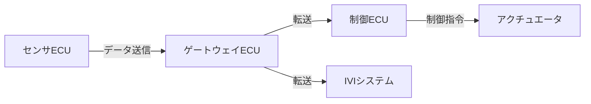

## 概要
通信とは、ある機器から別の機器へ「データ」を届けることです。届ける相手・順番・形式を双方が約束しておくことで、初めて意味のあるやり取りが成立します。この約束ごとを **プロトコル** と呼びます。

## なぜ必要か
車には数十〜百を超える ECU(電子制御ユニット)が積まれており、センサーの値や制御指令を互いにやり取りしています。共通のルールが無ければ、ブレーキ指令もカメラ映像も「ただのビット列」にしか見えません。通信の基礎は、すべての車載ネットワークの出発点です。

## 自動運転での利用例
カメラECUが検出した歩行者情報を、制御ECUへ送る——この単純なやり取りも「どの形式で・どの順で・誰宛に」というルールに支えられています。自動運転では遅延や欠損が安全に直結するため、通信の信頼性設計が極めて重要です。

## 関連用語
通信の階層モデルを整理したのが [[osi]] です。物理的な配線レベルでは [[ethernet]] が使われます。

## 次に学ぶべき内容
まずは通信を7つの層に分けて考える [[osi]] を学びましょう。

## 図解

