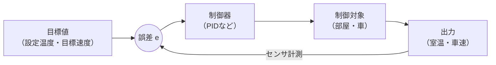
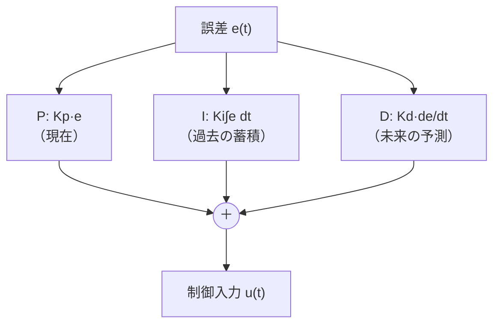

## 制御工学とは

**制御工学（Control engineering）** は、「システムを望みどおりに動かす」ための学問です。目標値（したいこと）に対して、システムの出力（実際の状態）を一致させるように入力を調整します。

身近な例：
- エアコン：室温を設定温度に保つ
- クルーズコントロール：車速を一定に保つ
- 自動駐車：車を駐車枠にぴったり収める（[[auto-parking-control]]）

これらはすべて **フィードバック制御**（[[block-diagram]]）で実現されます。



## 制御の目標（4つの性能）

| 性能 | 意味 |
|---|---|
| **安定性** | 発散せず、目標に落ち着くか（最優先） |
| **速応性** | どれだけ速く目標に到達するか |
| **定常特性** | 最終的に残る誤差（定常偏差）が小さいか |
| **ロバスト性** | 外乱・モデル誤差に対する強さ |

これらは互いにトレードオフの関係にあり、バランスを取るのが制御設計です。

## PID制御：もっとも使われる制御則

**PID制御** は、誤差 \(e(t) = r(t) - y(t)\)（目標 − 実際）から制御入力 \(u(t)\) を作る、産業界で最も普及した制御則です。

$$
u(t) = K_p\, e(t) + K_i \int_0^t e(\tau)\, d\tau + K_d\, \frac{de(t)}{dt}
$$

ラプラス変換すると、PID制御器の伝達関数は次のようにきれいな形になります。

$$
C(s) = K_p + \frac{K_i}{s} + K_d s
$$

3つの項がそれぞれ役割を持ちます。

| 項 | 名前 | 役割 | 例え |
|---|---|---|---|
| **P**（比例） | \(K_p\, e\) | 今の誤差に比例して修正 | 目標から遠いほど強く押す |
| **I**（積分） | \(K_i \int e\, dt\) | 誤差の蓄積を消す（定常偏差ゼロ化） | 「じわじわ残る差」を無くす |
| **D**（微分） | \(K_d\, \dot{e}\) | 誤差の変化を先読み（行き過ぎ抑制） | ブレーキ・ダンパの役 |



## 各項の効果を体で理解する

- **P だけ**：応答は速くなるが、定常偏差が残りがち。上げすぎると振動
- **I を追加**：定常偏差をゼロにできる。ただし応答が遅く・振動的になりやすい
- **D を追加**：オーバーシュートを抑え、安定性を改善。ただしノイズに弱い

## Python でPID制御をシミュレーション

```python
import numpy as np
import matplotlib.pyplot as plt

# 制御対象：一次遅れ系 dy/dt = (-y + u)/T
T = 1.0
dt, t_end = 0.01, 10
steps = int(t_end/dt)

def simulate(Kp, Ki, Kd, target=1.0):
    y, integral, e_prev = 0.0, 0.0, 0.0
    ys = []
    for _ in range(steps):
        e = target - y
        integral += e * dt
        derivative = (e - e_prev) / dt
        u = Kp*e + Ki*integral + Kd*derivative   # PID出力
        y += (-y + u) / T * dt                    # プラント更新
        e_prev = e
        ys.append(y)
    return np.array(ys)

t = np.arange(steps)*dt
plt.plot(t, simulate(2, 0, 0),   label="P のみ")
plt.plot(t, simulate(2, 1, 0),   label="PI")
plt.plot(t, simulate(2, 1, 0.5), label="PID")
plt.axhline(1.0, ls="--", color="gray", label="目標値")
plt.xlabel("時間 [s]"); plt.ylabel("出力 y"); plt.legend()
plt.savefig("pid.png", dpi=120)
```

**数式で表すと**、ループ内の各行は離散化したPID則

$$
u_k = K_p e_k + K_i \sum_{j=0}^{k} e_j \Delta t + K_d \frac{e_k - e_{k-1}}{\Delta t}
$$

を1ステップずつ実行しています。積分項が定常偏差を消し、微分項がオーバーシュートを抑えます。

## PIDゲインの調整（チューニング）

代表的な手法：

| 手法 | 概要 |
|---|---|
| **手動調整** | P→I→D の順に少しずつ上げる。現場で最も多い |
| **ジーグラ・ニコルス法** | 限界感度から経験式でゲインを決める古典的手法 |
| **モデルベース** | 伝達関数から極配置・最適制御で理論的に決める |
| **自動チューニング** | MATLAB の `pidtune` 等で最適化（[[matlab-simulink]]） |

ジーグラ・ニコルス（限界感度法）では、まず I,D を切って \(K_p\) を上げ、持続振動が始まる限界ゲイン \(K_u\) と振動周期 \(T_u\) を測り、

$$
K_p = 0.6 K_u,\quad K_i = \frac{2K_p}{T_u},\quad K_d = \frac{K_p T_u}{8}
$$

と設定します。

## PID以外の制御手法（発展）

| 手法 | 特徴 | 用途 |
|---|---|---|
| **状態フィードバック** | 内部状態を使う（極配置） | 高次・多入出力系 |
| **LQR（最適制御）** | 評価関数を最小化 | 自動運転の経路追従 |
| **モデル予測制御 MPC** | 先の予測を使い制約も扱える | 自動駐車・ADAS |
| **ロバスト制御 H∞** | 最悪ケースに強い | 不確かさの大きい系 |

自動駐車では、車体の非線形性や障害物制約を扱うため、PID を土台に **MPC** を組み合わせることが増えています（[[auto-parking-control]]）。

## まとめ

- 制御工学は「システムを目標どおりに動かす」学問。核はフィードバック
- 性能は 安定性・速応性・定常特性・ロバスト性 のバランス
- **PID制御** = 比例（現在）＋積分（過去）＋微分（未来）で誤差を消す
- ゲイン \(K_p, K_i, K_d\) の調整（チューニング）が設計の勘所
- 実装・検証には [[matlab-simulink]]、応用例は [[auto-parking-control]]
