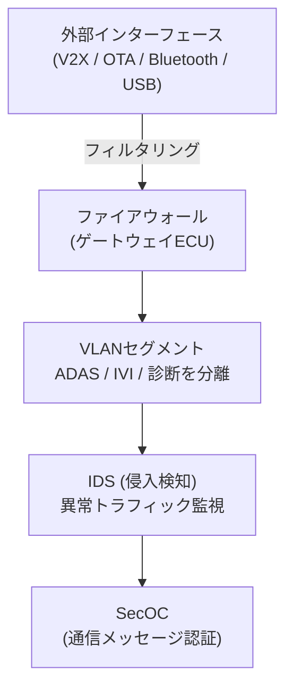

## 概要
車載サイバーセキュリティとは、外部からの不正アクセス・改ざん・盗聴から車両の電子システムを守る技術と管理体系の総称です。ISO 21434は自動車サイバーセキュリティの国際標準であり、開発〜廃棄まで全ライフサイクルでのリスク管理を義務付けています。

## なぜ必要か
現代の車はインターネット・Bluetooth・V2Xなど多数の外部インターフェースを持ち、遠隔から制御を乗っ取られるリスクが現実となっています。2015年のJeep Cherokee遠隔操作事件は世界に衝撃を与え、UN-R155/UN-R156規制により2022年以降のEU型式認証でサイバーセキュリティ対策が必須となりました。

## 主な脅威と対策

| 脅威 | 対策 |
|------|------|
| 不正診断アクセス | UDS認証(Security Access)、SecOC |
| OTA改ざん | コード署名、TLS**暗号化** |
| CAN bus注入 | CANの分離、侵入検知(IDS) |
| 外部ネット侵入 | **ファイアウォール**、VLANセグメント |
| 盗聴 | TLS/DTLS、鍵管理(HSM) |

## SecOC (Secure Onboard Communication)
AUTOSAR準拠のCAN/Ethernet通信に認証コード(MAC)を付与する仕組みです。改ざんされたメッセージを受信側で検知できます。

## 自動運転での利用例
ADAS ECUはHSM(Hardware Security Module)内で鍵を管理し、SecOCで制御コマンドを認証します。外部ネットワークとの境界には**ファイアウォール**機能付きゲートウェイを配置し、[[vlan]] でADASネットワークとインフォテインメントを分離します。

## 関連用語
ネットワーク分離は [[vlan]]、通信経路の保護は [[ethernet]] 上のTLS、外部通信は [[v2x]] / [[ota]] を参照。

## 次に学ぶべき内容
外部との無線通信 [[v2x]] のセキュリティ要件を確認しましょう。

## 図解

