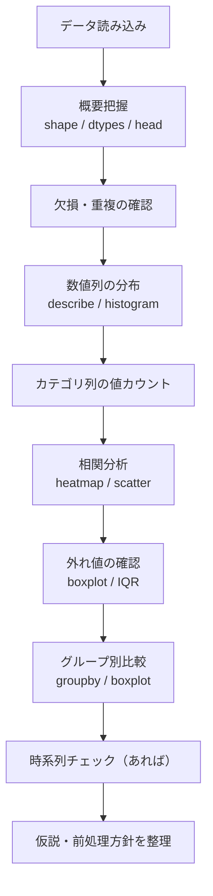

## 概要
EDA（Exploratory Data Analysis：探索的データ分析）は、機械学習・統計モデリングの**前に必ず行う**データ理解の工程です。数値の羅列から「傾向」「外れ値」「相関」「欠損パターン」を発見し、仮説を立てて次のアクションを決めます。コードよりも「何を見るか」の思考が重要です。

## なぜ必要か
データを見ずにモデルを作ると「なぜ精度が低いか」が分かりません。EDAで「価格列に10倍の外れ値がある」「年齢列に30%欠損がある」「AとBが強く相関している」を把握しておけば、前処理と特徴量エンジニアリングの方針が決まります。30分のEDAが数日のデバッグを防ぎます。

## EDAの全体ステップ



## 1. 読み込みと概要把握

```python
import pandas as pd
import numpy as np
import seaborn as sns
import matplotlib.pyplot as plt
from matplotlib import rcParams

# 日本語フォント設定（環境に応じて変更）
# rcParams["font.family"] = "IPAexGothic"

sns.set_theme(style="whitegrid")

df = pd.read_csv("dataset.csv", parse_dates=["date"])

print(f"サイズ: {df.shape}")        # (行数, 列数)
print(f"\n【型と欠損】")
print(df.info())
print(f"\n【先頭5行】")
display(df.head())
print(f"\n【基本統計量】")
display(df.describe().round(2))
```

## 2. 欠損の可視化

```python
missing = df.isnull().mean().sort_values(ascending=False)
missing = missing[missing > 0]

if len(missing) == 0:
    print("欠損なし")
else:
    fig, ax = plt.subplots(figsize=(8, max(3, len(missing) * 0.4)))
    missing.plot(kind="barh", color="coral", ax=ax)
    ax.set_xlabel("欠損率")
    ax.set_title("列ごとの欠損率")
    ax.axvline(0.3, color="red", linestyle="--", label="30%ライン")
    ax.legend()
    plt.tight_layout()
    plt.show()
    print(f"\n欠損率 30% 超: {list(missing[missing > 0.3].index)}")
```

## 3. 数値列の分布を一括確認

```python
num_cols = df.select_dtypes(include="number").columns.tolist()
n = len(num_cols)
cols = 3
rows = (n + cols - 1) // cols

fig, axes = plt.subplots(rows, cols, figsize=(15, rows * 3.5))
axes = axes.flatten()

for i, col in enumerate(num_cols):
    sns.histplot(df[col].dropna(), kde=True, ax=axes[i], color="steelblue")
    axes[i].set_title(col)
    axes[i].set_xlabel("")
    # 歪みを表示
    skew = df[col].skew()
    axes[i].text(0.98, 0.95, f"歪度: {skew:.2f}",
                 transform=axes[i].transAxes, ha="right", va="top", fontsize=9)

# 余ったAxesを非表示
for j in range(i + 1, len(axes)):
    axes[j].set_visible(False)

plt.suptitle("数値列の分布", y=1.01)
plt.tight_layout()
plt.show()
```

## 4. カテゴリ列の値カウント

```python
cat_cols = df.select_dtypes(include=["object", "category"]).columns

for col in cat_cols:
    vc = df[col].value_counts()
    print(f"\n■ {col}  (ユニーク数: {vc.nunique()})")
    print(vc.head(10).to_string())

    # カーディナリティが低い列は棒グラフで表示
    if len(vc) <= 15:
        fig, ax = plt.subplots(figsize=(7, 3))
        vc.plot(kind="bar", ax=ax, color="steelblue", edgecolor="white")
        ax.set_title(f"{col} の値分布")
        ax.set_xlabel("")
        plt.xticks(rotation=45, ha="right")
        plt.tight_layout()
        plt.show()
```

## 5. 相関分析

```python
corr = df[num_cols].corr()

# ヒートマップ
fig, ax = plt.subplots(figsize=(max(6, len(num_cols)), max(5, len(num_cols) - 1)))
mask = np.triu(np.ones_like(corr, dtype=bool))  # 上三角を隠す
sns.heatmap(
    corr,
    mask=mask,
    annot=True,
    fmt=".2f",
    cmap="RdBu_r",
    vmin=-1, vmax=1,
    square=True,
    linewidths=0.5,
    ax=ax,
)
ax.set_title("相関係数（下三角）")
plt.tight_layout()
plt.show()

# ターゲット列との相関を降順表示（あれば）
target = "price"   # ← 目的変数のカラム名
if target in corr:
    print(f"\n{target} との相関（絶対値降順）")
    print(corr[target].drop(target).abs().sort_values(ascending=False))
```

## 6. 外れ値の一括確認

```python
def iqr_bounds(s: pd.Series):
    Q1, Q3 = s.quantile([0.25, 0.75])
    IQR = Q3 - Q1
    return Q1 - 1.5*IQR, Q3 + 1.5*IQR

# 箱ひげ図で一括表示
fig, axes = plt.subplots(1, len(num_cols), figsize=(3 * len(num_cols), 4))
if len(num_cols) == 1:
    axes = [axes]
for ax, col in zip(axes, num_cols):
    sns.boxplot(y=df[col], ax=ax, color="lightblue")
    ax.set_title(col)
plt.suptitle("外れ値チェック（箱ひげ図）")
plt.tight_layout()
plt.show()

# 数値で集計
print("\n■ 外れ値カウント（IQR法）")
for col in num_cols:
    lo, hi = iqr_bounds(df[col].dropna())
    n_out = ((df[col] < lo) | (df[col] > hi)).sum()
    rate  = n_out / len(df) * 100
    if n_out > 0:
        print(f"  {col}: {n_out} 件 ({rate:.1f}%)")
```

## 7. グループ別比較

```python
# 例: カテゴリ別の目的変数分布
target = "price"
group  = "category"

if target in df.columns and group in df.columns:
    fig, axes = plt.subplots(1, 2, figsize=(12, 4))

    # 棒グラフ（平均 + CI）
    sns.barplot(data=df, x=group, y=target, palette="Set2", ax=axes[0])
    axes[0].set_title(f"{group} 別 {target}（平均）")
    axes[0].tick_params(axis="x", rotation=45)

    # バイオリンプロット（分布の形状）
    sns.violinplot(data=df, x=group, y=target, palette="muted",
                   inner="quartile", ax=axes[1])
    axes[1].set_title(f"{group} 別 {target}（分布）")
    axes[1].tick_params(axis="x", rotation=45)

    plt.tight_layout()
    plt.show()

    # 数値集計
    print(df.groupby(group)[target].agg(["mean","median","std","count"]).round(2))
```

## 8. 時系列チェック

```python
date_col = "date"   # 日付列名
val_col  = "sales"  # 数値列名

if date_col in df.columns:
    ts = df.set_index(date_col)[val_col].sort_index()

    fig, axes = plt.subplots(3, 1, figsize=(12, 9))

    # 全体トレンド
    ts.plot(ax=axes[0], color="steelblue")
    ts.rolling(30).mean().plot(ax=axes[0], color="red", label="30日移動平均")
    axes[0].set_title("時系列トレンド")
    axes[0].legend()

    # 月次集計
    ts.resample("ME").mean().plot(kind="bar", ax=axes[1], color="teal", edgecolor="white")
    axes[1].set_title("月次平均")

    # 曜日・月ごとのボックスプロット
    df["dow"] = df[date_col].dt.day_name()
    sns.boxplot(data=df, x="dow", y=val_col,
                order=["Monday","Tuesday","Wednesday","Thursday","Friday","Saturday","Sunday"],
                ax=axes[2])
    axes[2].set_title("曜日別分布")
    axes[2].tick_params(axis="x", rotation=45)

    plt.tight_layout()
    plt.show()
```

## EDAチェックリスト

| 項目 | 確認ポイント | 対処 |
|---|---|---|
| shape | 想定行数か | データ取得の見直し |
| dtypes | 数値列がobjectになっていないか | 型変換 |
| 欠損率 | 30%超の列がないか | 列削除 or 補完戦略 |
| 重複行 | 完全重複・キー重複 | drop_duplicates |
| 分布 | 正規分布か・歪みが大きいか | 対数変換など |
| 外れ値 | IQR法で何件か・記録ミスか | IQRクリップ or 削除 |
| 相関 | 目的変数と相関の高い変数は | 特徴量候補にする |
| カテゴリ | 値の偏りが極端でないか | リサンプリング |
| 時系列 | トレンド・季節性があるか | 時間特徴量の追加 |
