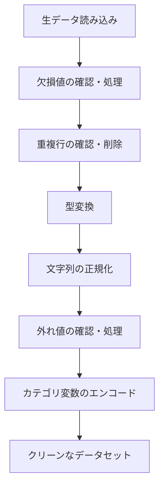

## 概要
データクリーニングは分析・機械学習の前処理として必須のステップです。現実のデータは欠損値・重複・型の不整合・表記ゆれを必ず含んでいます。「ゴミを入れればゴミが出る（GIGO）」という言葉の通り、前処理の質がそのまま分析精度に直結します。

## なぜ必要か
実務データの80〜90%のケースで、何らかのクリーニングが必要といわれています。欠損値を放置したまま平均を計算すれば誤った値になり、重複行があれば集計が2倍になります。機械学習モデルはNaN（欠損値）があると学習できないため、特に前処理は避けられません。

## クリーニングの全体フロー



## 1. 欠損値の確認

```python
import pandas as pd
import numpy as np

df = pd.read_csv("raw_data.csv")

# 全体の欠損数
print(df.isnull().sum())

# 欠損率（%）を降順で表示
missing_rate = (df.isnull().mean() * 100).sort_values(ascending=False)
print(missing_rate[missing_rate > 0])

# 欠損パターンを可視化（seaborn を使う場合）
import seaborn as sns
import matplotlib.pyplot as plt
sns.heatmap(df.isnull(), cbar=False, yticklabels=False, cmap="viridis")
plt.title("欠損マップ（黄=欠損）")
plt.show()
```

## 2. 欠損値の処理

```python
# ① 削除（欠損が少ない場合）
df_drop = df.dropna()                          # 欠損行をすべて削除
df_drop = df.dropna(subset=["price", "age"])   # 特定列が欠損の行のみ削除
df_drop = df.drop(columns=["col_70pct_null"])  # 欠損率が高い列を削除

# ② 数値列の補完
df["age"].fillna(df["age"].median(), inplace=True)        # 中央値
df["income"].fillna(df["income"].mean(), inplace=True)    # 平均
df["score"].fillna(df["score"].mode()[0], inplace=True)   # 最頻値

# ③ カテゴリ列の補完
df["city"].fillna("Unknown", inplace=True)

# ④ 時系列は前後の値で補完
df.fillna(method="ffill", inplace=True)   # 前の値で埋める
df.fillna(method="bfill", inplace=True)   # 後の値で埋める

# ⑤ グループ内の統計値で補完（より精度が高い）
df["price"] = df.groupby("category")["price"].transform(
    lambda x: x.fillna(x.median())
)
```

## 3. 重複行の処理

```python
print(f"重複行数: {df.duplicated().sum()}")

# 特定の列で重複判定
print(f"user_id重複: {df.duplicated(subset=['user_id']).sum()}")

# 重複を確認（最初の1件を残す）
df_unique = df.drop_duplicates()
df_unique = df.drop_duplicates(subset=["user_id"], keep="first")

# どんな重複があるか確認
print(df[df.duplicated(keep=False)].sort_values("user_id"))
```

## 4. 型変換

```python
# 文字列を数値に変換（変換できない値はNaNにする）
df["price"]  = pd.to_numeric(df["price"], errors="coerce")
df["score"]  = pd.to_numeric(df["score"], errors="coerce")

# 文字列を日付に変換
df["date"]   = pd.to_datetime(df["date"], format="%Y-%m-%d", errors="coerce")

# 日付から特徴量を抽出
df["year"]   = df["date"].dt.year
df["month"]  = df["date"].dt.month
df["day"]    = df["date"].dt.day
df["dow"]    = df["date"].dt.day_of_week      # 0=月曜
df["is_weekend"] = df["dow"].isin([5, 6])

# カテゴリ型に変換（メモリ節約・高速集計）
df["status"] = df["status"].astype("category")
```

## 5. 文字列のクリーニング

```python
# 前後の空白・改行を除去
df["name"]  = df["name"].str.strip()
df["email"] = df["email"].str.strip().str.lower()

# 表記ゆれを統一
df["gender"] = df["gender"].str.replace("男性", "M").str.replace("女性", "F")

# 正規表現で不要な文字を削除
df["phone"]  = df["phone"].str.replace(r"[^\d]", "", regex=True)   # 数字以外を削除
df["postal"] = df["postal"].str.replace(r"[-\s]", "", regex=True)  # ハイフン削除

# 特定パターンを含む行を除外
df = df[~df["name"].str.contains("test|dummy|temp", case=False, na=False)]

# 文字数が異常な行を除外
df = df[df["name"].str.len().between(1, 50)]
```

## 6. 外れ値の確認と処理

```python
# 箱ひげ図で外れ値を確認
import seaborn as sns
sns.boxplot(data=df, y="price")
plt.show()

# IQR法で外れ値を検出
def detect_outliers_iqr(series: pd.Series) -> pd.Series:
    Q1, Q3 = series.quantile([0.25, 0.75])
    IQR = Q3 - Q1
    lower, upper = Q1 - 1.5 * IQR, Q3 + 1.5 * IQR
    return (series < lower) | (series > upper)

is_outlier = detect_outliers_iqr(df["price"])
print(f"外れ値: {is_outlier.sum()} 件 / {len(df)} 件")

# 処理方法①: 削除
df_clean = df[~is_outlier]

# 処理方法②: クリッピング（上限・下限で切り詰める）
Q1, Q3 = df["price"].quantile([0.25, 0.75])
IQR    = Q3 - Q1
df["price"] = df["price"].clip(lower=Q1 - 1.5*IQR, upper=Q3 + 1.5*IQR)
```

## 7. カテゴリ変数のエンコード

```python
# ① Label Encoding（順序がある場合：Low/Mid/High など）
grade_map = {"C": 0, "B": 1, "A": 2}
df["grade_enc"] = df["grade"].map(grade_map)

# ② One-Hot Encoding（順序がないカテゴリ）
df = pd.get_dummies(df, columns=["city", "status"], drop_first=True)

# ③ 頻度エンコード（カーディナリティが高い場合）
freq_map = df["category"].value_counts(normalize=True)
df["category_freq"] = df["category"].map(freq_map)
```

## クリーニング前後のチェックリスト

```python
def data_quality_report(df: pd.DataFrame) -> None:
    print(f"=== データ品質レポート ===")
    print(f"行数: {len(df):,}  列数: {df.shape[1]}")
    print(f"\n【欠損】")
    missing = df.isnull().sum()
    print(missing[missing > 0].to_string())
    print(f"\n【重複行】{df.duplicated().sum()} 件")
    print(f"\n【各列の型】")
    print(df.dtypes.to_string())

data_quality_report(df)
```

## 次に学ぶべき内容
クリーンになったデータを [[data-analysis]] でEDA（探索的データ分析）してみましょう。
