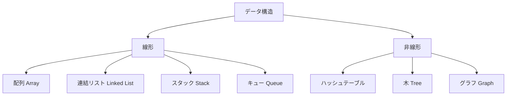
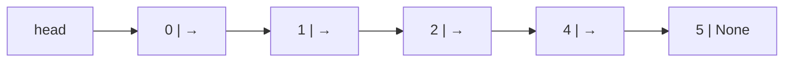
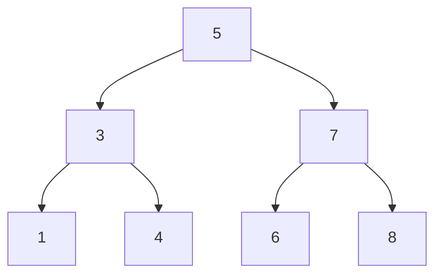

## データ構造とは

**データ構造**とは、データをどう格納・整理・アクセスするかの設計パターンです。同じ問題でも、適切なデータ構造を選ぶだけで処理速度が劇的に変わります。



## 配列（Array）

最も基本的なデータ構造。メモリ上に連続して並ぶ。

```python
arr = [10, 20, 30, 40, 50]

# O(1): 添字アクセス
print(arr[2])      # 30

# O(1): 末尾追加（amortized）
arr.append(60)

# O(n): 先頭/中間への挿入（後ろをずらす必要がある）
arr.insert(0, 5)   # [5, 10, 20, 30, 40, 50, 60]

# O(n): 要素の検索
idx = arr.index(30)   # 3
```

| 操作 | 計算量 |
|------|--------|
| 添字アクセス `arr[i]` | O(1) |
| 末尾追加 `append` | O(1)* |
| 末尾削除 `pop()` | O(1) |
| 先頭/中間挿入 | O(n) |
| 先頭/中間削除 | O(n) |
| 検索 `in` | O(n) |

\(*\) 動的配列は容量超過時にサイズ2倍のコピーが発生するため、ならし計算量 O(1)。

## 連結リスト（Linked List）

各要素（ノード）が「データ」と「次のノードへのポインタ」を持つ構造。

```python
class Node:
    def __init__(self, val):
        self.val  = val
        self.next = None

class LinkedList:
    def __init__(self):
        self.head = None

    def prepend(self, val):      # O(1): 先頭追加
        node = Node(val)
        node.next = self.head
        self.head = node

    def append(self, val):       # O(n): 末尾追加
        node = Node(val)
        if not self.head:
            self.head = node; return
        cur = self.head
        while cur.next:
            cur = cur.next
        cur.next = node

    def delete(self, val):       # O(n): 値で削除
        if not self.head: return
        if self.head.val == val:
            self.head = self.head.next; return
        cur = self.head
        while cur.next:
            if cur.next.val == val:
                cur.next = cur.next.next; return
            cur = cur.next

    def to_list(self):
        result, cur = [], self.head
        while cur:
            result.append(cur.val)
            cur = cur.next
        return result

ll = LinkedList()
for v in [1, 2, 3, 4, 5]:
    ll.append(v)
ll.prepend(0)
ll.delete(3)
print(ll.to_list())   # [0, 1, 2, 4, 5]
```

**計算量・数式で表すと**

$$
T_{\text{prepend}} = O(1), \quad T_{\text{append}} = T_{\text{delete}} = O(n)
$$

先頭操作は \(O(1)\)、末尾追加や値による削除は末尾までの走査が必要で \(O(n)\) です。



| 操作 | 配列 | 連結リスト |
|------|------|-----------|
| 先頭挿入 | O(n) | **O(1)** |
| 末尾挿入 | O(1) | O(n)* |
| 中間挿入（位置既知） | O(n) | **O(1)** |
| 添字アクセス | **O(1)** | O(n) |
| 検索 | O(n) | O(n) |

\(*\) tail ポインタを持てば O(1)。

## スタック（Stack）

**LIFO（後入れ先出し）**。最後に積んだものを最初に取り出す。

```python
class Stack:
    def __init__(self):
        self._data = []

    def push(self, val):    # O(1)
        self._data.append(val)

    def pop(self):          # O(1)
        if self.is_empty():
            raise IndexError("stack is empty")
        return self._data.pop()

    def peek(self):         # O(1): 取り出さずに確認
        return self._data[-1]

    def is_empty(self):
        return len(self._data) == 0

# 括弧の対応チェック（スタックの典型的な使用例）
def is_balanced(s):
    stack = Stack()
    pairs = {')': '(', ']': '[', '}': '{'}
    for ch in s:
        if ch in '([{':
            stack.push(ch)
        elif ch in ')]}':
            if stack.is_empty() or stack.pop() != pairs[ch]:
                return False
    return stack.is_empty()

print(is_balanced("({[]})"))   # True
print(is_balanced("({[})"))    # False
```

**計算量・数式で表すと**

$$
T_{\text{push}} = T_{\text{pop}} = T_{\text{peek}} = O(1), \quad T_{\text{is\_balanced}}(n) = O(n)
$$

スタックの基本操作は \(O(1)\)、文字列長 \(n\) を1回走査する対応チェックは \(O(n)\) です。

**活用場面**：
- 関数呼び出しのコールスタック
- ブラウザの「戻る」ボタン
- 括弧・タグの対応チェック
- 深さ優先探索（DFS）の実装

## キュー（Queue）

**FIFO（先入れ先出し）**。最初に入れたものを最初に取り出す。

```python
from collections import deque   # Python の効率的なキュー

class Queue:
    def __init__(self):
        self._data = deque()

    def enqueue(self, val):   # O(1): 末尾に追加
        self._data.append(val)

    def dequeue(self):        # O(1): 先頭から取り出す
        if self.is_empty():
            raise IndexError("queue is empty")
        return self._data.popleft()

    def peek(self):
        return self._data[0]

    def is_empty(self):
        return len(self._data) == 0

# 幅優先探索（BFS）の典型的な使用例
def bfs_levels(graph, start):
    visited = {start}
    queue   = Queue()
    queue.enqueue((start, 0))
    result  = []
    while not queue.is_empty():
        node, level = queue.dequeue()
        result.append((node, level))
        for neighbor in graph.get(node, []):
            if neighbor not in visited:
                visited.add(neighbor)
                queue.enqueue((neighbor, level + 1))
    return result

graph = {"A": ["B", "C"], "B": ["D"], "C": ["D", "E"], "D": [], "E": []}
for node, level in bfs_levels(graph, "A"):
    print(f"  Level {level}: {node}")
```

**計算量・数式で表すと**

$$
T_{\text{enqueue}} = T_{\text{dequeue}} = O(1), \quad T_{\text{BFS}} = O(V + E)
$$

キューの出し入れは \(O(1)\)、BFS は全頂点 \(V\) と全辺 \(E\) を1回ずつ処理して \(O(V+E)\) です。

> ⚠️ `list` を使って `pop(0)` でキューを実装すると O(n) になります。`collections.deque` を使いましょう。

## ハッシュテーブル（Hash Table）

キーから**ハッシュ関数**でインデックスを計算し、O(1) でデータにアクセスします。Python の `dict` がこれです。

```python
# Python の dict はハッシュテーブル
phone_book = {}
phone_book["Alice"]   = "090-1234-5678"   # O(1): 挿入
phone_book["Bob"]     = "080-9876-5432"
phone_book["Charlie"] = "070-1111-2222"

print(phone_book["Alice"])           # O(1): 検索
print("Bob" in phone_book)          # O(1): 存在確認
del phone_book["Charlie"]           # O(1): 削除
```

### ハッシュ衝突

異なるキーが同じインデックスになる「衝突」が起きることがあります。

```
hash("Alice")   % 8 = 3  ┐
hash("Charlie") % 8 = 3  ┘ 衝突！

解決策:
  チェイン法: 同じインデックスを連結リストでつなぐ
  オープンアドレス法: 次の空きスロットを探す
```

### カウンター・頻度集計

```python
from collections import Counter, defaultdict

words = ["apple", "banana", "apple", "cherry", "banana", "apple"]

# Counter: ハッシュテーブルで出現回数を O(n) で集計
freq = Counter(words)
print(freq.most_common(2))   # [('apple', 3), ('banana', 2)]

# defaultdict: キーがなければデフォルト値を自動生成
groups = defaultdict(list)
data = [("A", 1), ("B", 2), ("A", 3), ("B", 4), ("C", 5)]
for key, val in data:
    groups[key].append(val)
print(dict(groups))   # {'A': [1, 3], 'B': [2, 4], 'C': [5]}
```

| 操作 | 平均 | 最悪（全衝突） |
|------|------|--------------|
| 挿入 | O(1) | O(n) |
| 検索 | O(1) | O(n) |
| 削除 | O(1) | O(n) |

## 木（Tree）

階層構造を持つデータ構造。最も一般的なのが**二分木（各ノードに左右最大2つの子）**。

```python
class TreeNode:
    def __init__(self, val):
        self.val   = val
        self.left  = None
        self.right = None

# 二分探索木（BST）: 左 < 親 < 右 を常に保つ
class BST:
    def __init__(self):
        self.root = None

    def insert(self, val):
        self.root = self._insert(self.root, val)

    def _insert(self, node, val):
        if not node:
            return TreeNode(val)
        if val < node.val:
            node.left  = self._insert(node.left,  val)
        elif val > node.val:
            node.right = self._insert(node.right, val)
        return node

    def search(self, val):   # O(log n) 平均、O(n) 最悪（偏った木）
        cur = self.root
        while cur:
            if val == cur.val: return True
            cur = cur.left if val < cur.val else cur.right
        return False

    def inorder(self):       # 中順巡回 → ソート済みで取り出せる
        result = []
        def _inorder(node):
            if not node: return
            _inorder(node.left)
            result.append(node.val)
            _inorder(node.right)
        _inorder(self.root)
        return result

bst = BST()
for v in [5, 3, 7, 1, 4, 6, 8]:
    bst.insert(v)
print(bst.search(4))    # True
print(bst.inorder())    # [1, 3, 4, 5, 6, 7, 8] ← ソート済み！
```

**計算量・数式で表すと**

$$
T_{\text{search}} = T_{\text{insert}} = O(h), \quad h = O(\log n)\ \text{(平衡時)},\ O(n)\ \text{(最悪)}
$$

探索・挿入は木の高さ \(h\) に比例します。平衡していれば \(O(\log n)\)、偏った木では \(O(n)\) です。



### 木の巡回

```python
def preorder(node):    # 前順: 根 → 左 → 右（木のコピー・シリアライズ）
    if not node: return []
    return [node.val] + preorder(node.left) + preorder(node.right)

def inorder(node):     # 中順: 左 → 根 → 右（BST をソート順に取得）
    if not node: return []
    return inorder(node.left) + [node.val] + inorder(node.right)

def postorder(node):   # 後順: 左 → 右 → 根（ディレクトリの削除）
    if not node: return []
    return postorder(node.left) + postorder(node.right) + [node.val]
```

**計算量・数式で表すと**

$$
T(n) = 2T(n/2) + O(1) = O(n)
$$

いずれの巡回も各ノードをちょうど1回訪問するため、全体で \(O(n)\) です。

## ヒープ（Heap）

「常に最大値（または最小値）を O(1) で取り出せる」木構造。優先度付きキューの実装に使います。

```python
import heapq

# Python の heapq は最小ヒープ
nums = [5, 3, 8, 1, 9, 2]
heapq.heapify(nums)        # O(n) でヒープに変換

print(heapq.heappop(nums))  # 1（最小値）O(log n)
print(heapq.heappop(nums))  # 2
heapq.heappush(nums, 0)     # O(log n) で追加
print(heapq.heappop(nums))  # 0

# 最大ヒープ：値を負にして使う
import heapq
data = [5, 3, 8, 1, 9]
max_heap = [-x for x in data]
heapq.heapify(max_heap)
print(-heapq.heappop(max_heap))  # 9（最大値）

# 応用: 上位 k 件を効率よく取得
def top_k(arr, k):
    return heapq.nlargest(k, arr)   # O(n log k)

print(top_k([3,1,4,1,5,9,2,6], 3))  # [9, 6, 5]
```

**計算量・数式で表すと**

$$
T_{\text{push}} = T_{\text{pop}} = O(\log n), \quad T_{\text{heapify}} = O(n), \quad T_{\text{top\_k}} = O(n \log k)
$$

push/pop は木の高さ分の \(O(\log n)\)、構築は \(O(n)\)、上位 \(k\) 件の取得は \(O(n \log k)\) です。

| 操作 | ヒープ |
|------|--------|
| 最小/最大を見る（peek） | O(1) |
| 追加（push） | O(log n) |
| 最小/最大を取り出す（pop） | O(log n) |
| 構築（heapify） | O(n) |

## データ構造の選び方

```
何をしたいか？
  ├─ 添字でランダムアクセス         → 配列
  ├─ 先頭への高速挿入/削除          → 連結リスト
  ├─ 後入れ先出し（戻る・Undo）     → スタック
  ├─ 先入れ先出し（待ち行列・BFS）  → キュー（deque）
  ├─ キーで高速検索                → ハッシュテーブル（dict/set）
  ├─ ソート済みデータの範囲検索     → 二分探索木（BST）
  └─ 最大/最小を繰り返し取り出す   → ヒープ（heapq）
```

## まとめ

| データ構造 | Python実装 | 強み |
|-----------|-----------|------|
| 配列 | `list` | ランダムアクセス O(1) |
| 連結リスト | `collections.deque` | 先頭操作 O(1) |
| スタック | `list` | push/pop O(1) |
| キュー | `collections.deque` | enqueue/dequeue O(1) |
| ハッシュテーブル | `dict`, `set` | 全操作 O(1) 平均 |
| 二分探索木 | `sortedcontainers.SortedList` | 検索・挿入 O(log n) |
| ヒープ | `heapq` | 最小/最大取得 O(1) |
