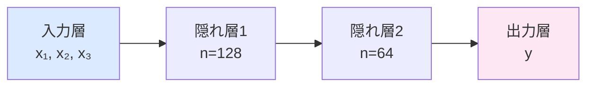

## 概要
深層学習（Deep Learning）は多層のニューラルネットワークを使って、データから特徴を自動的に学習する機械学習の手法です。画像認識・音声認識・自然言語処理で従来手法を大きく上回る精度を実現し、生成AIの基盤にもなっています。

## 主要な数式

**1層の順伝播**（重み $\mathbf{W}$、バイアス $\mathbf{b}$、活性化関数 $f$）：

$$\mathbf{a}^{(l)} = f\!\left(\mathbf{W}^{(l)}\mathbf{a}^{(l-1)} + \mathbf{b}^{(l)}\right)$$

**代表的な活性化関数**：

$$\mathrm{ReLU}(x) = \max(0, x), \qquad \sigma(x) = \frac{1}{1+e^{-x}}, \qquad \tanh(x) = \frac{e^x - e^{-x}}{e^x + e^{-x}}$$

**誤差逆伝播法**（連鎖律で勾配を計算）：

$$\frac{\partial \mathcal{L}}{\partial \mathbf{W}^{(l)}} = \boldsymbol{\delta}^{(l)} \left(\mathbf{a}^{(l-1)}\right)^\top, \qquad \boldsymbol{\delta}^{(l)} = \left(\mathbf{W}^{(l+1)\top}\boldsymbol{\delta}^{(l+1)}\right) \odot f'\!\left(\mathbf{z}^{(l)}\right)$$

**Adam オプティマイザ**の更新（モーメント $m_t, v_t$）：

$$\mathbf{w}_t = \mathbf{w}_{t-1} - \eta\,\frac{\hat{m}_t}{\sqrt{\hat{v}_t} + \epsilon}$$

## ニューラルネットワークの仕組み



各ノードは「重み付き和 → 活性化関数」を計算します：

```
z = w₁x₁ + w₂x₂ + ... + b
y = activation(z)
```

## 活性化関数の比較

```python
import numpy as np
import matplotlib.pyplot as plt

x = np.linspace(-5, 5, 200)

activations = {
    "ReLU":    np.maximum(0, x),
    "Sigmoid": 1 / (1 + np.exp(-x)),
    "Tanh":    np.tanh(x),
    "Leaky ReLU": np.where(x >= 0, x, 0.01 * x),
}

fig, axes = plt.subplots(1, 4, figsize=(14, 3))
for ax, (name, y) in zip(axes, activations.items()):
    ax.plot(x, y, linewidth=2, color="steelblue")
    ax.axhline(0, color="gray", linewidth=0.5)
    ax.axvline(0, color="gray", linewidth=0.5)
    ax.set_title(name)
    ax.grid(True, alpha=0.3)
plt.tight_layout()
plt.show()
```

| 関数 | 特徴 | 主な用途 |
|---|---|---|
| ReLU | 勾配消失しにくい・高速 | 隠れ層のデファクト |
| Sigmoid | 出力 0〜1 | 二値分類の出力層 |
| Softmax | 確率分布に変換 | 多クラス分類の出力層 |
| Tanh | 出力 -1〜1 | RNN の隠れ状態 |

## 順伝播（Forward Pass）を自分で実装

```python
import numpy as np

class NeuralNetwork:
    def __init__(self, layer_sizes: list[int]):
        self.weights = []
        self.biases  = []
        for i in range(len(layer_sizes) - 1):
            w = np.random.randn(layer_sizes[i], layer_sizes[i+1]) * 0.1
            b = np.zeros((1, layer_sizes[i+1]))
            self.weights.append(w)
            self.biases.append(b)

    def relu(self, x):
        return np.maximum(0, x)

    def softmax(self, x):
        e = np.exp(x - x.max(axis=1, keepdims=True))
        return e / e.sum(axis=1, keepdims=True)

    def forward(self, X):
        a = X
        for i, (w, b) in enumerate(zip(self.weights, self.biases)):
            z = a @ w + b
            a = self.softmax(z) if i == len(self.weights) - 1 else self.relu(z)
        return a

# 3入力 → 128 → 64 → 3クラス分類
nn = NeuralNetwork([3, 128, 64, 3])
X  = np.random.randn(10, 3)
y  = nn.forward(X)
print(f"出力形状: {y.shape}")   # (10, 3)
print(f"各行の和: {y.sum(axis=1)}")  # すべて 1.0
```

## 損失関数

```python
# 交差エントロピー（分類）
def cross_entropy(y_pred, y_true):
    eps = 1e-9
    return -np.sum(y_true * np.log(y_pred + eps)) / len(y_pred)

# 平均二乗誤差（回帰）
def mse(y_pred, y_true):
    return np.mean((y_pred - y_true) ** 2)
```

## 誤差逆伝播（Backpropagation）の直感


損失をすべての重みで偏微分し、**勾配降下法**で重みを更新します：
`W ← W − lr × ∂L/∂W`

## 学習率と最適化アルゴリズム

| オプティマイザ | 特徴 | 推奨場面 |
|---|---|---|
| SGD | シンプル・安定 | 画像分類（momentum付き） |
| Adam | 学習率自動調整 | 多くのタスクでデファクト |
| AdamW | Adamに正則化 | Transformer系 |
| RMSprop | RNN に強い | 時系列・RNN |

## 次に学ぶべき内容
PyTorchを使って実際にネットワークを書く [[pytorch]] を学びましょう。
