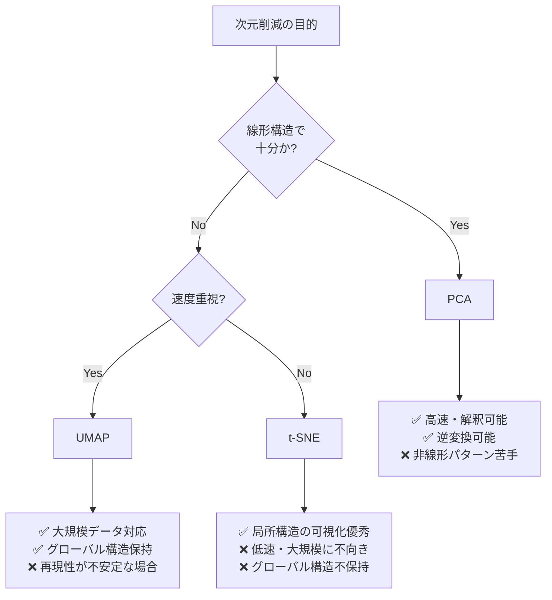

## 概要
次元削減は高次元データを低次元空間に圧縮する手法です。車載ネットワークでは数百のセンサーやプロトコル特徴量を2〜3次元に圧縮して可視化・分類に使います。PCAは線形、t-SNE・UMAPは非線形な構造を保持します。

## 主要な数式

**PCA**：共分散行列 $\mathbf{\Sigma}$ の固有値分解で分散最大の軸を求める。

$$\mathbf{\Sigma}\mathbf{v}_k = \lambda_k \mathbf{v}_k, \qquad \text{累積寄与率} = \frac{\sum_{k=1}^{m}\lambda_k}{\sum_{j=1}^{d}\lambda_j}$$

**t-SNE**：高次元の類似度を条件付き確率で、低次元を t 分布で表し KL ダイバージェンスを最小化。

$$p_{j|i} = \frac{\exp(-\lVert \mathbf{x}_i - \mathbf{x}_j \rVert^2 / 2\sigma_i^2)}{\sum_{k\ne i}\exp(-\lVert \mathbf{x}_i - \mathbf{x}_k \rVert^2 / 2\sigma_i^2)}$$

$$q_{ij} = \frac{(1 + \lVert \mathbf{y}_i - \mathbf{y}_j \rVert^2)^{-1}}{\sum_{k\ne l}(1 + \lVert \mathbf{y}_k - \mathbf{y}_l \rVert^2)^{-1}}, \qquad \mathrm{KL}(P\Vert Q) = \sum_{i\ne j} p_{ij}\log\frac{p_{ij}}{q_{ij}}$$

## PCA（主成分分析）

```python
import numpy as np
import pandas as pd
import matplotlib.pyplot as plt
from sklearn.preprocessing import StandardScaler
from sklearn.decomposition import PCA
from sklearn.manifold import TSNE

np.random.seed(42)

# 車載ECU通信ログの特徴量（10次元）
n_samples  = 500
n_features = 10
labels_true = np.repeat([0, 1, 2, 3, 4], n_samples // 5)   # 5種類のECUグループ

# 各グループは異なる中心を持つ
centers = np.random.randn(5, n_features) * 3
X = np.vstack([
    np.random.randn(n_samples // 5, n_features) + centers[i]
    for i in range(5)
])

scaler = StandardScaler()
X_scaled = scaler.fit_transform(X)

# PCA
pca = PCA()
pca.fit(X_scaled)

# 寄与率
explained = pca.explained_variance_ratio_
cumsum    = np.cumsum(explained)

fig, axes = plt.subplots(1, 2, figsize=(12, 5))
axes[0].bar(range(1, n_features+1), explained * 100)
axes[0].set_xlabel("主成分")
axes[0].set_ylabel("寄与率 (%)")
axes[0].set_title("各主成分の寄与率")

axes[1].plot(range(1, n_features+1), cumsum * 100, "bo-")
axes[1].axhline(90, color="red", linestyle="--", label="90%ライン")
axes[1].set_xlabel("主成分数")
axes[1].set_ylabel("累積寄与率 (%)")
axes[1].set_title("累積寄与率")
axes[1].legend()
plt.tight_layout()
plt.show()

n_components_90 = (cumsum >= 0.90).argmax() + 1
print(f"90%の分散を説明するのに必要な主成分: {n_components_90}")
```

## PCAで2次元に圧縮・可視化

```python
pca2 = PCA(n_components=2)
X_pca = pca2.fit_transform(X_scaled)

plt.figure(figsize=(8, 6))
colors = plt.cm.tab10(np.linspace(0, 1, 5))
for i, color in enumerate(colors):
    mask = labels_true == i
    plt.scatter(X_pca[mask, 0], X_pca[mask, 1], c=[color], label=f"ECUグループ {i}", alpha=0.6, s=30)
plt.xlabel(f"PC1 ({explained[0]*100:.1f}%)")
plt.ylabel(f"PC2 ({explained[1]*100:.1f}%)")
plt.legend()
plt.title("PCA 2次元可視化")
plt.show()

# 主成分の負荷量（どの特徴量が重要か）
loadings = pd.DataFrame(
    pca2.components_.T,
    columns=["PC1", "PC2"],
    index=[f"Feature_{i}" for i in range(n_features)]
)
print(loadings.abs().sort_values("PC1", ascending=False))
```

## PCA・t-SNEによる次元削減の可視化


## t-SNE（非線形次元削減）

```python
tsne = TSNE(
    n_components=2,
    perplexity=30,
    n_iter=1000,
    random_state=42,
    learning_rate="auto",
    init="pca",
)
X_tsne = tsne.fit_transform(X_scaled)

plt.figure(figsize=(8, 6))
for i, color in enumerate(colors):
    mask = labels_true == i
    plt.scatter(X_tsne[mask, 0], X_tsne[mask, 1], c=[color], label=f"ECUグループ {i}", alpha=0.6, s=30)
plt.legend()
plt.title("t-SNE 2次元可視化")
plt.show()
```

## UMAP（高速・グローバル構造保持）

```python
# pip install umap-learn
import umap

reducer = umap.UMAP(n_components=2, random_state=42, n_neighbors=15, min_dist=0.1)
X_umap  = reducer.fit_transform(X_scaled)

plt.figure(figsize=(8, 6))
for i, color in enumerate(colors):
    mask = labels_true == i
    plt.scatter(X_umap[mask, 0], X_umap[mask, 1], c=[color], label=f"ECUグループ {i}", alpha=0.6, s=30)
plt.legend()
plt.title("UMAP 2次元可視化")
plt.show()
```

## 手法の比較



## オートエンコーダー（深層次元削減）

```python
import torch
import torch.nn as nn

class Autoencoder(nn.Module):
    def __init__(self, input_dim=10, latent_dim=2):
        super().__init__()
        self.encoder = nn.Sequential(
            nn.Linear(input_dim, 32), nn.ReLU(),
            nn.Linear(32, 16),        nn.ReLU(),
            nn.Linear(16, latent_dim),
        )
        self.decoder = nn.Sequential(
            nn.Linear(latent_dim, 16), nn.ReLU(),
            nn.Linear(16, 32),         nn.ReLU(),
            nn.Linear(32, input_dim),
        )

    def forward(self, x):
        z = self.encoder(x)
        return self.decoder(z), z

model = Autoencoder(input_dim=10, latent_dim=2)
optimizer = torch.optim.Adam(model.parameters(), lr=1e-3)
criterion = nn.MSELoss()

X_tensor = torch.FloatTensor(X_scaled)
for epoch in range(200):
    recon, z = model(X_tensor)
    loss = criterion(recon, X_tensor)
    optimizer.zero_grad()
    loss.backward()
    optimizer.step()

print(f"最終損失: {loss.item():.4f}")

with torch.no_grad():
    _, X_ae = model(X_tensor)
    X_ae = X_ae.numpy()

plt.figure(figsize=(8, 6))
for i, color in enumerate(colors):
    mask = labels_true == i
    plt.scatter(X_ae[mask, 0], X_ae[mask, 1], c=[color], label=f"ECUグループ {i}", alpha=0.6, s=30)
plt.legend()
plt.title("オートエンコーダー 潜在空間")
plt.show()
```
