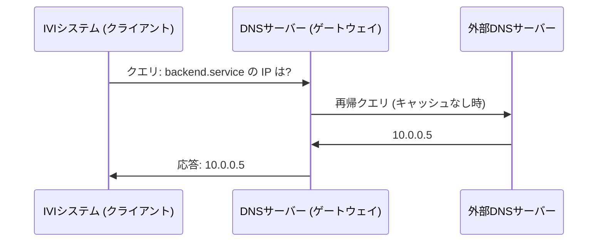

## 概要
DNS(Domain Name System)は、人間が読みやすいドメイン名(例 `example.com`)を、機器が使う [[ip]] アドレスに変換する「インターネットの電話帳」です。問い合わせは主に [[udp]] 上で高速に行われます。

## なぜ必要か
人はIPアドレスの数字を覚えられません。DNSが名前とIPを対応づけることで、私たちは名前だけでサービスにアクセスできます。設定変更時もIPが変わるだけでよく、名前は維持できます。

## 自動運転での利用例
クラウド連携(OTA更新やテレマティクス)を行う車載システムでは、接続先サーバをDNSで解決します。社内開発環境でも、ECUやテスト機をホスト名で扱うためにDNSが使われます。

## 関連用語
変換先が [[ip]]、問い合わせの土台が [[udp]]、設定配布元が [[dhcp]] です。

## 次に学ぶべき内容
通信の出入口 [[socket]] を学びましょう。

## 図解

