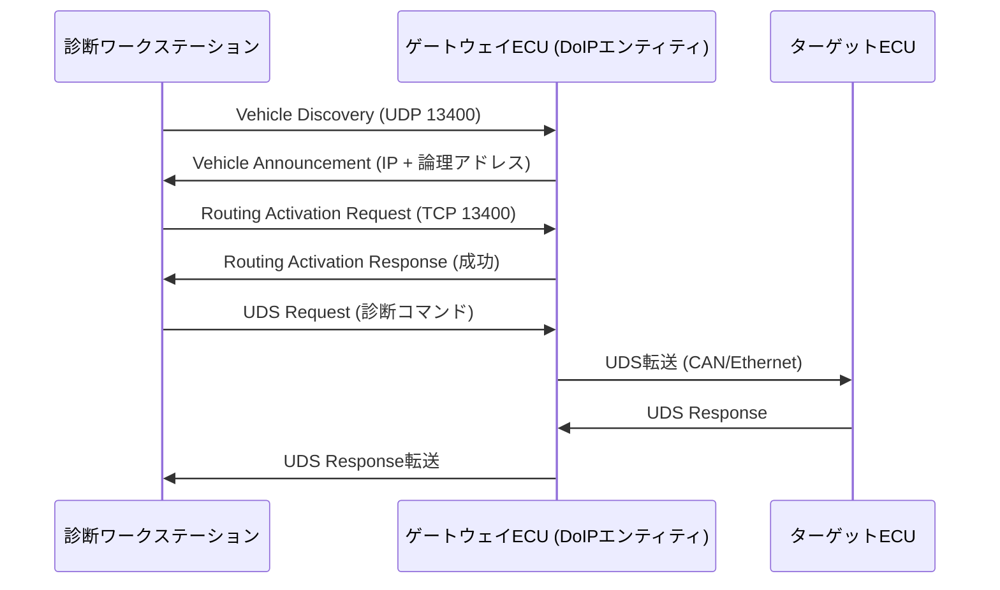

## 概要
DoIP(Diagnostics over IP / ISO 13400)は、車載診断通信(UDS)を [[ip]] ネットワーク上で行うための規格です。従来CAN上で行っていた診断を、高帯域なEthernetとIPで実現し、大量データの高速なやり取りを可能にします。

## なぜ必要か
ソフトウェア更新(OTA)や大容量ログの取得など、現代の診断は従来のCANでは帯域が不足します。DoIPはIP上で診断を行うことで、高速・大容量の診断・書き換えを可能にします。

## 自動運転での利用例
ECUのファームウェア更新や故障診断を、車載Ethernet経由で高速に実施します。DoIPは信頼性が必要なため主に [[tcp]] 上で動作し、ポート13400番が標準として使われます。

## 関連用語
土台が [[tcp]] / [[ip]]、サービス通信が [[some-ip]]、標準フレームワークが [[autosar]] です。

## 次に学ぶべき内容
サービス指向通信の中核 [[some-ip]] を学びましょう。

## 図解

