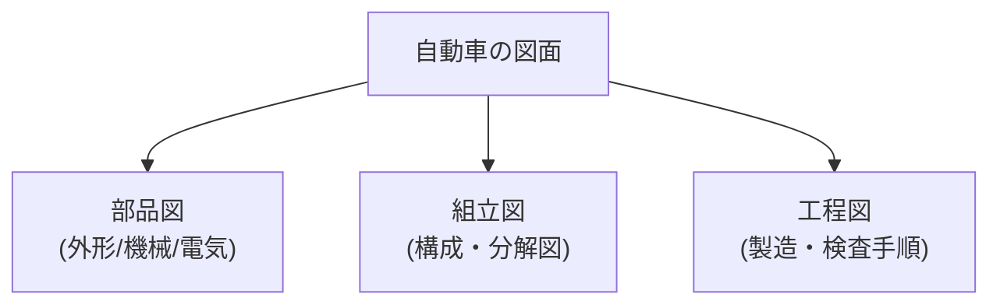

## 概要
図面（製図）はエンジニアの共通言語です。自動車のエンジンブロック・サスペンションアーム・ハーネスコネクタなど、すべての部品は図面から作られます。図面を読む力は設計・生産・品質・実験すべての職種で必要とされます。

## 図面の種類



| 図面 | 内容 |
|---|---|
| 部品図（Detail） | 1部品の形状・寸法・材質・加工精度 |
| 組立図（Assembly） | どの部品がどこに付くか・分解図 |
| 工程図（Process） | 製造工程・検査手順 |

## 三角法（第一角法 vs 第三角法）

立体を平面に描く投影法には2方式があり、図面右下の記号で見分けます。**「どちらの側面図を左右どちらに置くか」が逆**になります。

| 方式 | 採用地域 | 右側面図の位置 | 記号 |
|---|---|---|---|
| 第三角法 | 米国・日本（JIS推奨） | 右に置く | ○の中に△（外向き） |
| 第一角法 | EU（ISO） | 左に置く | ○の中に台形（内向き） |

```
第三角法（JIS推奨）の配置:

         [上面図]
  [左側面図][正面図][右側面図]
         [下面図]
  → 「右から見た図は右に置く」
```

## 寸法線・公差の読み方

図面の数字は記号で意味が変わります。

| 記法 | 意味 |
|---|---|
| 50 ± 0.1 | 50mm、許容差 ±0.1mm |
| 50 +0.05/0 | 50〜50.05mm（一方向公差） |
| φ20 | 直径 20mm |
| R5 | 半径 5mm |
| □30 | 正方形 30×30mm |
| 50H7 / 50h7 | はめあい公差（H=穴、h=軸） |

**はめあい**は穴と軸の組み合わせで、すきま・締め代を規定します。自動車のシャフトとベアリングの組付けに多用されます。

| はめあい | 種類 | 用途 |
|---|---|---|
| H7/g6 | すきまばめ | 回転・摺動部（軸受） |
| H7/k6 | 中間ばめ | 位置決め（軽圧入） |
| H7/n6 | 中間ばめ | ノックピン・位置決め |
| H7/p6 | しまりばめ | 圧入固定（ブッシュ） |

## 表面粗さ（仕上げ記号）

表面の滑らかさは算術平均粗さ **Ra [μm]** で表され、数値が小さいほど滑らかです。加工方法ごとに到達できる粗さが決まっています。

| 加工方法 | Ra（μm） |
|---|---|
| 超精密研削（ラッピング） | 0.006〜0.025 |
| 研削（Grinding） | 0.025〜0.8 |
| ホーニング | 0.1〜0.8 |
| 旋削・フライス（精） | 0.4〜3.2 |
| プレス・鍛造 | 1.6〜12.5 |
| 鋳造 | 6.3〜25 |

**自動車部品の例**：シリンダーボアは Ra 0.4〜0.8（ホーニング）、クランクシャフトジャーナルは Ra 0.2〜0.4（研削）と、シール性や摺動が必要な面ほど高精度に仕上げます。

## GD&T（幾何公差）

寸法公差だけでは表現できない「形状・位置のずれ」を規定します。

| 記号 | 名称 | 規定する誤差 |
|---|---|---|
| ⊙ | 真円度 | 断面の真円からのずれ |
| ⌭ | 円筒度 | 円柱全体のずれ |
| // | 平行度 | 基準面との平行性 |
| ⊥ | 直角度 | 基準面との垂直性 |
| ◎ | 同軸度 | 基準軸との同心度 |
| ⊕ | 位置度 | 理論位置からのずれ |

**エンジン部品の幾何公差例**：

| 部品 | 公差 | 値 | 理由 |
|---|---|---|---|
| シリンダーボア真円度 | ⊙ | 0.005 mm | ピストンリングのシール性 |
| クランクシャフト同軸度 | ◎ | 0.010 mm | 振動・ベアリング寿命 |
| ヘッド面平面度 | — | 0.050 mm | ガスケットのシール性 |
| カムシャフト位置度 | ⊕ | 0.020 mm | バルブタイミング精度 |

## 電気図面（配線図・回路図）

自動車の電気図面は3種類あります。

| 図面 | 内容 |
|---|---|
| 回路図（Schematic） | 電気的な接続を記号で表す |
| 配線図（Wiring） | 実際の配線経路・色・端子番号 |
| ハーネス図 | 束・クリップ・グロメット位置 |

配線は**線色コード**で識別します（例：`R/W` = 赤地に白ストライプ）。

| コード | 色 | 主な用途 |
|---|---|---|
| B | 黒 | GND（接地） |
| R | 赤 | B+電源 |
| W / G / Y / L | 白/緑/黄/青 | 信号 |
| P | ピンク | イグニッション電源 |
| O | 橙 | ACC電源 |

`C01-3` のような表記は「コネクタC01の3番ピン」を意味します。

## 部品番号・改訂管理

図面右下の**標題欄（Title Block）** に管理情報がまとまっています。

```
┌─────────────────────────────┐
│ 品番: 12345-67890            │ ← 部品番号
│ 品名: シリンダーヘッドカバー   │
│ 材質: ADC12（アルミダイカスト）│
│ 図番: DWG-2024-001 Rev.C     │ ← Rev=改訂番号
│ 縮尺: 1:2   単位: mm         │
└─────────────────────────────┘
```

**改訂（Rev）管理**：Rev.A（初版）→ Rev.B（1回目変更）→ Rev.C（2回目変更）と進み、Revが上がると旧版は廃止されます。どのRevの図面で作られた部品かは、品質トレーサビリティ上きわめて重要です。
