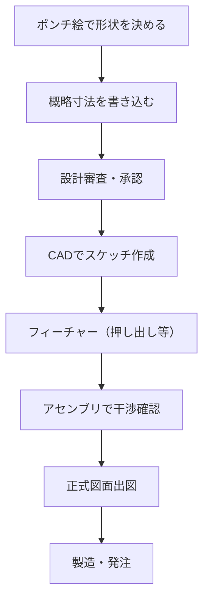

## ポンチ絵とは

**ポンチ絵（ぽんちえ）** とは、アイデアや構造を**フリーハンドで素早く描いた略図**のことです。英語では **engineering sketch** や **concept sketch** と呼ばれます。

もともと「ポンチ」はヨーロッパの風刺漫画（Punch）から来た言葉で、簡略化された絵を指します。製造業・ものづくりの現場では「精密な CAD 図面を描く前段階の手書きメモ」として今も活躍しています。


## ポンチ絵が必要な理由

| 場面 | CAD図面 | ポンチ絵 |
|------|--------|---------|
| アイデア出し | ❌ 時間がかかる | ✅ 即座に描ける |
| 会議での説明 | △ 画面が必要 | ✅ 紙1枚で伝わる |
| 問題の共有 | △ 詳細すぎて本質が埋もれる | ✅ 要点だけを強調 |
| 現場での確認 | ❌ PC/タブレット必須 | ✅ 油性ペンと紙だけ |
| 複数案の比較 | △ 作り直しに時間がかかる | ✅ 並べて比較しやすい |

> 「1000文字より1枚の絵」。複雑な構造も、ポンチ絵1枚で関係者全員が素早く共有できます。

## ポンチ絵の描き方

### 基本姿勢

- **正確さより速さ・伝わりやすさ優先**
- 定規・コンパスは使わない（使う時間があればCADで描く）
- 線が曲がっても太さが揃わなくても問題なし
- **見ている人が3秒で理解できる**かどうかが基準

### 立体を描くコツ

エンジニアリングスケッチでよく使う立体表現：

#### アイソメトリック図（等角投影）

3軸を120°ずつ開いて描く。奥行きが直感的に伝わる。

```
      /\
     /  \
    /    \
   /      \
  |        |
  |  箱型  |
  |        |
   \      /
    \    /
     \  /
      \/

描き方:
  ① 縦軸（高さ）を垂直に
  ② 横軸を左右30°傾けて描く
  ③ 奥行き軸を右上30°に描く
```

#### キャビネット図（斜投影）

正面図は実形のまま、奥行きを45°・1/2の長さで描く。

```
  正面図       奥行き(45°方向、実長の1/2)
  ┌───┐       ┌───┐
  │   │      ╱   ╱│
  │   │     ╱   ╱ │
  └───┘    └───┘  │
            │   │  │
            └───┘
```

### よく使う記号と省略表現

```
記号:
  ○  穴（貫通）、軸の断面
  ⊕  穴の中心マーク
  →  力・方向・流れ
  ≈  大体この寸法（正確な数字が不明なとき）
  Ø20 直径20mmの穴
  □  正方形断面

省略:
  対称形: 片側だけ描いて中心線を引く
  繰り返し: 1つを詳細に描き「×6ヶ所」と注記
  内部構造: 破線で外から見えない部分を示す
```

## 実際のポンチ絵の例

### 例1：ブラケット（取付金具）

```
           [取付面（壁側）]
       ┌───────────────┐
       │  ○      ○    │  ← M8穴×2
       │               │
       └──┬──────────┘
          │  （リブ）
    ┌─────┴────────────┐
    │  ○          ○   │  ← M6穴×2（部品取付側）
    └─────────────────┘
    　　　  t=3 SUS304
    　　　  全長 L=120
```

### 例2：油圧回路のブロック図

```
  タンク
  [====]
    │
   [P]── ポンプ（電動）
    │
  [絞り弁]
    │
  ┌─┴─┐
 [A]  [B]  ← 方向切換弁ポート
  │    │
[シリンダ─左]  [シリンダ─右]
  └────┘
    ↑伸長    ↑収縮
```

### 例3：組み付け手順のポンチ絵

```
STEP 1           STEP 2           STEP 3
  ベース            ブラケット        ボルト締め
  ┌───┐          ┌───┐           ┌───┐
  │   │    →    │ ╔═╗ │    →    │ ╔═╗ │
  │   │          │ ║ ║ │           │ ╠═╣ │
  └───┘          └─╚═╝─┘          └─╚═╝─┘
                   ↑挿入             ↑M6×3本
```

## ポンチ絵に書くべき情報

良いポンチ絵には以下を盛り込みます：

```
必須:
  □ 大まかな形状・構成
  □ 主要寸法（概略値でOK）
  □ 材料・板厚（決まっていれば）
  □ 穴の位置・大きさ

あると良い:
  □ 矢印で力・動き・流れを示す
  □ 重要な部位に注記（ここが接触面、ここが応力集中部など）
  □ スケール感（A4用紙に対してどれくらいの大きさか）
  □ 図の名前・作成者・日付
```

## デジタルポンチ絵ツール

手書きにこだわらなくても、以下のデジタルツールで素早くスケッチできます：

| ツール | 特徴 | 向いている場面 |
|--------|------|--------------|
| **Excalidraw** | ブラウザで使える・手書き風 | オンライン会議での共有 |
| **draw.io** | フロー図・ブロック図が得意 | システム構成・電気回路 |
| **Procreate / GoodNotes** | iPad + Apple Pencil | 本格的な手書きスケッチ |
| **OneNote / Notion** | 手書き＋文字を混在 | 議事録と一緒にまとめたい |
| **FreeCAD スケッチャー** | そのままCADに移行できる | 形状が決まってきたら |

## ポンチ絵からCADへの流れ



ポンチ絵段階での修正は**5分**、CAD段階での修正は**30分〜数時間**、製造後の修正は**数日〜数週間**かかります。早い段階でポンチ絵を使って議論することが、設計品質の向上とコスト削減に直結します。

## プロのポンチ絵のコツ

1. **3つの視点で描く癖をつける** → 正面・上・横を素早くセットで描く
2. **比率を意識する** → 大きいものと小さいものの相対感を合わせる
3. **太さで重要度を示す** → 外形線は太く、補助は細く
4. **矢印を積極的に使う** → 動き・力・流れ・組み付け方向
5. **「このくらい」を書く** → 厳密な数字でなく「約50mm」「A4くらい」でOK
6. **描きすぎない** → 伝えたい点に絞る。全部描こうとするとCADより遅くなる

## まとめ

| 場面 | 使うべき道具 |
|------|------------|
| 思いついたとき | 紙とペン（ポンチ絵） |
| 複数案を比較 | 紙×複数枚（ポンチ絵） |
| 会議で共有 | ホワイトボード or デジタルスケッチ |
| 形状が確定 | CAD（2D or 3D） |
| 製造に出す | 正式図面（JIS準拠） |

ポンチ絵は「下手でいい」のではなく「**要点が明確なら十分**」というものです。現場の熟練エンジニアほど素早く本質的なポンチ絵を描きます。
