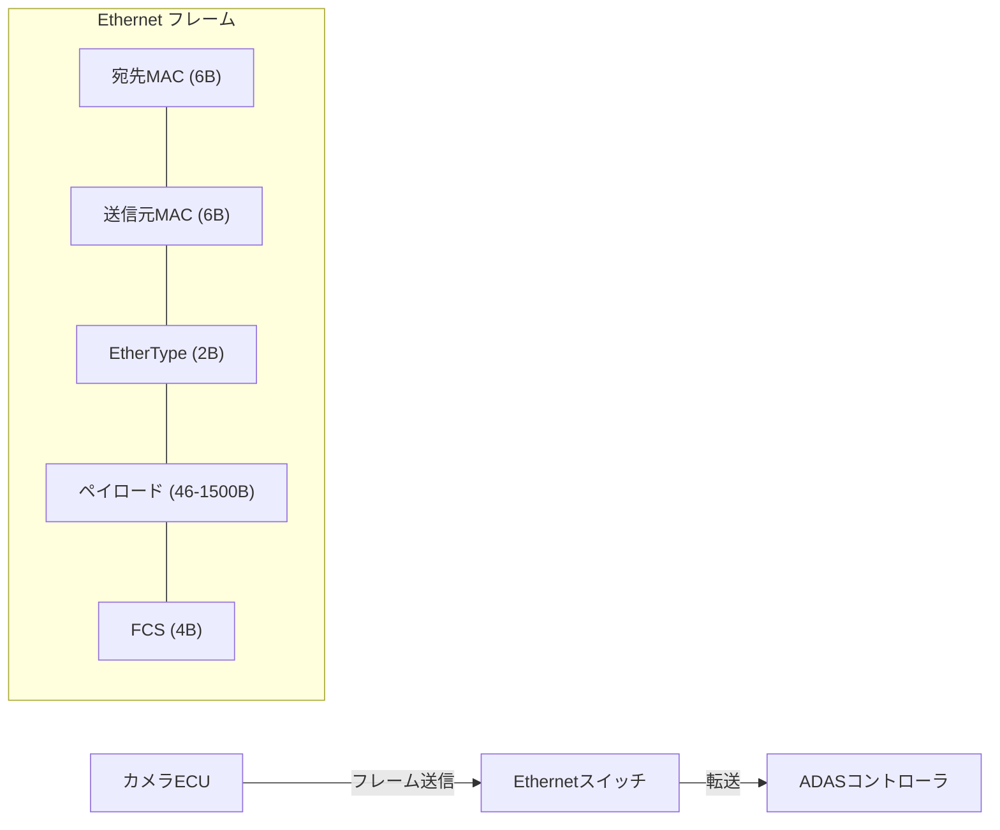

## 概要
Ethernetは有線LANの標準技術で、OSIの物理層・データリンク層(L1/L2)を担います。データを「**フレーム**」という単位にまとめ、[[mac-address]] を使って同じネットワーク内の機器へ届けます。

## なぜ必要か
高帯域・低コスト・成熟した技術であり、PCからデータセンターまで世界中で使われています。車載でも、従来のCANでは足りない大容量データ(カメラ映像など)を運ぶバックボーンとして採用が進んでいます。

## 自動運転での利用例
車載Ethernet(**100BASE-T1** / **1000BASE-T1** など)は1対のツイストペアで高速通信を実現し、カメラ・LiDAR・SOME/IP通信を1本の物理網に集約します。VLANで制御系と情報系のトラフィックを分離するのも一般的です。

## 関連用語
**フレーム**の宛先には [[mac-address]] が使われ、その上に [[ip]] が載ります。階層全体像は [[osi]] を参照。

## 次に学ぶべき内容
Ethernetが宛先判定に使う [[mac-address]] を学びましょう。

## 図解

