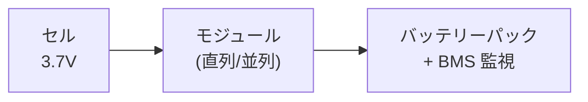

## 概要
電気自動車（EV）の心臓部はリチウムイオンバッテリーパックです。スマートフォンと同じ原理ですが、容量は数万倍。電圧・容量・BMS（バッテリー管理システム）・充電方式の仕組みを理解することは、EV開発・診断の基盤です。



## 主要な数式

**蓄えられるエネルギー**（電圧 \(V\)、容量 \(Q\)）：

$$E\,[\text{Wh}] = V\,[\text{V}] \times Q\,[\text{Ah}]$$

例：400V × 75Ah = 30kWh。

**充電時間の目安**（充電電力 \(P\)、効率 \(\eta\)）：

$$t = \frac{E}{P \cdot \eta}$$

**C レート**（充放電速度、容量 \(Q\) に対する電流 \(I\)）：

$$\text{C-rate} = \frac{I}{Q}$$

1C は1時間で満充電/放電する電流。**充電率（SOC）**は

$$\mathrm{SOC} = \frac{Q_{\text{remaining}}}{Q_{\text{rated}}} \times 100\,[\%]$$

## リチウムイオン電池の仕組み

```
充電時:
  正極（NMC/LFP）← Li⁺ ← 電解液 ← 負極（黒鉛）
                    Li⁺が正極から負極へ移動

放電時（使用時）:
  正極（NMC/LFP）→ Li⁺ → 電解液 → 負極（黒鉛）
                    Li⁺が負極から正極へ移動
                    電子は外部回路をモーターへ
```

```python
import numpy as np
import matplotlib.pyplot as plt

# 代表的なリチウムイオン電池の正極材料比較
cathode_materials = {
    "NMC 811":  {"V_nom": 3.7, "capacity": 200, "cycle": 1000,  "thermal": "中",  "cost": "高", "use": "EV高容量"},
    "NCA":      {"V_nom": 3.7, "capacity": 200, "cycle": 1000,  "thermal": "低",  "cost": "高", "use": "Tesla"},
    "LFP":      {"V_nom": 3.2, "capacity": 165, "cycle": 3000,  "thermal": "高",  "cost": "低", "use": "BYD/CATL"},
    "LTO":      {"V_nom": 2.4, "capacity": 130, "cycle": 20000, "thermal": "最高","cost": "最高","use": "急速充電"},
}

print(f"{'材料':10s} {'公称電圧':8s} {'容量mAh/g':10s} {'サイクル':8s} {'熱安定性':8s} {'用途'}")
print("-" * 70)
for mat, spec in cathode_materials.items():
    print(f"{mat:10s} {spec['V_nom']:6.1f}V  {spec['capacity']:6d}    "
          f"{spec['cycle']:5d}    {spec['thermal']:6s}    {spec['use']}")
```

## セル・モジュール・パックの構成

```python
def battery_pack_design(cell_voltage, cell_capacity_Ah, target_voltage, target_energy_kWh):
    """
    EVバッテリーパックの設計計算
    """
    cells_series  = round(target_voltage / cell_voltage)
    pack_voltage  = cells_series * cell_voltage

    target_Ah     = target_energy_kWh * 1000 / pack_voltage
    cells_parallel= round(target_Ah / cell_capacity_Ah)
    pack_capacity = cells_parallel * cell_capacity_Ah

    total_cells   = cells_series * cells_parallel
    actual_energy = pack_voltage * pack_capacity / 1000

    return {
        "直列セル数": cells_series,
        "並列セル数": cells_parallel,
        "総セル数":   total_cells,
        "パック電圧":  f"{pack_voltage:.0f} V",
        "パック容量":  f"{pack_capacity:.0f} Ah",
        "エネルギー":  f"{actual_energy:.1f} kWh",
    }

# Tesla Model 3 ロングレンジ（概算）
print("=== Tesla Model 3 Long Range（概算） ===")
design = battery_pack_design(
    cell_voltage=3.7,       # NCA セル公称電圧
    cell_capacity_Ah=4.8,   # 18650型
    target_voltage=350,     # パック電圧
    target_energy_kWh=75,   # 75kWh パック
)
for k, v in design.items():
    print(f"  {k}: {v}")

print()
# BYD Blade Battery（LFP）
print("=== BYD Blade Battery（LFP）（概算） ===")
design_lfp = battery_pack_design(
    cell_voltage=3.2,
    cell_capacity_Ah=100,   # 大型ブレードセル
    target_voltage=320,
    target_energy_kWh=60,
)
for k, v in design_lfp.items():
    print(f"  {k}: {v}")
```

## BMS（バッテリー管理システム）

```python
# BMSの主要機能をシミュレーション

class SimpleBMS:
    def __init__(self, cells_series, V_nominal=3.7, V_max=4.2, V_min=3.0):
        self.n = cells_series
        self.V_max  = V_max
        self.V_min  = V_min
        self.V_nom  = V_nominal

    def estimate_soc(self, V_cell):
        """セル電圧からSOC（充電残量）を推定"""
        soc = (V_cell - self.V_min) / (self.V_max - self.V_min) * 100
        return max(0, min(100, soc))

    def check_cell_balance(self, cell_voltages):
        """セルバランス確認（最大差が50mV以上でアンバランス警告）"""
        V_max  = max(cell_voltages)
        V_min  = min(cell_voltages)
        delta  = V_max - V_min
        status = "⚠️ アンバランス" if delta > 0.05 else "✅ 正常"
        return delta, status

    def thermal_check(self, temperatures_C):
        """温度監視"""
        T_max = max(temperatures_C)
        if T_max > 60:   return "🔴 過熱警告 → 充電停止"
        elif T_max > 45: return "🟡 高温注意 → 充電電流低減"
        else:            return "🟢 温度正常"

# シミュレーション
bms = SimpleBMS(cells_series=96)

# 各セルの電圧（バランス崩れを模擬）
cell_voltages = np.random.normal(3.65, 0.03, 96)
cell_voltages[10] = 3.82   # アンバランスセル
cell_voltages[50] = 3.40   # 劣化セル

avg_V   = cell_voltages.mean()
pack_V  = cell_voltages.sum()
soc_avg = bms.estimate_soc(avg_V)
delta_V, balance_status = bms.check_cell_balance(cell_voltages)

print(f"パック電圧:   {pack_V:.1f} V")
print(f"平均セル電圧: {avg_V:.3f} V")
print(f"推定SOC:     {soc_avg:.1f}%")
print(f"セルバランス: Δ{delta_V*1000:.0f}mV → {balance_status}")

temperatures = np.random.normal(35, 3, 12)
print(f"温度状態:    {bms.thermal_check(temperatures)}")
```

## 充電方式（AC/DC・CHAdeMO・CCS）

```python
charging_standards = {
    "普通充電 AC（200V/16A）":  {"power_kW": 3.2,  "type": "AC", "std": "SAE J1772"},
    "普通充電 AC（200V/32A）":  {"power_kW": 6.4,  "type": "AC", "std": "SAE J1772"},
    "CHAdeMO（急速）":          {"power_kW": 50,   "type": "DC", "std": "CHAdeMO 1.0（日本）"},
    "CHAdeMO 2.0":              {"power_kW": 400,  "type": "DC", "std": "CHAdeMO 2.0"},
    "CCS Combo 1/2（急速）":    {"power_kW": 50,   "type": "DC", "std": "IEC 62196 / SAE J1772"},
    "CCS（ハイパワー）":         {"power_kW": 350,  "type": "DC", "std": "CCS 2.0"},
    "Tesla Supercharger V3":    {"power_kW": 250,  "type": "DC", "std": "Tesla独自→現在CCS移行"},
    "NACS（Tesla）":             {"power_kW": 350,  "type": "DC", "std": "北米標準化（SAE J3400）"},
}

def charge_time(capacity_kWh, power_kW, soc_start=20, soc_end=80):
    """充電時間の計算（20%→80% の実用充電）"""
    energy_needed = capacity_kWh * (soc_end - soc_start) / 100
    # 充電末期は電流低減（CC-CVの影響）
    effective_power = power_kW * 0.85
    hours = energy_needed / effective_power
    return hours * 60   # 分

print(f"{'充電方式':28s} {'出力kW':8s} {'60kWh(20→80%)':14s}")
print("-" * 60)
for method, spec in charging_standards.items():
    t = charge_time(60, spec["power_kW"])
    if t > 120: t_str = f"{t/60:.1f}時間"
    else:       t_str = f"{t:.0f}分"
    print(f"{method:28s} {spec['power_kW']:5.0f}kW  {t_str}")
```
