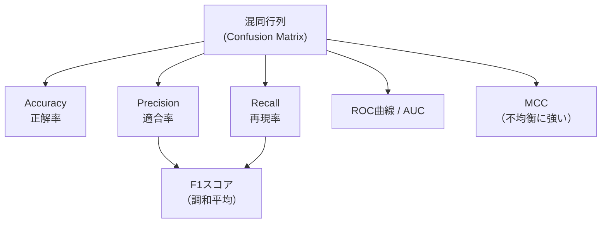
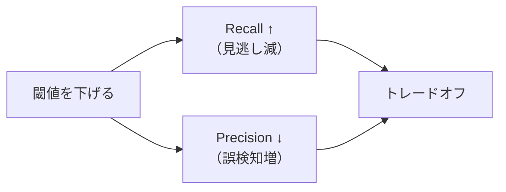

## 概要
機械学習モデルの「良し悪し」を正しく測るには、問題に合った評価指標を選ぶことが重要です。「精度（Accuracy）が高い＝良いモデル」は**不均衡データでは成り立ちません**。混同行列を起点に各指標の意味と使いどころを理解しましょう。



## 混同行列（Confusion Matrix）

二値分類における予測結果を4つのセルに整理します。

|  | 予測: Positive | 予測: Negative |
|---|---|---|
| **実際: Positive** | **TP** True Positive（正しく陽性） | **FN** False Negative（見逃し） |
| **実際: Negative** | **FP** False Positive（誤検知） | **TN** True Negative（正しく陰性） |

### 4つのセルの直感的な理解

| 記号 | 読み方 | 具体例（がん検診） |
|---|---|---|
| TP | 本当に陽性 → 陽性と予測 | がん患者を「がんあり」と正しく検出 |
| FN | 本当に陽性 → 陰性と予測 | がん患者を「がんなし」と見逃す（**危険**） |
| FP | 本当は陰性 → 陽性と予測 | 健康な人を「がんあり」と誤判定（無駄な検査） |
| TN | 本当に陰性 → 陰性と予測 | 健康な人を「がんなし」と正しく判定 |

## 主要な数式

**Accuracy（正解率）**：

$$\text{Accuracy} = \frac{TP + TN}{TP + FP + FN + TN}$$

**Precision（適合率）**：「陽性と予測した中で本当に陽性の割合」

$$\text{Precision} = \frac{TP}{TP + FP}$$

**Recall / Sensitivity（再現率）**：「本当の陽性をどれだけ拾えたか」

$$\text{Recall} = \frac{TP}{TP + FN}$$

**F1スコア**（PrecisionとRecallの調和平均）：

$$F_1 = 2 \cdot \frac{\text{Precision} \times \text{Recall}}{\text{Precision} + \text{Recall}} = \frac{2\,TP}{2\,TP + FP + FN}$$

**Specificity（特異度）**：「本当の陰性をどれだけ正しく陰性と判定できたか」

$$\text{Specificity} = \frac{TN}{TN + FP}$$

**MCC（Matthews Correlation Coefficient）**：不均衡データに強い指標

$$\text{MCC} = \frac{TP \cdot TN - FP \cdot FN}{\sqrt{(TP+FP)(TP+FN)(TN+FP)(TN+FN)}}$$

$-1$（完全に逆）〜 $0$（ランダム）〜 $+1$（完璧）の範囲。

## 指標の使い分け

| 優先すべき指標 | 使う場面 | 理由 |
|---|---|---|
| **Recall** | 医療診断・詐欺検知・故障検知 | 見逃し（FN）のコストが高い |
| **Precision** | スパムフィルタ・レコメンド | 誤検知（FP）のコストが高い |
| **F1** | 不均衡データ全般 | PrecisionとRecallのバランス |
| **AUC-ROC** | モデル比較・閾値未決定時 | 閾値に依存しない総合評価 |
| **MCC** | 強い不均衡データ | クラス間の不均衡を考慮 |
| **Accuracy** | 均衡データのみ | 不均衡では高精度でも無意味 |

## 実装と可視化

```python
import numpy as np
from sklearn.metrics import (
    confusion_matrix, classification_report,
    precision_score, recall_score, f1_score,
    roc_auc_score, roc_curve, matthews_corrcoef,
    ConfusionMatrixDisplay,
)
from sklearn.datasets import make_classification
from sklearn.linear_model import LogisticRegression
from sklearn.model_selection import train_test_split

# --- サンプルデータ（不均衡: 陽性10%）---
X, y = make_classification(
    n_samples=1000, n_features=10,
    weights=[0.9, 0.1],  # クラス0が90%
    random_state=42,
)
X_train, X_test, y_train, y_test = train_test_split(X, y, test_size=0.3, random_state=42)

model = LogisticRegression(random_state=42).fit(X_train, y_train)
y_pred = model.predict(X_test)
y_prob = model.predict_proba(X_test)[:, 1]

# --- 各指標の計算 ---
cm = confusion_matrix(y_test, y_pred)
tn, fp, fn, tp = cm.ravel()

print(f"混同行列:\n  TP={tp}  FN={fn}\n  FP={fp}  TN={tn}\n")
print(f"Accuracy  : {(tp+tn)/(tp+fp+fn+tn):.4f}")
print(f"Precision : {precision_score(y_test, y_pred):.4f}  ← 陽性予測の精度")
print(f"Recall    : {recall_score(y_test, y_pred):.4f}  ← 見逃さない率")
print(f"F1 Score  : {f1_score(y_test, y_pred):.4f}")
print(f"AUC-ROC   : {roc_auc_score(y_test, y_prob):.4f}")
print(f"MCC       : {matthews_corrcoef(y_test, y_pred):.4f}")

print("\n--- classification_report ---")
print(classification_report(y_test, y_pred, target_names=["陰性", "陽性"]))
```


## 混同行列・ROC曲線・PR曲線の可視化


## 不均衡データの落とし穴

```python
# 全部「陰性」と予測するダメモデルでもAccuracyが高くなる例
y_all_negative = np.zeros_like(y_test)

print("【全て陰性と予測したモデル】")
print(f"  Accuracy : {(y_test == y_all_negative).mean():.4f}")  # → 0.90（高い！）
print(f"  Recall   : {recall_score(y_test, y_all_negative):.4f}")  # → 0.00（最悪）
print(f"  F1 Score : {f1_score(y_test, y_all_negative):.4f}")  # → 0.00
print(f"  MCC      : {matthews_corrcoef(y_test, y_all_negative):.4f}")  # → 0.00
```

## ROC曲線と閾値選択



```python
import matplotlib.pyplot as plt

fpr, tpr, thresholds = roc_curve(y_test, y_prob)
auc_score = roc_auc_score(y_test, y_prob)

# Youden's J統計量で最適閾値を探す
j_scores = tpr - fpr
best_idx = np.argmax(j_scores)
best_threshold = thresholds[best_idx]
print(f"最適閾値（Youden's J）: {best_threshold:.3f}")
print(f"  その時の Recall={tpr[best_idx]:.3f}, FPR={fpr[best_idx]:.3f}")
```

## PR曲線（Precision-Recall曲線）

不均衡データでは ROC曲線より **PR曲線** の方が実態を正確に反映します。

```python
from sklearn.metrics import precision_recall_curve, average_precision_score

precision_curve, recall_curve, _ = precision_recall_curve(y_test, y_prob)
ap = average_precision_score(y_test, y_prob)
print(f"Average Precision (AP): {ap:.4f}")
# ランダムモデルのAP ≈ 陽性クラスの割合（例: 0.10）
# AP が高いほど良いモデル
```

## F-βスコア（RecallとPrecisionの重み付け）

$$F_\beta = (1 + \beta^2) \cdot \frac{\text{Precision} \times \text{Recall}}{\beta^2 \cdot \text{Precision} + \text{Recall}}$$

- $\beta = 1$：F1スコア（等重み）
- $\beta = 2$：Recallを重視（見逃しを減らしたい場合）
- $\beta = 0.5$：Precisionを重視（誤検知を減らしたい場合）

```python
from sklearn.metrics import fbeta_score

print(f"F1    (β=1): {fbeta_score(y_test, y_pred, beta=1):.4f}")
print(f"F2    (β=2): {fbeta_score(y_test, y_pred, beta=2):.4f}  ← Recall重視")
print(f"F0.5  (β=0.5): {fbeta_score(y_test, y_pred, beta=0.5):.4f}  ← Precision重視")
```

## 多クラス分類への拡張

| 集計方法 | 計算方法 | 適した場面 |
|---|---|---|
| `macro` | 各クラスの平均（重みなし） | クラス間を等しく評価したい |
| `weighted` | サンプル数で重み付け平均 | 不均衡でも実態に近い評価 |
| `micro` | TP/FP/FNを全クラス合計 | 全サンプルの正解率に近い |

```python
from sklearn.datasets import load_iris
from sklearn.ensemble import RandomForestClassifier

iris = load_iris()
X_tr, X_te, y_tr, y_te = train_test_split(iris.data, iris.target, test_size=0.3, random_state=42)
rf = RandomForestClassifier(random_state=42).fit(X_tr, y_tr)
y_pr = rf.predict(X_te)

print(f"Macro   F1: {f1_score(y_te, y_pr, average='macro'):.4f}")
print(f"Weighted F1: {f1_score(y_te, y_pr, average='weighted'):.4f}")
print(classification_report(y_te, y_pr, target_names=iris.target_names))
```

## 評価指標まとめ

| 指標 | 範囲 | 高いほど良い | 不均衡への対応 |
|---|---|---|---|
| Accuracy | 0〜1 | ○ | △（不均衡で無意味になる） |
| Precision | 0〜1 | ○ | △ |
| Recall | 0〜1 | ○ | △ |
| F1 | 0〜1 | ○ | ○ |
| F-β | 0〜1 | ○ | ○（β で調整可） |
| AUC-ROC | 0〜1 | ○ | △（強不均衡では過大評価） |
| AP (PR-AUC) | 0〜1 | ○ | ◎ |
| MCC | -1〜1 | ○（1が最良） | ◎ |
| Log Loss | 0〜∞ | ×（低いほど良い） | ○ |
