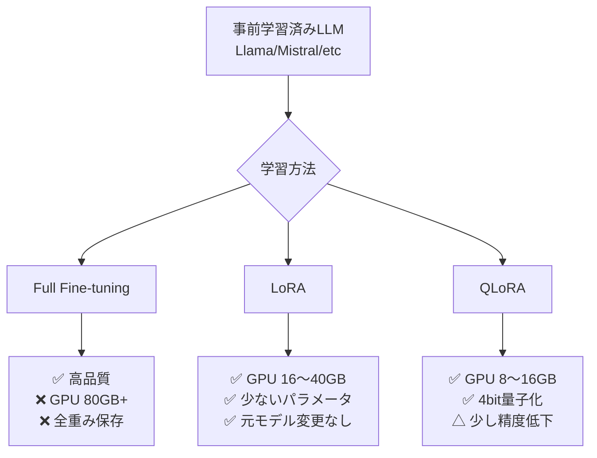

## 概要
ファインチューニングは事前学習済みLLMを特定タスク・ドメインに適応させる技術です。全パラメータを更新するFull Fine-tuningに対し、LoRA（Low-Rank Adaptation）・QLoRA（量子化+LoRA）は少ないGPUメモリで効率よく学習できます。車載ネットワークの専門用語を理解するモデルの作成などに活用できます。

## Fine-tuning の全体像



## 可視化


## LoRAの仕組み

```python
import torch
import torch.nn as nn

class LoRALinear(nn.Module):
    """Linear層にLoRAアダプターを追加"""
    def __init__(self, in_features, out_features, rank=4, alpha=16):
        super().__init__()
        self.weight = nn.Parameter(
            torch.randn(out_features, in_features) * 0.02, requires_grad=False
        )  # 元の重み（凍結）
        self.lora_A = nn.Parameter(torch.randn(rank, in_features) * 0.02)
        self.lora_B = nn.Parameter(torch.zeros(out_features, rank))
        self.scale  = alpha / rank   # スケーリング係数

    def forward(self, x):
        base   = x @ self.weight.T
        lora   = x @ self.lora_A.T @ self.lora_B.T * self.scale
        return base + lora   # 元の出力 + LoRAの出力を加算

# パラメータ数の比較
in_dim, out_dim, rank = 4096, 4096, 8
full_params = in_dim * out_dim
lora_params = rank * in_dim + out_dim * rank
print(f"Full: {full_params:,} params")
print(f"LoRA: {lora_params:,} params ({lora_params/full_params*100:.1f}%)")
```

## HuggingFace PEFTによるLoRA

```python
# pip install peft transformers accelerate bitsandbytes
from transformers import AutoModelForCausalLM, AutoTokenizer, TrainingArguments
from peft import LoraConfig, get_peft_model, TaskType

model_name = "meta-llama/Llama-3.2-1B"

# モデルのロード
model     = AutoModelForCausalLM.from_pretrained(model_name, torch_dtype=torch.float16)
tokenizer = AutoTokenizer.from_pretrained(model_name)

# LoRA設定
lora_config = LoraConfig(
    task_type     = TaskType.CAUSAL_LM,
    r             = 8,            # ランク: 小さいほど省メモリ（4〜64）
    lora_alpha    = 32,           # スケーリング (alpha/r が実効スケール)
    target_modules= ["q_proj", "v_proj", "k_proj", "o_proj"],
    lora_dropout  = 0.05,
    bias          = "none",
)

model = get_peft_model(model, lora_config)
model.print_trainable_parameters()
# trainable params: ~3M || all params: ~1.2B (0.26%)
```

## QLoRAによる4bit量子化ファインチューニング

```python
from transformers import BitsAndBytesConfig
from peft import prepare_model_for_kbit_training

# 4bit量子化設定
bnb_config = BitsAndBytesConfig(
    load_in_4bit              = True,
    bnb_4bit_use_double_quant = True,      # 二重量子化（さらにメモリ削減）
    bnb_4bit_quant_type       = "nf4",     # Normal Float 4bit
    bnb_4bit_compute_dtype    = torch.bfloat16,
)

model_4bit = AutoModelForCausalLM.from_pretrained(
    model_name,
    quantization_config = bnb_config,
    device_map          = "auto",
)
model_4bit = prepare_model_for_kbit_training(model_4bit)
model_4bit = get_peft_model(model_4bit, lora_config)
```

## データセットの準備とSFTTrainer

```python
from datasets import Dataset
from trl import SFTTrainer

# 車載ネットワーク専門知識のデータセット（例）
data = [
    {"text": "### 質問: CANバスの最大速度は？\n### 回答: CAN 2.0は最大1Mbps、CAN FDは最大8Mbpsです。"},
    {"text": "### 質問: DoIPとは何ですか？\n### 回答: Diagnostics over IP（DoIP）はISO 13400で規定されたEthernetベースの診断プロトコルです。"},
    {"text": "### 質問: SOME/IPの用途は？\n### 回答: SOME/IPはEthernet上でのSOA（サービス指向アーキテクチャ）通信を実現するプロトコルで、車載Ethernetに採用されています。"},
]
dataset = Dataset.from_list(data)

# SFTTrainerで訓練
training_args = TrainingArguments(
    output_dir            = "./lora_output",
    num_train_epochs      = 3,
    per_device_train_batch_size = 4,
    gradient_accumulation_steps = 4,
    learning_rate         = 2e-4,
    fp16                  = True,
    logging_steps         = 10,
    save_strategy         = "epoch",
    optim                 = "paged_adamw_8bit",   # 省メモリオプティマイザー
)

trainer = SFTTrainer(
    model           = model_4bit,
    train_dataset   = dataset,
    args            = training_args,
    dataset_text_field = "text",
    max_seq_length  = 512,
)
trainer.train()
trainer.save_model("./lora_output/final")
```

## LoRAアダプターのマージと推論

```python
from peft import PeftModel

# 元モデル + LoRAアダプターをマージ
base_model   = AutoModelForCausalLM.from_pretrained(model_name, torch_dtype=torch.float16)
merged_model = PeftModel.from_pretrained(base_model, "./lora_output/final")
merged_model = merged_model.merge_and_unload()   # アダプターをマージして通常のモデルに
merged_model.save_pretrained("./merged_model")
tokenizer.save_pretrained("./merged_model")

# 推論
inputs = tokenizer("### 質問: SOME/IPとは？\n### 回答:", return_tensors="pt")
with torch.no_grad():
    output = merged_model.generate(**inputs, max_new_tokens=100, temperature=0.7)
print(tokenizer.decode(output[0], skip_special_tokens=True))
```

## GPU メモリ目安

| 手法 | モデル規模 | GPU VRAM |
|---|---|---|
| Full FT | 7B | 80GB以上 |
| LoRA | 7B | 24〜40GB |
| QLoRA (4bit) | 7B | 10〜16GB |
| QLoRA (4bit) | 13B | 16〜24GB |
| QLoRA (4bit) | 70B | 48〜80GB |
