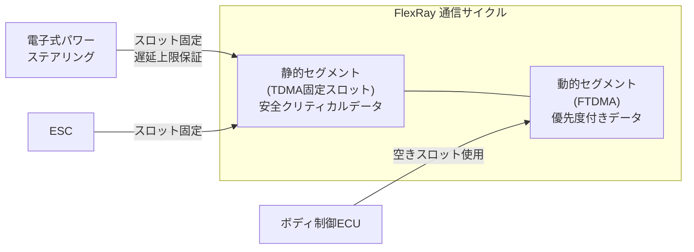

## 概要
FlexRayは、時分割多重(TDMA)方式を採用した高速・高信頼性の車載バスです。最大10 Mbpsの速度と、決定論的タイミング(遅延上限が保証)が特徴です。冗長チャネル構成によりフォールトトレランスも実現します。

## なぜ必要か
ステアリングやブレーキといった機能安全(ASIL-D)が要求される制御では、「このメッセージは必ず○ms以内に届く」という保証が必要です。CANはCSMA/CAバスなので遅延が確率的ですが、FlexRayのTDMAは各ノードに固定タイムスロットを割り当てるため遅延が上限保証されます。

## 仕組み
通信サイクルは静的セグメント(TDMA)と動的セグメント(FTDMA)に分かれます。安全クリティカルなデータは静的セグメントで確実に送り、優先度の低いデータは動的セグメントで柔軟に送ります。

## 自動運転での利用例
電子式パワーステアリング(EPS)やESCなどの制御ECUはFlexRayで連携し、最悪応答時間を保証します。ただし10 Mbpsではセンサの大容量データに不足するため、カメラ・LiDARはEthernetに移行しています。

## 関連用語
Ethernet上でFlexRayと同等の時刻保証を実現するのが [[tsn]] です。速度向上版CANとして [[can-fd]] も並行して使われます。

## 次に学ぶべき内容
Ethernet上でリアルタイム性を保証する [[tsn]] を学びましょう。

## 図解

