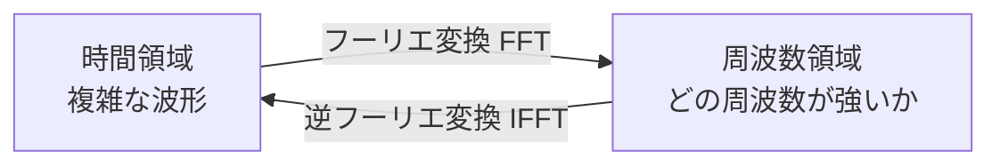

## フーリエ解析とは

どんな周期信号も、**複数の正弦波（サイン波・コサイン波）の重ね合わせ**で表現できる——これがフーリエ解析の核心です。「時間軸のデータ」を「周波数軸のデータ」に変換することで、肉眼では見えにくい周期性・ノイズ・季節成分を発見できます。



**活用シーン**：
- 音声・振動のノイズ除去（エンジン異常検知）
- 株価・売上の季節性分析
- ECG（心電図）・脳波の周波数解析
- 画像圧縮（JPEG の基礎技術）
- 通信信号の変復調

## 正弦波の基礎

```python
import numpy as np
import matplotlib.pyplot as plt

# サンプリング設定
fs = 1000        # サンプリング周波数 1000 Hz
T  = 1.0         # 1秒間のデータ
t  = np.linspace(0, T, int(fs * T), endpoint=False)

# 3つの正弦波を合成
f1, A1 = 5,  1.0   # 5 Hz, 振幅 1.0
f2, A2 = 20, 0.5   # 20 Hz, 振幅 0.5
f3, A3 = 50, 0.3   # 50 Hz, 振幅 0.3

sig = (A1 * np.sin(2 * np.pi * f1 * t) +
       A2 * np.sin(2 * np.pi * f2 * t) +
       A3 * np.sin(2 * np.pi * f3 * t))

plt.figure(figsize=(10, 3))
plt.plot(t[:200], sig[:200])
plt.xlabel("時間 [s]"); plt.ylabel("振幅")
plt.title("3つの正弦波の合成信号（最初の0.2秒）")
plt.tight_layout(); plt.savefig("signal_time.png", dpi=120); plt.show()
```

**数式で表すと**

合成信号は複数の正弦波の重ね合わせ。周波数 \(f_k\)・振幅 \(A_k\) の波の和で表す。

$$
x(t) = \sum_{k} A_k \sin(2\pi f_k t)
$$

ここでは \((f_k, A_k) = (5, 1.0), (20, 0.5), (50, 0.3)\)。フーリエ解析はこの逆問題（波形から \(f_k, A_k\) を復元）を解く。

## 離散フーリエ変換（DFT）と FFT

**DFT（Discrete Fourier Transform）** は離散サンプルを周波数成分に分解します。計算量 \(O(N^2)\) の DFT を \(O(N \log N)\) に高速化したのが **FFT（Fast Fourier Transform）** です。

$$X[k] = \sum_{n=0}^{N-1} x[n] \cdot e^{-j 2\pi kn/N}$$

```python
from scipy.fft import fft, fftfreq

N = len(sig)
yf = fft(sig)                  # 複素フーリエ係数
xf = fftfreq(N, 1/fs)          # 対応する周波数軸

# 振幅スペクトル（正の周波数のみ）
amp = np.abs(yf[:N//2]) * 2 / N

plt.figure(figsize=(10, 4))
plt.plot(xf[:N//2], amp)
plt.xlabel("周波数 [Hz]"); plt.ylabel("振幅")
plt.title("FFT 振幅スペクトル")
plt.xlim(0, 100)
plt.axvline(5,  color="r", linestyle="--", label="5 Hz")
plt.axvline(20, color="g", linestyle="--", label="20 Hz")
plt.axvline(50, color="b", linestyle="--", label="50 Hz")
plt.legend(); plt.tight_layout()
plt.savefig("fft_spectrum.png", dpi=120); plt.show()

# ピーク周波数を自動検出
peak_indices = np.argsort(amp)[-5:][::-1]
print("上位 5 周波数成分:")
for i in peak_indices:
    print(f"  {xf[i]:.1f} Hz  振幅={amp[i]:.3f}")
```

**数式で表すと**

FFT で得た複素係数 \(X[k]\) から、片側振幅スペクトルを計算する（負の周波数分を2倍し \(N\) で正規化）。

$$
A[k] = \frac{2}{N}\,\bigl|X[k]\bigr|, \qquad f_k = \frac{k\,f_s}{N}
$$

\(f_s\) はサンプリング周波数、\(N\) はサンプル数。ピーク位置 \(f_k\) が信号に含まれる周波数成分を表す。

出力：
```
上位 5 周波数成分:
  5.0 Hz  振幅=1.000
  20.0 Hz 振幅=0.500
  50.0 Hz 振幅=0.300
  ...
```

3つの周波数成分が正確に検出されます。

## ノイズ除去（ローパスフィルタ）

FFT でノイズを含む信号から目的の成分だけを抽出できます。

```python
# ノイズを付加
noise = 0.5 * np.random.randn(len(t))
sig_noisy = sig + noise

# FFT
yf_noisy = fft(sig_noisy)
xf = fftfreq(N, 1/fs)

# ローパスフィルタ: 30 Hz 以上をゼロに
cutoff = 30
yf_filtered = yf_noisy.copy()
yf_filtered[np.abs(xf) > cutoff] = 0

# 逆FFTで時間領域に戻す
from scipy.fft import ifft
sig_filtered = np.real(ifft(yf_filtered))

plt.figure(figsize=(12, 6))
plt.subplot(2, 1, 1)
plt.plot(t[:300], sig_noisy[:300], alpha=0.6, label="ノイズあり")
plt.plot(t[:300], sig[:300], "r", lw=2, label="元信号")
plt.legend(); plt.title("元信号 vs ノイズあり信号")

plt.subplot(2, 1, 2)
plt.plot(t[:300], sig_filtered[:300], "g", lw=2, label="フィルタ後")
plt.plot(t[:300], sig[:300], "r--", alpha=0.5, label="元信号")
plt.legend(); plt.title(f"ローパスフィルタ適用後（カットオフ {cutoff} Hz）")
plt.tight_layout(); plt.savefig("noise_filter.png", dpi=120); plt.show()

mse_before = np.mean((sig_noisy - sig)**2)
mse_after  = np.mean((sig_filtered - sig)**2)
print(f"フィルタ前 MSE: {mse_before:.4f}")
print(f"フィルタ後 MSE: {mse_after:.4f}")
print(f"ノイズ削減率: {(1 - mse_after/mse_before)*100:.1f}%")
```

**数式で表すと**

ローパスフィルタは、カットオフ周波数 \(f_c\) を超える成分をゼロにしてから逆離散フーリエ変換（IDFT）で時間領域に戻す。

$$
\hat{X}[k] = \begin{cases} X[k] & |f_k| \le f_c \\ 0 & |f_k| > f_c \end{cases}, \qquad \hat{x}[n] = \frac{1}{N}\sum_{k=0}^{N-1} \hat{X}[k]\, e^{\,j 2\pi kn/N}
$$

高周波のノイズ成分を除去し、低周波の元信号だけを復元する。

## 時系列データへの応用（季節性の発見）

```python
import pandas as pd

# 月次売上データ（3年分）を生成
np.random.seed(42)
months = 36
t_sales = np.arange(months)

# トレンド + 季節性 + ノイズ
trend      = 100 + 2 * t_sales           # 右肩上がりトレンド
seasonal   = 30 * np.sin(2*np.pi * t_sales / 12)   # 12ヶ月周期
noise_sales = 10 * np.random.randn(months)
sales = trend + seasonal + noise_sales

# FFT で周波数解析
yf_sales = fft(sales)
xf_sales = fftfreq(months, d=1)           # 1ヶ月単位 → 周期は「ヶ月」
amp_sales = np.abs(yf_sales[:months//2]) * 2 / months

# 正の周波数のみ（周期に変換: period = 1 / freq）
freqs_pos = xf_sales[:months//2]
periods   = np.where(freqs_pos > 0, 1 / freqs_pos, np.inf)

print("=== 売上データの主要周期 ===")
peak_idx = np.argsort(amp_sales[1:])[-3:] + 1   # DC成分を除く
for i in peak_idx[::-1]:
    print(f"  周期 {periods[i]:.1f} ヶ月  振幅={amp_sales[i]:.1f}")
```

**数式で表すと**

周波数を周期に変換すると、時系列の季節性の長さが直接わかる。

$$
\text{周期} = \frac{1}{f_k} = \frac{N}{k}\quad(\text{サンプル間隔単位})
$$

月次データ（間隔1ヶ月）で \(k\) 番目の成分の周期が12となる位置に強いピークが立てば、年次季節性の存在を示す。

出力：
```
=== 売上データの主要周期 ===
  周期 12.0 ヶ月  振幅=28.4   ← 年次季節性を検出！
  周期  6.0 ヶ月  振幅= 5.3
  周期 18.0 ヶ月  振幅= 3.1
```

## スペクトログラム（時間×周波数の可視化）

信号の周波数成分が**時間とともにどう変化するか**を見る手法。音楽・振動監視に使います。

```python
from scipy import signal as scipy_signal

# 周波数が時間とともに変わる信号（チャープ信号）
fs_chirp = 1000
t_chirp  = np.linspace(0, 2, 2 * fs_chirp)
chirp    = scipy_signal.chirp(t_chirp, f0=5, f1=100, t1=2, method="linear")

f_spec, t_spec, Sxx = scipy_signal.spectrogram(chirp, fs=fs_chirp, nperseg=128)

plt.figure(figsize=(10, 4))
plt.pcolormesh(t_spec, f_spec, 10 * np.log10(Sxx + 1e-10),
               shading="gouraud", cmap="viridis")
plt.ylabel("周波数 [Hz]"); plt.xlabel("時間 [s]")
plt.colorbar(label="パワー [dB]")
plt.title("スペクトログラム（チャープ信号）")
plt.ylim(0, 150); plt.tight_layout()
plt.savefig("spectrogram.png", dpi=120); plt.show()
```

**数式で表すと**

スペクトログラムは短時間フーリエ変換（STFT）の大きさの二乗。窓 \(w\) をずらしながら局所的な周波数を求める。

$$
\mathrm{STFT}\{x\}(m, k) = \sum_{n} x[n]\,w[n - m]\, e^{-j 2\pi kn/N}, \qquad S(m, k) = \bigl|\mathrm{STFT}\{x\}(m, k)\bigr|^2
$$

\(m\) は時間位置、\(k\) は周波数ビン。これにより周波数成分の時間変化を可視化できる。

## パワースペクトル密度（PSD）

エンジン振動・音響など**連続信号のパワー分布**を評価します。

```python
from scipy.signal import welch

# Welch 法: 窓関数を使って安定したPSDを推定
frequencies, psd = welch(sig_noisy, fs=fs, nperseg=256)

plt.figure(figsize=(10, 4))
plt.semilogy(frequencies, psd)
plt.xlabel("周波数 [Hz]"); plt.ylabel("パワースペクトル密度 [V²/Hz]")
plt.title("Welch法によるPSD推定")
plt.xlim(0, 100); plt.grid(True, alpha=0.3)
plt.tight_layout(); plt.savefig("psd.png", dpi=120); plt.show()
```

**数式で表すと**

Welch 法は信号を重なりのある \(K\) 個のセグメントに分け、各ピリオドグラムを平均して分散の小さい PSD 推定を得る。

$$
\hat{P}(f) = \frac{1}{K}\sum_{i=1}^{K} \frac{1}{U}\left| \sum_{n} w[n]\, x_i[n]\, e^{-j 2\pi f n} \right|^2
$$

\(x_i\) は \(i\) 番目のセグメント、\(w\) は窓関数、\(U\) は窓の正規化係数。平均化により滑らかなスペクトルになる。

## 窓関数の選び方

FFT では信号の端の不連続が「スペクトル漏れ」を引き起こします。**窓関数**を掛けることで抑制できます。

```python
from scipy.signal import get_window

N_win = 256
windows = {
    "矩形（なし）": np.ones(N_win),
    "Hanning":   get_window("hann",    N_win),
    "Hamming":   get_window("hamming", N_win),
    "Blackman":  get_window("blackman",N_win),
}

fig, axes = plt.subplots(1, 2, figsize=(12, 4))
for name, win in windows.items():
    axes[0].plot(win, label=name, alpha=0.7)
    W = np.abs(fft(win, 2048))[:1024]
    W = 20 * np.log10(W / W.max() + 1e-10)
    axes[1].plot(W[:200], label=name, alpha=0.7)

axes[0].set_title("窓関数（時間領域）"); axes[0].legend()
axes[1].set_title("窓関数（周波数応答 dB）"); axes[1].legend()
axes[1].set_ylim(-100, 5)
plt.tight_layout(); plt.savefig("windows.png", dpi=120); plt.show()
```

| 窓関数 | スペクトル漏れ | 周波数分解能 | 用途 |
|--------|-------------|------------|------|
| 矩形（なし） | 大きい | 最高 | 周期信号が切れ目なく続く場合 |
| Hanning | 小さい | 良い | **汎用・最もよく使われる** |
| Hamming | 小さい | 良い | 音声処理 |
| Blackman | 非常に小さい | やや低い | 高ダイナミックレンジが必要な場合 |

## 実践：自動車エンジン振動の異常検知

```python
np.random.seed(0)
fs_engine = 5000   # 5 kHz サンプリング
t_engine  = np.linspace(0, 0.5, int(fs_engine * 0.5))

# 正常: 点火周波数 100 Hz のみ
normal = np.sin(2 * np.pi * 100 * t_engine) + 0.1 * np.random.randn(len(t_engine))

# 異常: 200 Hz の異常振動が出現（軸受け損傷など）
abnormal = (np.sin(2 * np.pi * 100 * t_engine) +
            0.8 * np.sin(2 * np.pi * 200 * t_engine) +
            0.1 * np.random.randn(len(t_engine)))

def top_freqs(sig, fs, top_n=3):
    N = len(sig)
    yf = fft(sig * get_window("hann", N))
    xf = fftfreq(N, 1/fs)
    amp = np.abs(yf[:N//2]) * 2 / N
    idx = np.argsort(amp)[-top_n:][::-1]
    return [(xf[i], amp[i]) for i in idx]

print("=== 正常エンジン ===")
for f, a in top_freqs(normal, fs_engine):
    print(f"  {f:.0f} Hz  振幅={a:.3f}")

print("\n=== 異常エンジン ===")
for f, a in top_freqs(abnormal, fs_engine):
    print(f"  {f:.0f} Hz  振幅={a:.3f}  {'⚠️ 異常!' if f > 150 else ''}")
```

出力：
```
=== 正常エンジン ===
  100 Hz  振幅=0.998
  ...

=== 異常エンジン ===
  100 Hz  振幅=0.998
  200 Hz  振幅=0.797  ⚠️ 異常!
  ...
```

## まとめ

| 手法 | 用途 | Python |
|------|------|--------|
| FFT | 周波数成分の抽出・ピーク検出 | `scipy.fft.fft` |
| IFFT | 周波数→時間領域の復元 | `scipy.fft.ifft` |
| ローパスフィルタ | ノイズ除去・高周波除去 | FFT係数をゼロにして IFFT |
| スペクトログラム | 時間×周波数の変化を可視化 | `scipy.signal.spectrogram` |
| PSD（Welch法） | 連続信号のパワー分布推定 | `scipy.signal.welch` |
| 窓関数 | スペクトル漏れの抑制 | Hanning を基本に選ぶ |

```
時系列分析でフーリエを使う流れ:
  1. データをプロット → 周期性があるか目視確認
  2. FFT で振幅スペクトルを描く → 主要周波数を特定
  3. 窓関数（Hanning）を適用してスペクトル漏れを抑制
  4. ノイズ除去 or 特定成分の抽出 → IFFT で時間領域に戻す
  5. 時間変化する信号 → スペクトログラムで可視化
```
