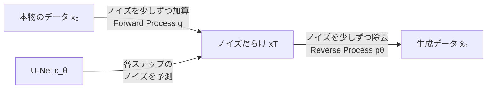

## 概要
生成モデルはデータの分布を学習して新しいサンプルを生成するモデルです。GAN（Generative Adversarial Network）・VAE（Variational Autoencoder）・Diffusionモデルが三大潮流です。ネットワークセキュリティではデータ拡張・合成トラフィック生成・異常サンプル生成に活用されます。

## 主要な数式

**GAN の min-max ゲーム**（生成器 $G$ と識別器 $D$）：

$$\min_G \max_D \; \mathbb{E}_{\mathbf{x}\sim p_{\text{data}}}[\log D(\mathbf{x})] + \mathbb{E}_{\mathbf{z}\sim p_z}[\log(1 - D(G(\mathbf{z})))]$$

**VAE の変分下限（ELBO）**：

$$\mathcal{L} = \mathbb{E}_{q(\mathbf{z}|\mathbf{x})}[\log p(\mathbf{x}|\mathbf{z})] - \mathrm{KL}\big(q(\mathbf{z}|\mathbf{x}) \,\Vert\, p(\mathbf{z})\big)$$

第1項が再構成、第2項が事前分布への正則化。

**Diffusion モデルの順過程**（ノイズを徐々に付加）：

$$q(\mathbf{x}_t | \mathbf{x}_{t-1}) = \mathcal{N}\!\left(\mathbf{x}_t;\, \sqrt{1-\beta_t}\,\mathbf{x}_{t-1},\, \beta_t \mathbf{I}\right)$$

逆過程でノイズを予測して除去し、データを生成する。

## 可視化


## GAN（敵対的生成ネットワーク）

```python
import torch
import torch.nn as nn
import torch.optim as optim
import numpy as np
import matplotlib.pyplot as plt

# シンプルなGANで1次元分布を学習
# 本物データ: 正規分布 N(4, 1.5)
def real_data_sampler(n):
    return torch.FloatTensor(np.random.normal(4, 1.5, (n, 1)))

# Generator: ノイズ → データ
class Generator(nn.Module):
    def __init__(self, z_dim=8):
        super().__init__()
        self.net = nn.Sequential(
            nn.Linear(z_dim, 32), nn.LeakyReLU(0.2),
            nn.Linear(32, 32),    nn.LeakyReLU(0.2),
            nn.Linear(32, 1),
        )
    def forward(self, z): return self.net(z)

# Discriminator: データ → 本物/偽物スコア
class Discriminator(nn.Module):
    def __init__(self):
        super().__init__()
        self.net = nn.Sequential(
            nn.Linear(1, 32),  nn.LeakyReLU(0.2),
            nn.Linear(32, 32), nn.LeakyReLU(0.2),
            nn.Linear(32, 1),  nn.Sigmoid(),
        )
    def forward(self, x): return self.net(x)

z_dim = 8
G = Generator(z_dim=z_dim)
D = Discriminator()
opt_G = optim.Adam(G.parameters(), lr=2e-4, betas=(0.5, 0.999))
opt_D = optim.Adam(D.parameters(), lr=2e-4, betas=(0.5, 0.999))
criterion = nn.BCELoss()

g_losses, d_losses = [], []

for epoch in range(2000):
    batch_size = 128
    # ---- Discriminatorの更新 ----
    real = real_data_sampler(batch_size)
    z    = torch.randn(batch_size, z_dim)
    fake = G(z).detach()

    d_loss = criterion(D(real), torch.ones(batch_size, 1)) + \
             criterion(D(fake), torch.zeros(batch_size, 1))
    opt_D.zero_grad(); d_loss.backward(); opt_D.step()

    # ---- Generatorの更新 ----
    z    = torch.randn(batch_size, z_dim)
    fake = G(z)
    g_loss = criterion(D(fake), torch.ones(batch_size, 1))
    opt_G.zero_grad(); g_loss.backward(); opt_G.step()

    g_losses.append(g_loss.item())
    d_losses.append(d_loss.item())

# 結果の可視化
with torch.no_grad():
    z     = torch.randn(1000, z_dim)
    fakes = G(z).numpy().flatten()

plt.figure(figsize=(10, 4))
plt.subplot(1, 2, 1)
plt.hist(real_data_sampler(1000).numpy(), bins=50, alpha=0.5, label="本物", density=True)
plt.hist(fakes, bins=50, alpha=0.5, label="生成", density=True)
plt.legend(); plt.title("GANによる分布学習")

plt.subplot(1, 2, 2)
plt.plot(g_losses, label="G Loss", alpha=0.5)
plt.plot(d_losses, label="D Loss", alpha=0.5)
plt.legend(); plt.title("学習曲線")
plt.tight_layout(); plt.show()
```

## VAE（変分オートエンコーダー）

```python
class VAE(nn.Module):
    def __init__(self, input_dim=784, latent_dim=2):
        super().__init__()
        # Encoder
        self.fc_enc = nn.Sequential(nn.Linear(input_dim, 256), nn.ReLU())
        self.fc_mu  = nn.Linear(256, latent_dim)
        self.fc_var = nn.Linear(256, latent_dim)
        # Decoder
        self.fc_dec = nn.Sequential(
            nn.Linear(latent_dim, 256), nn.ReLU(),
            nn.Linear(256, input_dim),  nn.Sigmoid(),
        )

    def encode(self, x):
        h = self.fc_enc(x)
        return self.fc_mu(h), self.fc_var(h)

    def reparameterize(self, mu, log_var):
        std = torch.exp(0.5 * log_var)
        eps = torch.randn_like(std)
        return mu + eps * std

    def decode(self, z):
        return self.fc_dec(z)

    def forward(self, x):
        mu, log_var = self.encode(x)
        z = self.reparameterize(mu, log_var)
        x_recon = self.decode(z)
        return x_recon, mu, log_var

def vae_loss(x_recon, x, mu, log_var):
    recon = nn.functional.binary_cross_entropy(x_recon, x, reduction="sum")
    kl    = -0.5 * torch.sum(1 + log_var - mu.pow(2) - log_var.exp())
    return recon + kl

# 簡単なデモ（ランダムデータ）
vae = VAE(input_dim=20, latent_dim=2)
opt = optim.Adam(vae.parameters(), lr=1e-3)

for _ in range(200):
    x = torch.rand(64, 20)
    x_recon, mu, log_var = vae(x)
    loss = vae_loss(x_recon, x, mu, log_var)
    opt.zero_grad(); loss.backward(); opt.step()

print(f"VAE最終損失: {loss.item():.2f}")

# 潜在空間からサンプリング
with torch.no_grad():
    z_sample = torch.randn(10, 2)
    generated = vae.decode(z_sample)
    print(f"生成サンプル形状: {generated.shape}")
```

## Diffusionモデルの概念



```python
# Diffusionモデルの簡略実装
class SimpleUNet(nn.Module):
    """超シンプルな1Dノイズ除去ネット（概念説明用）"""
    def __init__(self, dim=16, t_emb=8):
        super().__init__()
        self.t_embed = nn.Embedding(1000, t_emb)
        self.net = nn.Sequential(
            nn.Linear(dim + t_emb, 64), nn.SiLU(),
            nn.Linear(64, 64),          nn.SiLU(),
            nn.Linear(64, dim),
        )
    def forward(self, x, t):
        t_emb = self.t_embed(t)
        return self.net(torch.cat([x, t_emb], dim=-1))

# ノイズスケジュール
T = 1000
betas   = torch.linspace(1e-4, 0.02, T)
alphas  = 1 - betas
alpha_bar = torch.cumprod(alphas, dim=0)

def forward_diffusion(x0, t):
    """t ステップ後のノイズ付きサンプル"""
    sqrt_ab  = alpha_bar[t].sqrt().unsqueeze(-1)
    sqrt_1ab = (1 - alpha_bar[t]).sqrt().unsqueeze(-1)
    eps = torch.randn_like(x0)
    return sqrt_ab * x0 + sqrt_1ab * eps, eps

# 訓練ループ（概念）
net = SimpleUNet(dim=16)
opt = optim.Adam(net.parameters(), lr=1e-3)
for step in range(100):
    x0 = torch.randn(32, 16)
    t  = torch.randint(0, T, (32,))
    xt, eps = forward_diffusion(x0, t)
    eps_pred = net(xt, t)
    loss = (eps_pred - eps).pow(2).mean()
    opt.zero_grad(); loss.backward(); opt.step()
print(f"Diffusion訓練損失: {loss.item():.4f}")
```

## GAN vs VAE vs Diffusion 比較

| | GAN | VAE | Diffusion |
|---|---|---|---|
| 生成品質 | 高（シャープ） | 中（ぼやける） | **最高** |
| 学習安定性 | 不安定 | 安定 | **安定** |
| 多様性 | 低（mode collapse） | 中 | **高** |
| 推論速度 | **高速** | **高速** | 低速（多ステップ） |
| 潜在空間 | 構造不明 | **解釈可能** | なし |
| 代表例 | StyleGAN | β-VAE | Stable Diffusion |
