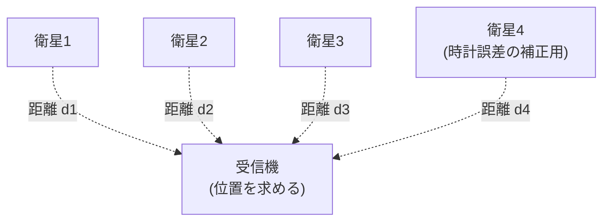
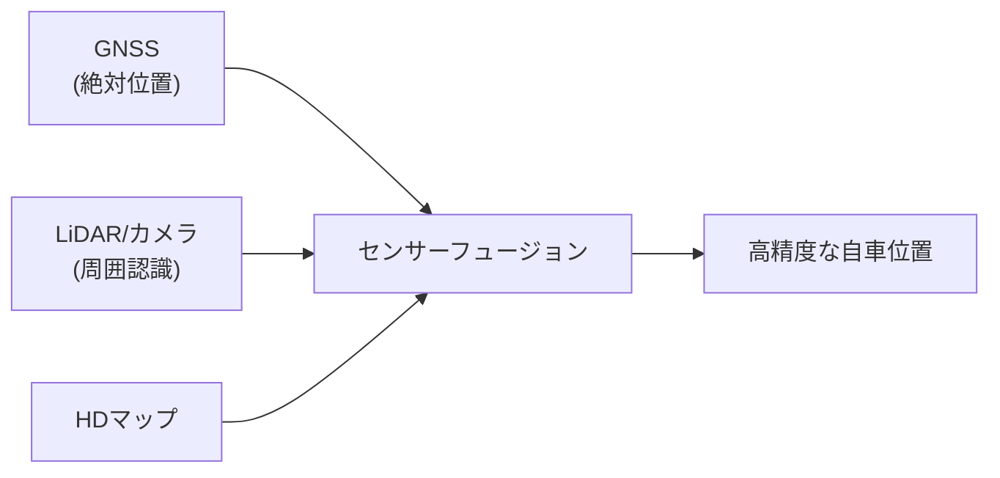

## 概要
GNSS（Global Navigation Satellite System）はGPS・GLONASS・Galileo・みちびきなどの衛星測位システムの総称です。カーナビゲーション・自動運転・タクシー配車・緊急通報（eCall）に不可欠です。「なぜGPSは位置がわかるのか」を電波と時間の物理から理解しましょう。

## GPSの測位原理

GPSは「電波が衛星から届くまでの時間」から距離を求めます。電波は光速 \(c\) で進むので、送信時刻と受信時刻の差に \(c\) を掛ければ衛星までの距離が分かります。

$$d_i = c \times (t_{receive} - t_{send_i})$$

複数の衛星からの距離が分かれば、その球面の交点として位置が定まります（三辺測量）。

**なぜ衛星が4つ必要か**：3次元の位置（\(x, y, z\)）に加えて、受信機の**時計の誤差**という未知数が1つあるためです。未知数4つを解くには方程式（衛星）が4つ要ります。受信機に高精度な原子時計を積まなくて済むのは、この4衛星目のおかげです。

$$d_i = \sqrt{(x-x_i)^2 + (y-y_i)^2 + (z-z_i)^2} + c\,\Delta t$$

## GNSS の種類と精度

世界各国が独自の測位システムを運用しており、現代の受信機は複数を併用して精度と安定性を高めています。

| システム | 運用国 | 衛星数 | 標準精度 | 備考 |
|---|---|---|---|---|
| GPS | 米国 | 31 | 約3 m | 2000年に民間の精度制限を撤廃 |
| GLONASS | ロシア | 24 | 約4 m | 軍事・民間併用 |
| Galileo | EU | 30 | 約1 m | 2016年運用開始 |
| BeiDou | 中国 | 35 | 約2.5 m | 2020年全面運用 |
| みちびき (QZSS) | 日本 | 4 | cm級 | 準天頂軌道でGPSを補完・補強 |

すべての主要システムが **L1帯=1575.42MHz** を共有しているため、1つの受信機で複数システムを同時受信できます。

## 測位精度向上の技術

単独測位の数mの誤差を、補正技術でcm級まで縮められます。

| 方式 | 精度 | 原理 | 主な用途 |
|---|---|---|---|
| 単独測位 | 3〜5 m | 衛星4個以上で三辺測量 | カーナビ・スマホ |
| SBAS | 1〜2 m | 静止衛星から誤差補正を配信 | 航空・高精度ナビ |
| DGNSS | 0.5〜1 m | 既知位置の基準局との差分補正 | 測量・建機・農機 |
| RTK | 1〜2 cm | 搬送波位相を利用 | 測量・精密農業・自動運転 |
| みちびき CLAS | 約6 cm | 衛星補強信号 | 自動運転・ドローン（日本全国） |

> 誤差の主な原因は、電離層・対流圏による電波の遅延と、衛星・受信機の時計誤差です。補正技術はこれらを基準局で測って差し引く発想です。

## 自動車へのGNSS応用

GNSSはナビだけでなく、緊急通報や自動運転にも使われます。

| 用途 | 内容 |
|---|---|
| カーナビ | 地図上の自車位置表示・ルート案内 |
| eCall（EU義務化） | 事故時に位置・車両情報を自動で緊急通報 |
| テレマティクス | 盗難追跡・走行データ収集 |
| 自動運転 | 自車位置推定（地図照合の基準） |

**自動運転の測位精度要件**：

| シーン | 必要精度 |
|---|---|
| 高速道路の車線変更 | < 0.5 m |
| 一般道のレーン維持 | < 0.1 m（10cm） |
| 自動駐車 | < 0.02 m（2cm） |

ただしGNSSはトンネル・高層ビル街・地下では受信できず、また数cmの誤差も残ります。そのため自動運転では **GNSS単体に頼らず、LiDAR・カメラ・HDマップと組み合わせる（センサーフュージョン）** ことが必須です。

