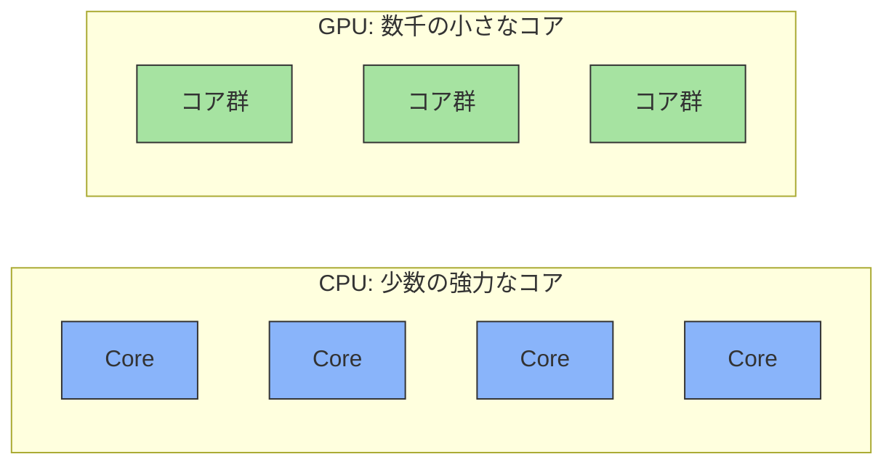
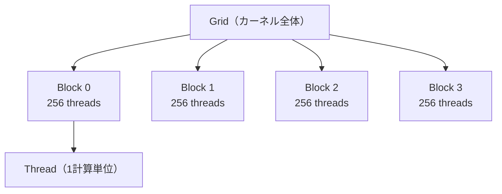
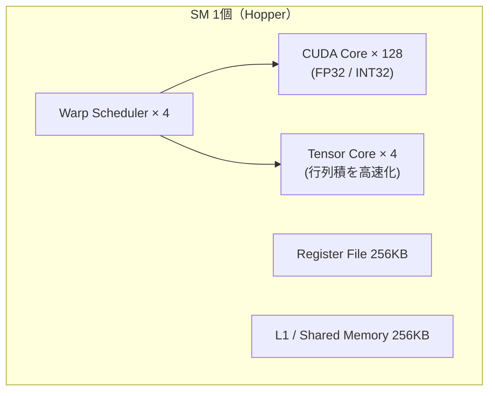

## 概要
GPU（Graphics Processing Unit）はもともとゲームのグラフィックス描画用に設計されましたが、行列演算の並列処理能力がディープラーニングに最適でした。CPUが「少数の賢いコア」で複雑なタスクをこなすのに対し、GPUは「数千の単純なコア」で同じ計算を並列に実行します。

## CPU vs GPU のアーキテクチャ比較

| 項目 | CPU（Core i9） | GPU（RTX 4090） |
|---|---|---|
| コア数 | 24 コア（高クロック） | 16,384 CUDA コア + 512 Tensor コア |
| 設計思想 | 少数の賢いコア | 多数の単純なコア |
| 得意な処理 | 逐次処理・複雑な制御フロー・低レイテンシ | 並列処理・行列演算・高スループット |
| メモリ | DDR5（〜50 GB/s） | GDDR6X 24GB（1008 GB/s） |
| 制御機構 | 分岐予測・アウトオブオーダー実行 | SIMT（多数スレッドで同一命令） |



**性能の指標**：理論演算性能（FLOPS）はコア数・クロック・コアあたり演算数で決まります。

$$\text{FLOPS} = (\text{コア数}) \times (\text{クロック周波数}) \times (\text{1クロックあたり演算数})$$

実効性能はメモリ帯域に律速されることも多く、**演算強度**（1バイトあたりの演算量）が高いほどGPUが有利です。

$$\text{演算強度} = \frac{\text{演算回数 [FLOP]}}{\text{メモリアクセス量 [Byte]}}$$

行列積（大サイズ）は演算強度が高いため、GPUがCPUに対して数十倍速くなります。実測には以下のコードが使えます。

```python
import numpy as np, torch, time

N = 4096
A = np.random.randn(N, N).astype(np.float32)
B = np.random.randn(N, N).astype(np.float32)

t0 = time.perf_counter(); A @ B
print(f"CPU: {(time.perf_counter()-t0)*1000:.1f} ms")

Ag, Bg = torch.from_numpy(A).cuda(), torch.from_numpy(B).cuda()
_ = Ag @ Bg; torch.cuda.synchronize()          # ウォームアップ
t0 = time.perf_counter(); _ = Ag @ Bg; torch.cuda.synchronize()
print(f"GPU: {(time.perf_counter()-t0)*1000:.2f} ms")
```

## CUDA 実行モデル

CUDAはスレッドを3階層で管理します。「1024要素の配列に +1」する処理なら、4ブロック × 256スレッド = 1024スレッドが同時に走ります。



| 階層 | 意味 | 規模 |
|---|---|---|
| Grid | カーネル全体 | 複数ブロック |
| Block | スレッドの集まり | 最大 1024 スレッド |
| Warp | スケジューリング単位 | 必ず 32 スレッド |
| Thread | 最小の計算単位 | レジスタを持つ |

**Warp（32スレッドの束）** は必ず同じ命令を同時実行します（SIMT）。そのため `if` の分岐でスレッドが別々の経路に進むと、両方の経路を順番に実行することになり遅くなります（**Warp Divergence**）。条件分岐はwarp単位で揃えるのが高速化の鉄則です。

## SM（Streaming Multiprocessor）の構造

GPUは複数のSMで構成され、各SMがCUDAコア・Tensorコア・キャッシュを内蔵します。



GPU全体のCUDAコア数は概算で **SM数 × 128** です。PyTorchで確認できます。

```python
import torch
p = torch.cuda.get_device_properties(0)
print(p.name, "SM:", p.multi_processor_count,
      "CUDAコア概算:", p.multi_processor_count * 128,
      "VRAM:", f"{p.total_memory/1e9:.1f}GB")
```

## GPU メモリ階層

メモリは「速いが小さい」レジスタから「遅いが大きい」VRAM・CPU RAMまで階層化されています。学習を速くする鍵は、低速なVRAM/PCIeへのアクセスをいかに減らすかです。

| 階層 | 帯域幅 | レイテンシ | サイズ | 用途 |
|---|---|---|---|---|
| レジスタ | 〜28 TB/s | 1 クロック | 256 KB/SM | スレッドローカル変数 |
| L1 / Shared | 〜20 TB/s | 〜20 クロック | 256 KB/SM | ブロック内共有・タイリング |
| L2 Cache | 〜5 TB/s | 〜200 クロック | 60 MB（H100） | DRAMのキャッシュ |
| VRAM（HBM/GDDR） | 〜3.35 TB/s | 〜600 クロック | 80 GB（H100） | パラメータ・活性化・勾配 |
| CPU RAM | 〜50 GB/s | 数千ク＋PCIe | 数百 GB | データセット・チェックポイント |


## Tensor コアと混合精度学習

Tensorコアは FP16/BF16/FP8 の行列積を専用回路で処理し、FP32より桁違いに高速です。

| GPU | FP16 性能 | FP8 性能 |
|---|---|---|
| A100 | 312 TFLOPS | — |
| H100 | 989 TFLOPS | 1,979 TFLOPS |

PyTorchの**自動混合精度（AMP）** を使うと、精度をほぼ保ちつつVRAMを約半分にし、Tensorコアで高速化できます。

```python
scaler = torch.cuda.amp.GradScaler()
for x in loader:
    with torch.cuda.amp.autocast():     # FP16でフォワード
        loss = model(x).sum()
    scaler.scale(loss).backward()       # 勾配スケーリング
    scaler.step(optimizer); scaler.update()
    optimizer.zero_grad()
```

## GPU 使用率のモニタリング

学習中は `nvidia-smi` または PyTorch でVRAM・使用率を監視します。

```bash
# 1秒ごとに更新表示
nvidia-smi -l 1
# 必要な項目だけCSVで取得
nvidia-smi --query-gpu=utilization.gpu,memory.used,temperature.gpu,power.draw --format=csv
```

```python
print(f"割当済み: {torch.cuda.memory_allocated()/1e9:.2f} GB")
print(f"最大使用: {torch.cuda.max_memory_allocated()/1e9:.2f} GB")
```

## VRAM が足りないときの対処法

VRAM不足（`CUDA out of memory`）は最も頻出するエラーです。以下を上から順に試します。

| 手法 | 効果 | デメリット / 実装 |
|---|---|---|
| バッチサイズを減らす | VRAMを線形に削減 | 学習が不安定 → Gradient Accumulation で補う |
| 混合精度 (FP16/BF16) | VRAM 約 50%減・高速化 | `torch.cuda.amp.autocast()` |
| Gradient Checkpointing | 活性化メモリを大幅削減 | 速度 30〜40%低下 / `gradient_checkpointing_enable()` |
| Flash Attention | Attention を省メモリ・高速化 | `pip install flash-attn` |
| 量子化 (INT8/INT4) | 推論VRAM 50〜75%減 | `bitsandbytes`、学習は QLoRA |
| モデル並列 / DeepSpeed | 複数GPUに分散 | ZeRO-3 でパラメータ・勾配・状態を分散 |

**Gradient Accumulation** はバッチを小分けにして勾配を貯め、等価的に大きなバッチを再現する手法です。

$$\text{実効バッチサイズ} = (\text{ミニバッチ}) \times (\text{累積ステップ数})$$
