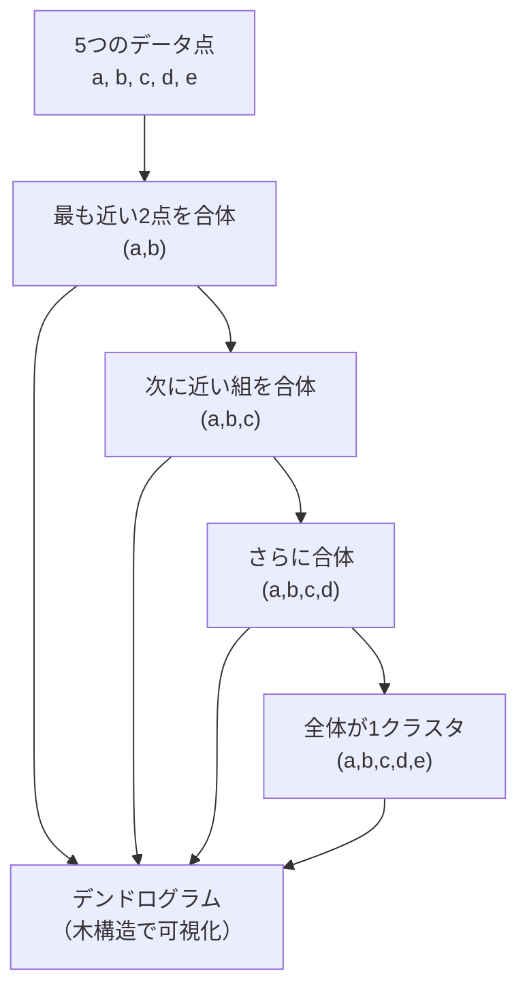

## 階層的クラスタリングとは

k-meansがクラスタ数 \(k\) を事前に決める必要があるのに対し、**階層的クラスタリング**はデータを段階的に合体（または分割）させ、**どのクラスタ数でも後から選べる**ツリー構造（デンドログラム）を作ります。



**活用シーン**：
- 遺伝子発現データの解析（どの遺伝子が似た挙動か）
- 顧客セグメントの自然な構造を発見
- 文書・ニュース記事のグルーピング
- クラスタ数が未知の探索的分析

## 2種類の手法

| 手法 | 方向 | 特徴 |
|------|------|------|
| **凝集型（Agglomerative）** | 下から上（各点→1クラスタ） | 一般的・実用的 |
| **分割型（Divisive）** | 上から下（1クラスタ→各点） | 計算コストが高い |

以下では凝集型に絞って解説します。

## 距離の測り方（リンケージ基準）

2つのクラスタ間の距離をどう定義するかで結果が大きく変わります。

| リンケージ | 定義 | 特徴 |
|-----------|------|------|
| **単連結（Single）** | 最も近い2点間の距離 | 鎖状の細長いクラスタになりやすい |
| **完全連結（Complete）** | 最も遠い2点間の距離 | コンパクトなクラスタ・外れ値に敏感 |
| **平均連結（Average）** | 全ペアの平均距離 | バランスが良い |
| **Ward法** | 合体後の分散増加量を最小化 | 等サイズ・球状クラスタに強い・**最もよく使われる** |

```
単連結: dist(C1, C2) = min_{x∈C1, y∈C2} d(x, y)
完全連結: dist(C1, C2) = max_{x∈C1, y∈C2} d(x, y)
平均連結: dist(C1, C2) = (1/|C1||C2|) Σ d(x, y)
Ward: dist(C1, C2) = Δ分散 = (n1*n2)/(n1+n2) * ||μ1-μ2||²
```

## Pythonによる実装

### SciPy を使った基本例

```python
import numpy as np
import matplotlib.pyplot as plt
from scipy.cluster.hierarchy import dendrogram, linkage, fcluster
from scipy.spatial.distance import pdist

# サンプルデータ（3つのグループ）
np.random.seed(42)
X = np.vstack([
    np.random.randn(10, 2) + [0, 0],
    np.random.randn(10, 2) + [5, 0],
    np.random.randn(10, 2) + [2.5, 4],
])
labels_true = [0]*10 + [1]*10 + [2]*10

# 階層的クラスタリング（Ward法）
Z = linkage(X, method="ward", metric="euclidean")
# Z: (n-1, 4) の配列
# 各行 = [合体したクラスタ1, クラスタ2, 距離, マージ後のサイズ]
print("連結行列（最初の5行）:")
print(np.round(Z[:5], 2))

# デンドログラムの描画
plt.figure(figsize=(10, 5))
dendrogram(Z, leaf_font_size=10, color_threshold=5)
plt.title("Ward法によるデンドログラム")
plt.xlabel("データ点のインデックス")
plt.ylabel("距離（クラスタ間）")
plt.tight_layout()
plt.savefig("dendrogram.png", dpi=120)
plt.show()
```

**数式で表すと**

$$
d_{\text{Ward}}(C_i, C_j) = \frac{n_i\,n_j}{n_i + n_j}\,\lVert \boldsymbol{\mu}_i - \boldsymbol{\mu}_j \rVert^2
$$

`linkage(..., method="ward")` は、各ステップで合体後の分散増加量 \(d_{\text{Ward}}\) が最小になるクラスタ対を選び、連結行列 \(Z\) の各行に `[クラスタ1, クラスタ2, 距離, サイズ]` を記録していきます。

### クラスタ数を指定して切り出す

```python
# 方法1: クラスタ数 k を指定
k = 3
labels = fcluster(Z, t=k, criterion="maxclust")
print(f"k={k} でのラベル: {labels}")
# [1 1 1 ... 2 2 2 ... 3 3 3]  ← 各点のクラスタ番号

# 方法2: 距離閾値で切り出す
threshold = 5.0
labels2 = fcluster(Z, t=threshold, criterion="distance")
print(f"閾値={threshold} でのラベル: {labels2}")
```

### scikit-learn版

```python
from sklearn.cluster import AgglomerativeClustering
from sklearn.metrics import adjusted_rand_score

model = AgglomerativeClustering(
    n_clusters=3,
    linkage="ward"
)
labels = model.fit_predict(X)
ari = adjusted_rand_score(labels_true, labels)
print(f"Adjusted Rand Index: {ari:.3f}")   # 1.0に近いほど正解に近い
```

## デンドログラムの読み方

```
高さ（Y軸）= 合体時のクラスタ間距離

       ┌──────────────────────────────┐
 10 ── │                              │  ← ここで切ると 2クラスタ
       │                              │
  5 ── │           ┌────────┐         │  ← ここで切ると 3クラスタ
       │           │        │         │
  2 ── │    ┌──┐   │  ┌──┐  │  ┌──┐  │
       │    │  │   │  │  │  │  │  │  │
  0 ── ┴────┴──┴───┴──┴──┴──┴──┴──┴──┘
            G1      G2         G3

切る高さ（閾値）を大きくする → クラスタ数が減る
切る高さを小さくする         → クラスタ数が増える
```

「クラスタ間の距離が急に跳ね上がる場所（肘）」で切るのが目安です。

## 最適クラスタ数の選び方

```python
# 連結距離の「ジャンプ」を見る
last = Z[-20:, 2]          # 最後の20回のマージ距離
acceleration = np.diff(last, 2)   # 2階差分
k_opt = len(last) - np.argmax(acceleration)
print(f"推奨クラスタ数: {k_opt}")

# シルエットスコアで評価
from sklearn.metrics import silhouette_score

scores = []
k_range = range(2, 8)
for k in k_range:
    lbl = fcluster(Z, t=k, criterion="maxclust")
    s = silhouette_score(X, lbl)
    scores.append((k, s))
    print(f"  k={k}: silhouette={s:.3f}")

best_k = max(scores, key=lambda x: x[1])[0]
print(f"\n最良 k = {best_k}")
```

**数式で表すと**

$$
a_m = d_{m+1} - 2 d_m + d_{m-1}, \qquad k_{\text{opt}} = \arg\max_m a_m
$$

`np.diff(last, 2)` はマージ距離列 \(d_m\) の 2 階差分（加速度）で、距離が急に跳ね上がる位置を捉えます。これが最大となる箇所を最適クラスタ数の目安とし、シルエットスコア \(s\) の最大化と併用して確定します。

## リンケージ手法の比較

```python
import matplotlib.pyplot as plt
from scipy.cluster.hierarchy import dendrogram, linkage

methods = ["single", "complete", "average", "ward"]
fig, axes = plt.subplots(1, 4, figsize=(16, 4))

for ax, method in zip(axes, methods):
    Z = linkage(X, method=method)
    dendrogram(Z, ax=ax, no_labels=True)
    ax.set_title(method)
    ax.set_ylabel("距離" if ax == axes[0] else "")

plt.suptitle("リンケージ手法の比較")
plt.tight_layout()
plt.savefig("linkage_comparison.png", dpi=120)
plt.show()
```

## k-means との比較

| 項目 | k-means | 階層的クラスタリング |
|------|---------|-------------------|
| クラスタ数 | 事前に必要 | 後から決められる |
| スケーラビリティ | ✅ 大規模データ向き O(nkT) | ⚠️ O(n² log n)〜O(n³) |
| クラスタ形状 | 球状を仮定 | 制限なし（リンケージ依存） |
| 決定論性 | ❌ 初期値依存 | ✅ 結果が一意 |
| 可視化 | 散布図 | デンドログラム |
| 外れ値への耐性 | 弱い | Ward法は比較的強い |

## 実践：ワインデータの解析

```python
from sklearn.datasets import load_wine
from sklearn.preprocessing import StandardScaler
from sklearn.cluster import AgglomerativeClustering
from sklearn.metrics import adjusted_rand_score
import numpy as np

wine = load_wine()
X_wine = StandardScaler().fit_transform(wine.data)

results = []
for linkage in ["ward", "complete", "average", "single"]:
    model = AgglomerativeClustering(n_clusters=3, linkage=linkage)
    labels = model.fit_predict(X_wine)
    ari = adjusted_rand_score(wine.target, labels)
    results.append((linkage, ari))
    print(f"  {linkage:10s}: ARI = {ari:.3f}")

best = max(results, key=lambda x: x[1])
print(f"\n最良リンケージ: {best[0]}（ARI={best[1]:.3f}）")
```

典型的な出力：
```
  ward      : ARI = 0.897
  complete  : ARI = 0.640
  average   : ARI = 0.491
  single    : ARI = 0.052

最良リンケージ: ward（ARI=0.897）
```

## よくある落とし穴

| 問題 | 症状 | 対策 |
|------|------|------|
| スケールが違う特徴量 | 距離が支配される | `StandardScaler` で標準化 |
| 大規模データ | O(n²) で遅い・メモリ不足 | Mini-batch や k-means を検討 |
| 単連結の「鎖」現象 | 細長い不自然なクラスタ | Ward法か完全連結に変える |
| クラスタ数の選択 | デンドログラムが読みにくい | シルエットスコアで定量評価 |

## まとめ

- 階層的クラスタリングはデンドログラムで**クラスタ構造を可視化**できる
- **Ward法**が最もよく使われる（分散増加を最小化・コンパクトなクラスタ）
- クラスタ数は後から選べる → 探索的分析に最適
- 大規模データには計算量 O(n²) 以上がネック → k-means との使い分けが重要
- `StandardScaler` による前処理は必須
