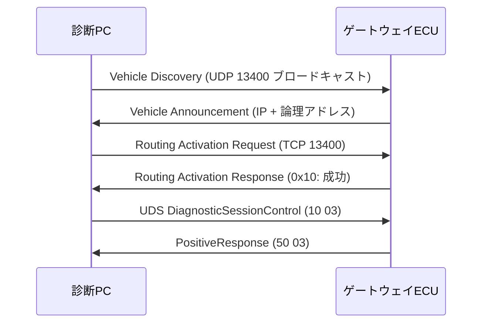

## やること
診断PCからDoIP(Diagnostics over IP)を使ってゲートウェイECUへ接続し、UDS診断を開始するまでの手順を説明します。

## 前提条件
- 診断PCと車両ゲートウェイECUがEthernetで接続
- 診断ツール (ETAS INCA、Vector CANoe、またはPythonスクリプト)
- 対象ECUのIPアドレスと**論理アドレス**(Logical Address)が判明

## DoIPの接続フロー

```
診断PC ──[UDP 13400]──→ ECU : Vehicle Discovery (broadcast)
診断PC ←──────────────── ECU : Vehicle Announcement (IP + Logical Address)
診断PC ──[TCP 13400]──→ ECU : Routing Activation Request
診断PC ←────────────────ECU : Routing Activation Response (成功)
診断PC ──[TCP 13400]──→ ECU : UDS Request (例: ReadDTC)
診断PC ←────────────────ECU : UDS Response
```

## ステップ1: ECUのIPアドレスを探す

```python
# Python (doipclient ライブラリ使用)
import doipclient

# UDP 13400 でブロードキャスト送信し、応答を収集
client = doipclient.DoIPClient("192.168.1.255", 13400)
result = client.request_vehicle_identity()
print(result)  # VIN, IPアドレス, 論理アドレス が返る
```

または手動でDoIPゲートウェイのIPが分かっている場合は直接指定します。

## ステップ2: Routing Activation

```python
client = doipclient.DoIPClient("192.168.1.1", 13400)

# Routing Activation (診断セッションの入り口)
response = client.request_activation(0x00)  # 0x00 = Default Activation
print(f"Activation result: {response.activation_response_code}")
# 0x10 = Routing successfully activated
```

## ステップ3: UDSリクエストを送る

```python
# DiagnosticSessionControl — 拡張診断セッションへ切り替え
# UDS: 0x10 0x03
resp = client.send_doip(
    source_address=0x0E00,   # 診断PC論理アドレス
    target_address=0x0001,   # ゲートウェイECU論理アドレス
    uds_message=bytes([0x10, 0x03])
)
print(resp.hex())  # 50 03 = PositiveResponse
```

## ステップ4: Wiresharkで確認

```
# WiresharkでDoIPセッションを確認するフィルタ
tcp.port == 13400
```

**Routing Activation** → UDS Request → UDS Response の流れが見えれば接続成功です。

## よくあるエラー

| エラーコード | 原因 | 対処 |
|-------------|------|------|
| 0x00 (Denied) | 認証失敗 / アドレス不一致 | **論理アドレス**を確認 |
| **TCP接続**タイムアウト | IPアドレスが違う / ファイアウォール | [[howto-ping-ecu]] で疎通確認 |
| NRC 0x25 | ECUがプログラミングセッション以外では拒否 | セッション種別を確認 |

## 関連用語
プロトコル詳細は [[doip]]、UDSサービスの意味は [[uds]]、通信の確認は [[wireshark]] を参照。

## 図解

