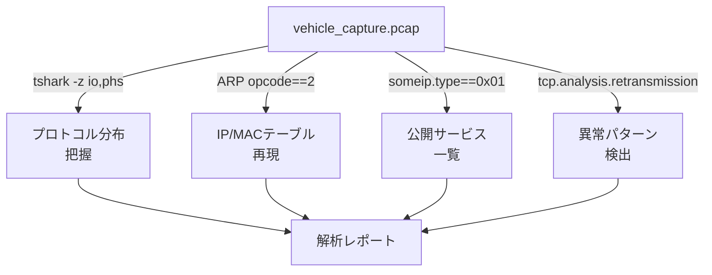

## やること
車両ネットワークのpcapファイルを受け取ったとき、何から確認すればよいかの分析ステップと、よく見るべきポイントを説明します。

## 前提条件
- Wireshark / tshark インストール済み
- 解析対象のpcapファイル

## ステップ1: 全体像を把握する (最初の5分)

```bash
# パケット数・期間・平均レートを確認
tshark -r capture.pcap -q -z io,stat,0

# プロトコル分布
tshark -r capture.pcap -q -z io,phs

# エンドポイント一覧
tshark -r capture.pcap -q -z endpoints,ip
```

どのプロトコルが何%を占めるかを把握してから詳細に入ります。

## ステップ2: ARPテーブルを再現する

```bash
# ARP応答からIP-MACの対応表を作成
tshark -r capture.pcap -Y "arp.opcode == 2" \
  -T fields -e arp.src.proto_ipv4 -e arp.src.hw_mac \
  -E separator=" => " | sort | uniq
```

どのIPがどのECUか(MAC OUI等で推定)を特定します。

## ステップ3: サービスディスカバリを確認 (SOME/IP-SD)

```bash
# SDのOfferServiceを抽出 (どのサービスが公開されているか)
tshark -r capture.pcap -Y "someip.type == 0x01" \
  -T fields -e ip.src -e someip.sd.entry.srv.id
```

車内にどんなサービスが存在するかのマップを描けます。

## ステップ4: 異常パターンを探す

### ARP嵐
```bash
# 短時間に同一IPへのARP要求が多発しているか
tshark -r capture.pcap -Y "arp.opcode == 1" \
  -T fields -e frame.time_relative -e arp.dst.proto_ipv4 | head -50
```

### TCPリトライ
```bash
# TCP再送パケット (通信品質問題のサイン)
tshark -r capture.pcap -Y "tcp.analysis.retransmission" \
  -T fields -e ip.src -e ip.dst -e tcp.stream | sort | uniq -c | sort -rn
```

### 未解決ARP(ECU不在の疑い)
```bash
# ARPリクエストを送ったが応答がないもの
tshark -r capture.pcap -Y "arp.opcode == 1" \
  -T fields -e arp.dst.proto_ipv4 > arp_req.txt

tshark -r capture.pcap -Y "arp.opcode == 2" \
  -T fields -e arp.src.proto_ipv4 > arp_rep.txt

# arp_req.txtにあってarp_rep.txtにないIPが「応答なし」
```

## ステップ5: タイムライン作成

```bash
# CSV出力でExcelに取り込む
tshark -r capture.pcap \
  -T fields -e frame.time_epoch \
  -e ip.src -e ip.dst -e _ws.col.Protocol -e frame.len \
  -E header=y -E separator=, > timeline.csv
```

Excelのピボットテーブルで「時間別 × プロトコル別 × ECU別」のヒートマップを作ると通信パターンの全体像が見えます。

## チェックリスト

- [ ] ARPで全ECUのIPを特定した
- [ ] **プロトコル分布**で想定外のトラフィックがないか確認
- [ ] SOME/IP-SDでサービス一覧を把握した
- [ ] TCPリトライ・未解決ARPなど異常がないか確認
- [ ] DoIPポート(13400)への想定外アクセスがないか確認

## 関連用語
pcapの形式は [[pcap]]、GUIでの解析は [[wireshark]]、コマンドライン解析は [[howto-tshark-filter]] を参照。

## 図解

