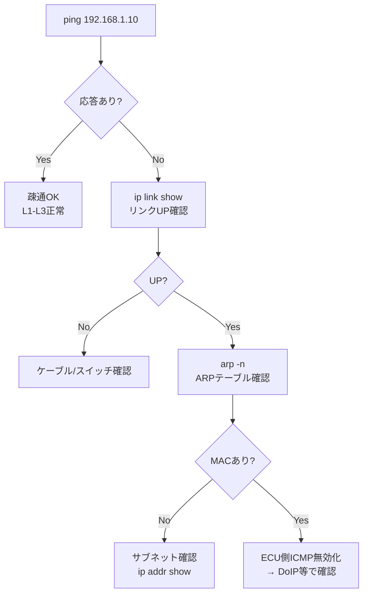

## やること
診断PCや別ECUから対象ECUへ**ping**を使って**疎通確認**する手順と、応答がない場合のトラブルシュート手順を説明します。

## 前提条件
- 診断PCと対象ECUが同じEthernetセグメント(またはルータ経由で到達可能)に接続
- 対象ECUのIPアドレスが判明している

## ステップ1: 基本ping

```bash
# Windows
ping 192.168.1.10

# Linux / macOS
ping 192.168.1.10

# 回数指定 (Linuxは -c、Windowsは -n)
ping -c 4 192.168.1.10
```

正常応答例：
```
64 bytes from 192.168.1.10: icmp_seq=1 ttl=64 time=0.8 ms
```

## ステップ2: 応答がない場合のチェックリスト

### L1/L2 チェック（物理・データリンク）
```bash
# リンクアップ確認
ip link show eth0
# → state UP なら物理接続OK

# ARPテーブルを確認 (pingの前にARPが解決されているか)
arp -n
# または
ip neigh show
```

[[arp]] が解決できていない場合はケーブル/スイッチポートの問題です。

### L3 チェック（IPアドレス・サブネット）
```bash
# 自分のIPアドレス確認
ip addr show eth0

# サブネットの確認 (192.168.1.0/24 同士か？)
ip route show
```

自分が `192.168.1.x/24`、相手が `10.0.0.x/24` なら異なるサブネット。  
→ ルータまたは [[vlan]] の設定を確認。

### ファイアウォール/ECU側設定チェック
一部の車載ECUはICMPに応答しない設定(セキュリティ要件)になっています。  
その場合は [[howto-doip-connect]] のようにアプリ層で疎通を確認します。

## ステップ3: 詳細診断 — traceroute

```bash
# Linux
traceroute 192.168.1.10

# Windows
tracert 192.168.1.10
```

どのホップで止まっているか特定できます。

## ステップ4: ARP で存在確認

**ping**が届かなくても**ARP**で機器の存在は確認できます：

```bash
# arping (L2レベルの疎通確認)
arping -I eth0 192.168.1.10
```

**ARP**には応答するが**ping**に応答しない → ECU側でICMP無効化の可能性。

## 関連用語
**疎通確認**の仕組みは [[icmp]]、アドレス解決は [[arp]]、サブネット設計は [[subnet]] を参照。

## 図解

