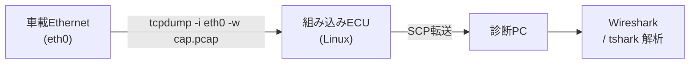

## やること
Linux搭載のECUやゲートウェイECU上で tcpdump を使い、車載Ethernetパケットをキャプチャしてpcapファイルに保存する手順を説明します。

## 前提条件
- 対象ECUにSSHまたはシリアルコンソールでログイン可能
- ECU上にtcpdump(またはbusybox tcpdump)がインストール済み
- 解析用PCとのファイル転送手段(SCP/USB)

## ステップ1: インターフェース確認

```bash
# 利用可能なネットワークインターフェースを確認
ip link show
# または
ifconfig -a
```

車載EthernetはECUによって `eth0`、`eth1`、`br0` などになっています。

## ステップ2: 基本キャプチャ

```bash
# eth0 の全パケットを capture.pcap に保存
tcpdump -i eth0 -w /tmp/capture.pcap

# ファイルサイズ上限付き (100MB)
tcpdump -i eth0 -w /tmp/capture.pcap -C 100

# 指定パケット数でキャプチャ停止
tcpdump -i eth0 -w /tmp/capture.pcap -c 10000
```

## ステップ3: フィルタ付きキャプチャ

```bash
# SOME/IP-SD のみ (UDP 30490)
tcpdump -i eth0 -w /tmp/someip_sd.pcap 'udp port 30490'

# DoIP のみ (TCP/UDP 13400)
tcpdump -i eth0 -w /tmp/doip.pcap 'port 13400'

# 特定IPとの通信のみ
tcpdump -i eth0 -w /tmp/ecu.pcap 'host 192.168.1.10'

# ICMPのみ (疎通確認)
tcpdump -i eth0 -w /tmp/icmp.pcap 'icmp'
```

## ステップ4: キャプチャファイルをPCへ転送

```bash
# SCP でPCへコピー (PC側から実行)
scp user@192.168.1.50:/tmp/capture.pcap ./

# ECU側から送る場合
scp /tmp/capture.pcap analyst@192.168.0.100:/captures/
```

## ステップ5: Wiresharkで開く

転送した `.pcap` ファイルをWiresharkで開いて解析します。  
[[howto**-w**ireshark-someip]] の手順でSOME/IPフィルタをかけると効率的です。

## バックグラウンドでの長時間キャプチャ

```bash
# nohupで端末切断後も継続
nohup tcpdump -i eth0 -w /tmp/long_cap.pcap &

# 停止するとき
kill $(pgrep tcpdump)
```

## 関連用語
コマンドの詳細は [[tcpdump]]、キャプチャファイルの形式は [[pcap]]、高度なフィルタは [[tshark]] を参照。

## 図解

