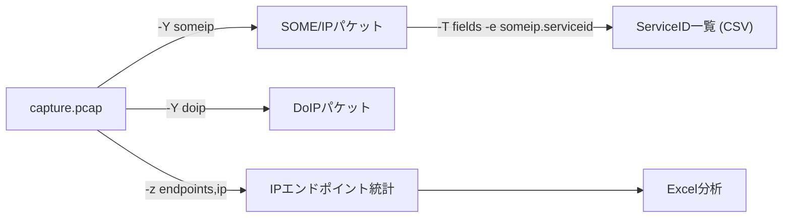

## やること
tshark(Wiresharkのコマンドライン版)を使って、pcapファイルや生トラフィックから特定の車載プロトコルを素早く抽出・解析する実践的なコマンドを紹介します。

## 前提条件
- tshark インストール済み (`sudo apt install tshark` または Wireshark同梱)
- 解析対象のpcapファイル or キャプチャ可能なインターフェース

## 基本構文

```bash
tshark -r <ファイル> -Y <表示フィルタ> -T fields -e <フィールド>
```

## SOME/IP の解析

```bash
# SOME/IP パケットの一覧
tshark -r capture.pcap -Y "someip"

# Service ID と Method ID を抽出
tshark -r capture.pcap -Y "someip" \
  -T fields -e frame.number -e ip.src -e ip.dst \
  -e someip.serviceid -e someip.methodid -e someip.msgtype \
  -E header=y -E separator=,

# 特定サービスIDだけ
tshark -r capture.pcap -Y "someip.serviceid == 0x1234"
```

## DoIP の解析

```bash
# DoIP パケット一覧 (TCP/UDP 13400)
tshark -r capture.pcap -Y "doip"

# Routing Activationだけ
tshark -r capture.pcap -Y "doip.type == 0x0005"

# UDSペイロードを16進数で表示
tshark -r capture.pcap -Y "doip" -T fields -e doip.diag.payload
```

## ARP の解析

```bash
# ARP要求・応答を全表示
tshark -r capture.pcap -Y "arp" -V

# ARPが解決できていないリクエストだけ (応答なし)
tshark -r capture.pcap -Y "arp.opcode == 1" \
  -T fields -e arp.src.proto_ipv4 -e arp.dst.proto_ipv4
```

## 通信量の集計

```bash
# IPアドレスごとのパケット数
tshark -r capture.pcap -q -z endpoints,ip

# プロトコルごとの割合
tshark -r capture.pcap -q -z io,phs

# 1秒ごとのビットレート
tshark -r capture.pcap -q -z io,stat,1
```

## リアルタイムキャプチャ + フィルタ

```bash
# eth0 をリアルタイム解析してSOME/IPだけ表示
tshark -i eth0 -Y "someip" \
  -T fields -e ip.src -e someip.serviceid -e someip.methodid
```

## pcapをCSVに変換

```bash
tshark -r capture.pcap \
  -T fields \
  -e frame.time_relative \
  -e ip.src -e ip.dst \
  -e _ws.col.Protocol \
  -e frame.len \
  -E header=y -E separator=, > output.csv
```

Excelで開いて通信量の時系列分析ができます。

## 関連用語
GUIで同じことをする場合は [[wireshark]]、コマンドラインでの簡易キャプチャは [[tcpdump]]、pcapの形式は [[pcap]] を参照。

## 図解

