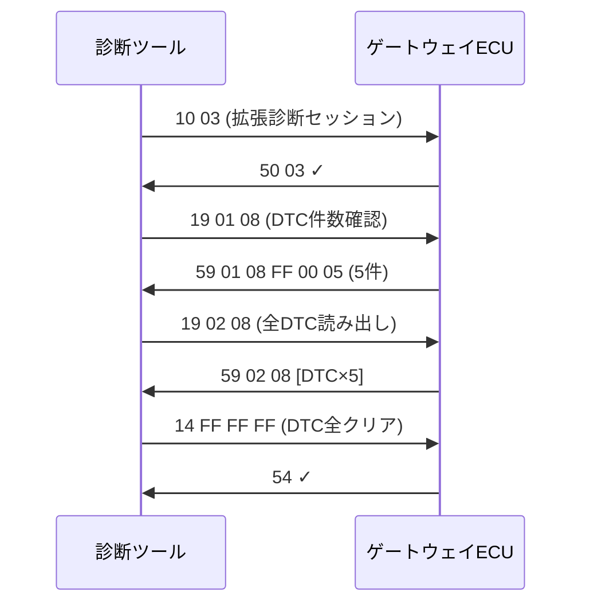

## やること
UDS (ISO 14229) の `ReadDTCInformation` サービス(0x19)を使って、ECUに記録された故障コード(DTC: Diagnostic Trouble Code)を読み出す手順を説明します。

## 前提条件
- DoIP または CAN 経由でECUへ接続済み([[howto-doip-connect]] 参照)
- ECUがデフォルトまたは拡張診断セッションにある

## DTCとは

DTCは `P0123` のような5桁コードで、故障内容を示します：
- **P** = Powertrain / **C** = Chassis / **B** = Body / **U** = Network
- `P0123` = Throttle Position Sensor / Pedal Position Sensor A Circuit High

## ステップ1: 診断セッション切り替え

まず拡張診断セッション(0x03)に切り替えます：

```
送信: 10 03         (DiagnosticSessionControl, ExtendedDiagnosticSession)
応答: 50 03 00 19 01 F4   (PositiveResponse)
```

## ステップ2: 全DTCを読む (subfunction 0x02)

```
送信: 19 02 08
      ↑  ↑  ↑
      |  |  StatusMask: 0x08 = confirmedDTC
      |  subfunction: 0x02 = reportDTCByStatusMask
      Service ID: 0x19

応答: 59 02 08 [DTCRecord...] [DTCRecord...]
      各DTCRecord = 3バイトDTCコード + 1バイトStatus
```

Pythonでのバイト列例：
```python
request = bytes([0x19, 0x02, 0x08])
response = send_uds(request)

# レスポンスを解析
dtc_list = response[3:]   # 先頭3バイト(59 02 08)を除く
for i in range(0, len(dtc_list), 4):
    dtc = dtc_list[i:i+3].hex().upper()
    status = dtc_list[i+3]
    print(f"DTC: {dtc}, Status: {status:#04x}")
```

## ステップ3: DTCの件数だけ確認 (subfunction 0x01)

```
送信: 19 01 08     (reportNumberOfDTCByStatusMask)
応答: 59 01 08 FF 00 05   → DTCが5件
```

## ステップ4: スナップショットデータを読む

特定のDTCが発生した瞬間の車両状態を取得：

```
送信: 19 04 [DTC3バイト] FF   (reportDTCSnapshotRecordByDTCNumber)
応答: DTC発生時の各センサ値・車速・電圧などのDID値
```

## ステップ5: DTCをクリアする

```
送信: 14 FF FF FF   (ClearDiagnosticInformation, 全DTC対象)
応答: 54            (PositiveResponse)
```

## 注意
量産車のECUではセキュリティアクセス(0x27)認証が必要なサービスがあります。認証なしで0x14を送ると NRC `0x33`(SecurityAccessDenied) が返ります。

## 関連用語
プロトコルの概要は [[uds]]、接続手順は [[howto-doip-connect]]、CANバス経由の場合は [[can]] を参照。

## 図解

